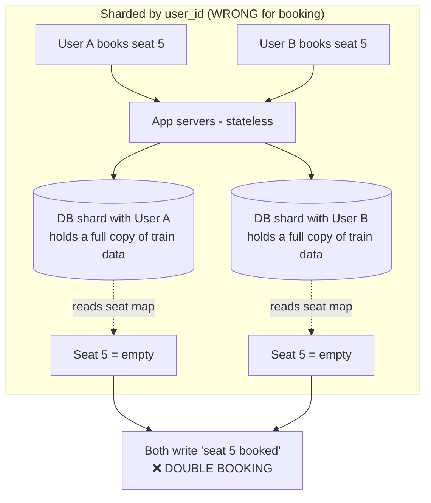
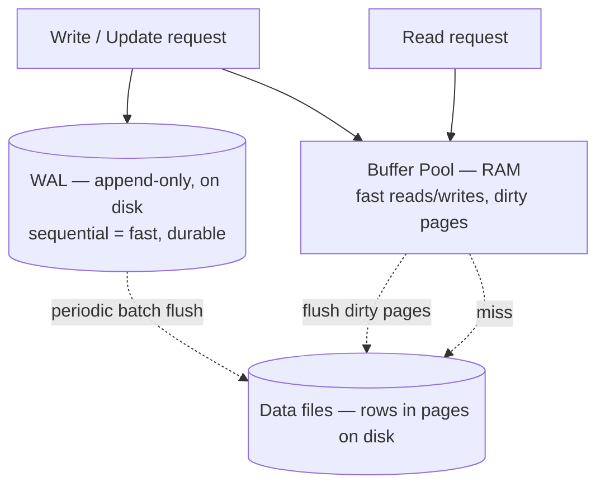
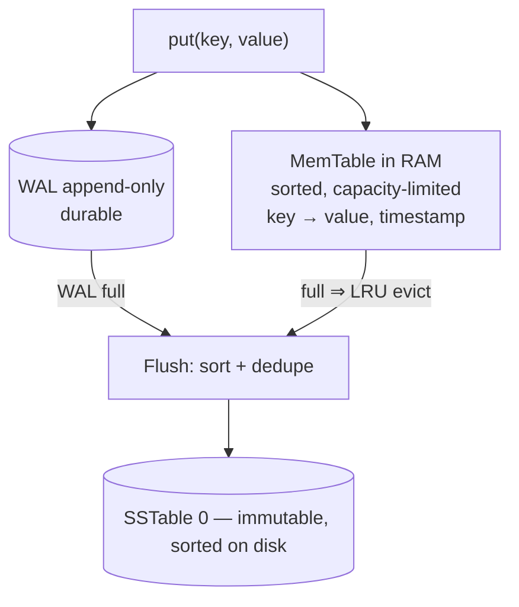
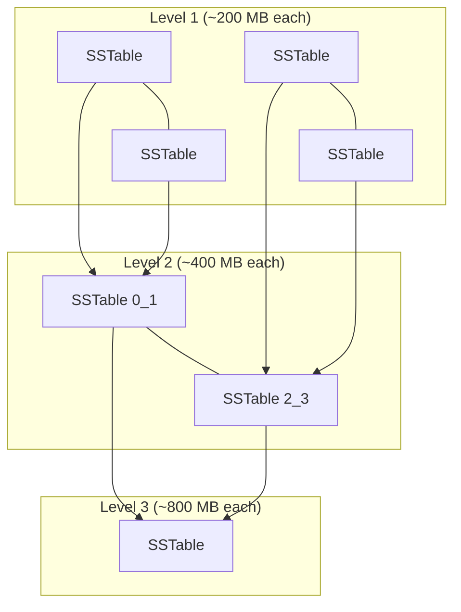

# Lecture 9: SQL Internals, Sharding for ACID, and Building an LSM‑Tree Database

## Table of Contents
- [Overview](#overview)
- [Why Companies Still Choose SQL](#why-companies-still-choose-sql)
- [ACID Lives on a Single Machine — So We Shard](#acid-lives-on-a-single-machine--so-we-shard)
- [Choosing a Sharding Key](#choosing-a-sharding-key)
- [Types of NoSQL Databases](#types-of-nosql-databases)
- [How SQL Stores Data on Disk (and the Update Problem)](#how-sql-stores-data-on-disk-and-the-update-problem)
- [Buffer Pool + Write-Ahead Log: How SQL Stays Fast and Durable](#buffer-pool--write-ahead-log-how-sql-stays-fast-and-durable)
- [Why B+ Trees, Not BSTs: Disk Is Block-Addressable](#why-b-trees-not-bsts-disk-is-block-addressable)
- [Design Exercise: A Persistent Key-Value Store → The LSM Tree](#design-exercise-a-persistent-key-value-store--the-lsm-tree)
- [Try It Yourself](#try-it-yourself)
- [Homework / Next Lecture Preview](#homework--next-lecture-preview)

## Overview
This lecture closes the "databases" arc and pivots from *choosing* a database to *building* one. We first answer a question that trips up most engineers — if NoSQL scales so well, why do banks, IRCTC, and almost every company still run on SQL? The answer (ACID) leads directly to **sharding**, because ACID guarantees only hold inside a single machine. We then crack open a SQL engine to see how rows are stored on disk, why updates are expensive, and how the **buffer pool + write-ahead log** keep it fast. Finally, we design a persistent key-value store from scratch and rediscover the **LSM tree** — the write-optimized engine behind Cassandra, ScyllaDB, and most "fast-write" NoSQL stores.

> 🔑 **Key Point (emphasized in class):** Every design decision is *use-case specific*. Two nearly identical apps end up with completely different architectures because of small differences in their access patterns. There is no universal "best database" — only the best fit for *your* reads, writes, and consistency needs.

---

## Why Companies Still Choose SQL

NoSQL is built for scale and gives you automatic sharding, auto-scaling, and load balancing out of the box. So why do giants still default to SQL? Because of one feature NoSQL gives up: **ACID transactions**.

A helpful mental model the faculty kept returning to:

- **SQL = jack of all trades, master of none.** It does *everything* decently: ACID, joins, full-text search, geospatial queries, JSON columns, recursive queries. The catch — these strengths only hold *at low scale* (data + traffic that fit on one server).
- **NoSQL = master of one trade.** Each NoSQL database does *one thing* extremely well at massive scale, precisely *because* it drops most features. It is easy to be world-class at one thing and hard to be great at everything.

SQL trades on **ACID**; NoSQL trades on **BASE**:

| | SQL (Relational) | NoSQL |
|---|---|---|
| Guarantee | **ACID** | **BASE** |
| Data shape | Normalized | Denormalized / redundant / often schemaless |
| Scope | 1 server (scale up) | Many servers (scale out, built-in sharding) |
| Philosophy | Do everything decently | Do one thing brilliantly |

**BASE** stands for:
- **Ba**sically Available — the system *as a whole* stays available even if a small fraction of users/services are temporarily down (high availability, not per-request guarantees).
- **S**oft state — data may sit in a *partial* (in-between) state for a while, sometimes for an extended period, instead of ACID's strict all-or-nothing.
- **E**ventually consistent — you may read stale data, but if you wait long enough every write propagates to every replica.

> 🔑 **Key Point:** Your default choice should *always* be a relational SQL database. A modern Postgres/MySQL handles up to ~1 million users flawlessly. Roughly 99% of companies run on SQL and never *need* NoSQL. Reach for NoSQL only when you can concretely justify the scale. Reasons like "legacy" or "security" are weak — even a brand-new company picks SQL as its primary store, and both families can be secured and indexed.

> 🤔 **Think About It (faculty's question):** If relational databases can also create indexes, store JSON, and do text search, what *specific* thing forces a company to abandon SQL? (Answer: nothing about features — it's purely **scale**. The single con of SQL is that it is only feasible at low scale.)

---

## ACID Lives on a Single Machine — So We Shard

Here is the crux of the whole lecture: **ACID guarantees only hold when all the relevant data lives on one machine.** Spread that data across servers and atomicity/isolation become nearly impossible.

Why? Inside a single server you can:
- Acquire **locks/semaphores** cheaply (the OS and hardware do it for you).
- Share memory (RAM/disk), so coordinating transactions costs almost nothing.
- Know immediately whether a write succeeded or failed.

Across servers, none of that is free. You'd need a **distributed lock**, which means a **two-phase commit (2PC)** (or a coordinator like ZooKeeper). That is slow, complex, and fragile — networks and servers fail regularly, and the PACELC/CAP trade-offs bite. **Sharding nullifies ACID** unless you shard so that one logical transaction stays inside one shard.

### The IRCTC double-booking example
Imagine IRCTC (India's railway booking system). Trains are few (~18,000–20,000), so the train/seat tables can be *replicated* on every server. Now suppose we shard the *booking* data by **user_id**:



User A and User B both try to book seat 5 of the same train. Their requests land on **different** database shards (because they are different users). Each shard reads its own copy of the seat map, sees the seat as free, and books it. **No lock can be acquired across the two shards**, so the double booking is impossible to prevent.

The fix is to **shard by `train_id`** instead. Now *all* data for a given train lives on *one* shard, both booking requests are forced to the same server, a lock is acquired there, and ACID (atomicity + isolation) saves the day.

> 🔑 **Key Point:** The sharding key is *use-case specific*. For Facebook Messenger the right key is `user_id`; for IRCTC it is `train_id`. Same family of problem, different access pattern, different key. Spend serious time choosing it — it is the single most consequential decision in a sharded design.

> 🤔 **Think About It:** Can't we keep replicas and still get strong consistency? Yes — using **quorum** reads/writes you can keep replicas consistent. But that's *consistency across copies of the same shard*, not *atomicity across different shards*. Two parallel requests to the **same** shard are fine (a lock is taken); two requests to **different** shards are the unsolvable case.

---

## Choosing a Sharding Key

A **sharding key** decides *how data is distributed* across servers and *how queries are routed* to find it. It is different from a **primary key**:

- **Primary key** — uniquely identifies a row ("*what* you're talking about"). It need not be unique *across tables* (a `user_id = 1` and a `product_id = 1` can coexist), but must be unique *within a table*, regardless of sharding.
- **Sharding key** — tells you *where the data lives* ("*which server* to look in"). The same sharding-key value always maps to the same shard.

You typically use **both**: the sharding key routes you to the right server, then the primary key locates the row inside it.

> 🤔 **Think About It (analogy from class):** To find your little sister at a huge school, her **primary key** is her name + roll number (identifies her). Her **sharding key** is her *class number* (tells you which classroom to walk into). Without the class number you must **fan out** — search every classroom. That's exactly what a database does without the sharding key in the query.

### Five properties of a good sharding key
1. **Even data & load distribution** — every key value should be roughly equally likely; otherwise you get **hot shards** (one server overwhelmed). Sharding by `age` or `gender` skews badly; `user_id` spreads evenly. (Caveat: the *celebrity problem* — a few user_ids attract disproportionate load, which matters for notification/feed systems.)
2. **High cardinality** — cardinality is the count of possible key values, and it caps how many servers you can ever use. `gender` (~3 values) ⇒ at most 3 shards. `age` (0–123) ⇒ at most 124. `user_id` (64-bit) ⇒ ~16 quintillion ⇒ effectively unlimited. Cardinality sets the *ceiling*, not the actual server count.
3. **Part of every read/write request** — if the sharding key isn't in the request, the router doesn't know which shard to hit and must **fan out** to all of them.
4. **No fan-outs** — your *most frequent* queries should touch only 1 (at most 2) shards. Rare queries are allowed to fan out — you can't optimize everything.
5. **Immutable** — the key's value should never change for a row, because changing it would force the row to move to a different shard (a reshuffle). `age` is a bad key partly because it changes every birthday.

### Worked examples
- **Banking** — operations are balance lookup `(user_id, account_id)`, transaction history `(user_id, account_id, date_range)`, list accounts `(user_id)`, create transaction `(sender_id, receiver_id, amount)`. The ideal key is **`user_id`**: balance/history/list all hit one shard. A transaction is the interesting case — it concerns *two* users, so it is stored on **two** shards (sender's + receiver's). That's two shards, not a fan-out, and doing it atomically still needs 2PC (higher latency, lower availability).
- **Facebook Messenger** — `sendMessage(sender_id, recipient_id, msg)` and `viewMessages(user_id, other_person_id)`. Key = **`user_id`**: every message a user sends *or* receives lives on their shard; a message between Sanjana and Sachin is stored on *both* their shards (not a fan-out). See [Lecture 13](./Lec13.md) where this becomes a full case study.
- **Slack** — has both 1-1 chats and groups (up to 100,000 members). Sharding a group by a member's `user_id` is terrible: a single "Announcements" post would have to be written to 100,000 shards (or read from 100,000). Sharding by **`group_id`** keeps the whole conversation on one shard (write 1, read 1). Final answer: either two databases (groups by `group_id`, 1-1 by `user_id`), or treat every 1-1 chat as a 2-person group keyed by `conversation_id`.

> 🔑 **Key Point:** Changing the sharding key later means re-shuffling *all* data across *all* servers — very expensive and almost always requires downtime. Choose it correctly up front.

---

## Types of NoSQL Databases

We're about to build a key-value store, so it helps to know the landscape. NoSQL families *specialize*; pick the one whose strength matches your access pattern.

| Family | Mental model | Examples | Best for |
|---|---|---|---|
| **Key-Value** | A giant hashmap spread across servers | Redis, Memcached, DynamoDB | Caches, tiny values queried *very* frequently (counters, rate-limits, preferences) |
| **Document** | A pile of JSON/BSON docs; a single doc never splits across servers | MongoDB, Elasticsearch, Couchbase | Semi-structured data, full-text search (Amazon product listings, user profiles) |
| **Column-Family / Wide-Column** | Tabular but stored column-wise; partitioned across servers; **built on LSM trees** | Cassandra, BigTable, ScyllaDB, HBase | Analytics, *very high write* throughput, time-series/paginated queries |
| **Large File / Object** | Flat files chunked across servers | S3, Google Cloud Storage, HDFS, Git LFS | Huge, mostly-static blobs (media, logs); can stream |
| **Graph** | Nodes + edges for "path-finding" queries | Neo4j (+ often a graph cache over SQL) | Recommenders, shortest-path, social graphs |
| **Vector** | Fast K-Nearest-Neighbor over embeddings | (AI-era stores) | Semantic search over an embedding space |

Notes that matter for this lecture:
- **Key-value rules:** keys ≤ ~100 bytes, values ≤ ~10 KB. Redis caps a string at 500 MB, but that is *not* a license to store 500 MB values. Sharding key = the key; primary key = the key. A single Redis server handles ~100,000+ ops/sec; a well-tuned Postgres only a few thousand.
- **Why MongoDB caps documents at 16 MB:** reads/writes happen at the *whole-document* level. Change one character and the entire document is rewritten; read one field and the whole document is loaded. This is the same **addressability** idea we'll see on disk (you can't cheaply touch a sub-unit).
- **Column-family writes are fast because they use LSM trees** and keep writes sequential — which is exactly what we build below. MongoDB instead uses **B+ trees** (read-optimized).

> 🔑 **Key Point:** "NoSQL" means **Not Only SQL**, not "no SQL." The first NoSQL database was Google's **BigTable**; the term went viral around 2009–2010 (literally a conference hashtag, `#NoSQL`).

---

## How SQL Stores Data on Disk (and the Update Problem)

From the user's view there are neat tables. Internally, a SQL engine stores rows inside **files**, row by row, in fixed-size **pages (blocks)**. When you define a column, the engine **pre-allocates** space based on its data type. This is what "strong, well-defined schema" buys you: predictable, fixed-size layout on disk.

This creates the **update problem**. Consider two ways to store a name:
- `char(6)` — always reserves 6 characters, even for `"VBS"`. Wastes space but never has to move.
- `varchar(10)` — stores only as many characters as needed (`"VBS"` ⇒ 3 chars), then the *next* column begins immediately after.

Now update `"VBS"` to `"Abdul Rehman Bin Aziz"`. With `varchar`, there's no room — the next column is sitting right there. The engine must **shift** subsequent data, **fragment**, or **migrate the whole row** to a new block. (And if you declared `char(6)`, the DB correctly *refuses* a longer value — you promised names ≤ 6 chars.)

```mermaid
flowchart LR
    subgraph Before
    A["name=VBS | age=20 | email=..."]
    end
    subgraph After update name=Abdul Rehman...
    B["name=Abdul Rehman Bin Aziz | ???"]
    B --> C[Must shift / fragment / migrate the row<br/>= expensive disk reorganization]
    end
    A -->|update| B
```

So **every update can potentially reorganize rows on disk** — a disk seek per write, which is expensive. In an update-heavy system this is clearly suboptimal. Yet companies still use SQL. How does SQL avoid paying this cost on every single write?

> 🔑 **Key Point:** Changing a SQL schema (adding/removing a column) is a **table migration**: rewrite the entire table, which is extremely slow and usually needs the service down. There are ways around the downtime (**rolling migration**), but the lesson is — a "static schema" is a feature *and* a constraint.

---

## Buffer Pool + Write-Ahead Log: How SQL Stays Fast and Durable

SQL keeps two extra structures beyond the on-disk data files:

1. **Buffer pool** — a chunk of **RAM** holding recently used pages. Reads and writes hit RAM first (fast). Pages modified in RAM are marked *dirty* and flushed to disk later.
2. **Write-Ahead Log (WAL)** — an **append-only** file on disk that records *every* change *before* it touches the actual data pages.

When an update arrives, SQL does **not** immediately reorganize the row on disk. It:
1. Appends a record to the **WAL** (sequential write — fast).
2. Updates the page in the **buffer pool** (RAM).
3. Later, in **batches**, flushes the accumulated changes into the real data files (one reorganization for many updates, not one per update).



Why is it called a **log**? Because, like any log, you only **append** — never edit a previous line, never read a random line. That restriction is exactly what makes it fast: **sequential writes to one end of a file are dramatically faster than random edits in the middle** (which would require loading and rewriting arbitrary blocks).

The WAL also gives you **durability**: the moment a change is in the WAL it survives a power cut. On restart, the engine **replays** the WAL to rebuild any state that hadn't yet been flushed to the data files. (How aggressively writes are flushed depends on the **isolation level** you configure — a knob between speed and visibility guarantees.)

> 🔑 **Key Point:** Durability protects against *power loss / crashes*, not against *disk failure*. Only **replication** protects you from a dead disk.

> 🤔 **Think About It:** While the WAL is being flushed, where do brand-new writes go? (Into a *new* WAL file. The DBMS juggles multiple log files so flushing never blocks incoming writes; a fully-flushed log file is then deleted.)

---

## Why B+ Trees, Not BSTs: Disk Is Block-Addressable

A SQL **index** is a **B+ tree** — like a binary search tree, but each node holds *many* keys and has *many* children. That seems wasteful: a balanced BST halves the search space each step (`log₂ n`), which is provably optimal for comparisons. So why fan a node out into hundreds of children?

First, a detour the faculty used to kill a tempting wrong idea. If halving (binary search) is good, isn't splitting into thirds (ternary) better? Into quarters? Push it to the extreme — split into *n* parts and you've reached **linear search**. Each split adds comparisons, and those comparisons add up (`O(log n)` *iterations*, but more comparisons per iteration). So *more fan-out does not reduce work* — binary is the comparison-optimal split. **The B+ tree's win has nothing to do with comparisons.**

The real reason is **how disk is addressed**:

- **RAM is byte-addressable** — it fetches one byte at a time. (This is also why a Java `boolean` takes a whole *byte*, not a bit: RAM loads a full byte regardless.) Pointers can point anywhere; following one costs `O(1)`. A BST in RAM is perfectly fine.
- **Disk is block/page-addressable** — it reads a whole **block (kilobytes)** per access. A magnetic disk must *physically spin* to the right track. Following a pointer to an arbitrary location is a **disk seek** — slow.

> 🤔 **Think About It (analogy from class):** Ordering on Swiggy, everyone in this building writes the *same* address — the building. That's **building-addressable** (coarse). A hospital visit needs the *bed number* — **bed-addressable** (fine). RAM is "bed-addressable" (per byte); disk is "building-addressable" (per block).

A BST on disk scatters its nodes across many blocks, so each step down the tree is a separate disk seek — catastrophic. A **B+ tree fixes this**: each node is sized to fill **exactly one disk block**. One disk read loads a whole node (hundreds of keys). Once that block is in RAM, scanning it — even linearly — is essentially free compared to a seek. So a B+ tree **minimizes disk seeks**, which is the only thing that matters here.

### Sequential vs random access — the number that explains everything
On a 7200 RPM disk: one rotation ≈ **8 ms**, moving the read head to a track ≈ **10 ms** (≈18 ms to position).

- Read a **100 MB** track **sequentially**: ≈ 100 MB / 18 ms ≈ **5.5 Gbps**.
- Read **4 KB** at a **random** location: ≈ 4 KB / 18 ms ≈ **222 Kbps**.

**Sequential access is up to ~10,000× faster than random access** — and this is true for *every* storage tier (HDD, SSD, RAM, CPU cache). This single fact justifies the WAL, the B+ tree, *and* the LSM tree we build next.

> 🔑 **Key Point:** Pick index columns that rarely change. Every update to an indexed column also restructures the B+ tree — so index a stable column, not a frequently-updated one.

---

## Design Exercise: A Persistent Key-Value Store → The LSM Tree

**The problem (a real final-exam question):** Design a **persistent, key-value** database. Both keys and values are arbitrary strings. It must be **durable** (survive power loss), handle **more data than fits in RAM** (tens to ~100 GB), and keep **both reads and writes fast (low latency)**. Assume single machine for now — worry about sharding/replication later.

### Why the obvious answers fall short
- **In-memory hashmap?** Fast and key-value native, but *not durable* and *doesn't fit in RAM*.
- **Hashmap on disk (hash index)?** Two problems: (1) its buckets point to balanced trees scattered across the disk ⇒ many disk seeks (same BST-on-disk problem); (2) hashing destroys order, so **range queries are impossible** (`age BETWEEN 20 AND 60` can't work — adjacent keys hash to unrelated buckets).
- **B+ tree (what MongoDB does)?** Works, and several students proposed it. But every write/update *also restructures the tree*, so write latency is higher than we'd like. B+ trees are **read-optimized**.

We want something **write-optimized** that still reads well. That's the **LSM (Log-Structured Merge) tree** — used by Cassandra and ScyllaDB.

### The three building blocks
We reuse two ideas from SQL (WAL for durability, an in-memory map for speed) and add a sorted, immutable on-disk format.

1. **WAL (Write-Ahead Log)** — append-only file on disk. Every write is recorded here first ⇒ durability + fast sequential writes. We never read it randomly, never edit it. Note that for a key-value store there are no "updates," only re-writes — updating a key just appends a new `(key, value, timestamp)`.
2. **MemTable** — an in-memory map (capacity-limited; here pretend it holds 5 entries). On each write we write to the WAL **then** the MemTable (a *write-through* cache; since both are on the same machine the write-through never fails). Each entry carries a **timestamp** for versioning.
3. **SSTable (Sorted String Table)** — an immutable on-disk file holding entries **sorted by key, deduplicated**.



### How a write flows
For `put(item, 1)`: append `item=1, t=1` to the WAL, and put `item → (1, t=1)` in the MemTable. For an update `put(item, 10)`: the WAL just **appends** `item=10, t=2` (we never edit the log); the MemTable **overwrites** the existing key with `(10, t=2)`.

The **timestamp** disambiguates versions. A key can appear many times in the WAL (and later in multiple SSTables); the highest timestamp is the live value.

> 🤔 **Think About It:** Why store a timestamp instead of trusting "the latest file wins"? Because these databases are *distributed* — the same key may be updated on another machine too. File ordering only tells you recency *on this machine*; the timestamp tells you recency *globally*.

### Flushing: WAL → SSTable
When the WAL (say ~100 MB) or the MemTable hits its limit, we **flush**: read the entries, **sort by key**, **drop duplicates** (keep the newest), and write a fresh **SSTable**. Then the old WAL is deleted — its data was *durable but temporary*; once safely in an SSTable, it's no longer needed. New writes meanwhile go to a new WAL file, so flushing doesn't block writes.

Why sort? Because to look up a key we may have to search files larger than RAM. A **sorted** file lets us **binary search** (`log n`) instead of scanning the whole file — slower than a B+ tree, but vastly faster than a linear scan.

### Compaction: merge two equal-sized SSTables at a time
A single SSTable is internally deduplicated, but **duplicates can exist across different SSTables**. **Compaction** merges them: take two SSTables, **merge-sort** them into one (two-pointer merge of already-sorted files — no need to re-sort), keep the newest version of each key by timestamp, and delete the originals.

The crucial design choice: **always merge two files of the *same* size** — and wait until two equal-sized files exist before merging. This is the **merge-sort vs insertion-sort** insight:

> 🤔 **Think About It:** Why not merge each small new SSTable directly into the big one? Because merging a tiny file into a 1 GB file repeatedly is **insertion sort** (`O(n²)`-ish, scanning the giant file every time). Merging equal halves bottom-up is **merge sort** (`O(n)` per level). Same reason merge sort beats insertion sort.

This produces a **leveled** structure where each level holds files roughly **double** the size of the level above:



Sizes grow exponentially per level (200 MB → 400 MB → 800 MB → GBs). Merging huge GB-sized files is rare; merging small files is frequent and cheap — exactly like merge sort, where you merge small subarrays often and the full `n/2 + n/2` merge only once.

This whole machine — append-only logs being merged into ever-larger sorted, immutable files — *is* the **Log-Structured Merge tree (LSM tree)**. It's not one data structure but a system of components describing how data flows from RAM to disk.

> 🔑 **Key Point:** **B+ trees are read-optimized; LSM trees are write-optimized.** Writes are cheap because they're sequential appends, and updates never restructure a tree.

### What's still broken (next lecture)
- **Reads are not yet fast.** A `get(key)`: check the MemTable (`O(1)`); on a miss, search the SSTables newest-to-oldest — potentially many files. We'll fix this with a **sparse index** and a **Bloom filter**.
- **Deletes aren't handled.** Since the same key can live in many files, how do you "remove" it? (The answer is a **tombstone** marker — next lecture.)

> 🤔 **Think About It (Bloom filter teaser):** When you type a username on a signup page, the site instantly tells you whether it's taken — with no perceptible latency, without holding every username in cache. What structure can say "this key is *definitely not* present" with 100% certainty, and "possibly present" otherwise? That **probabilistic** structure is the Bloom filter, covered in [Lecture 10](./Lec10.md).

The trade-off to remember: SSTables hold **redundant** data across files (the price of fast, append-only writes), so you must budget extra disk (a *storage buffer*) — unlike normalized SQL, which stores each fact once.

---

## Try It Yourself
1. **Sharding key under pressure.** You're designing an Uber-like ride history. Queries: "my past rides" `(rider_id)`, "this driver's trips today" `(driver_id, date)`, and "trips in a city this hour" `(city_id, hour)`. Pick one sharding key and, using the five properties, explain which queries become fan-outs. Is there *any* single key with no fan-outs? If not, what would you do (hint: revisit the banking "two-shard transaction" idea)?
2. **Trace the LSM.** Start with a MemTable of capacity 3 and SSTables of 2 entries. Apply: `put(a,1) put(b,2) put(c,3) put(a,9) put(d,4) delete(b)`. Draw the WAL contents, the MemTable after each op, every SSTable created, and the result of one compaction. Where does the `delete(b)` cause trouble, and why do we need tombstones?
3. **Pick the engine.** For each workload say B+ tree (read-optimized) or LSM (write-optimized) and why: (a) IoT sensors writing 1M points/sec, (b) a user-profile store read 100× more than written, (c) a write-heavy event/audit log. 
4. **Defend the disk fact.** Explain to a teammate why a WAL (append-only) can be durable *and* fast when "writing to disk is slow." Use the ~10,000× sequential-vs-random number.

## Homework / Next Lecture Preview
- **Build your own key-value database.** Implement the LSM design above (WAL + MemTable + SSTables + compaction), *or* the alternative some students proposed (B+ tree or hashmap index + a write-ahead log). Either is acceptable.
- **Benchmark it.** Test and benchmark your implementation, and compare its read/write performance against real systems. The faculty will also post an LSM **animation** you can play with — and encourages building your own.
- **Coming next ([Lecture 10](./Lec10.md)):** fixing **reads** and **deletes** in the LSM tree — the **sparse index**, the **Bloom filter** (the username-availability trick), and **tombstones**. After that you'll add a Bloom filter to your own implementation.
