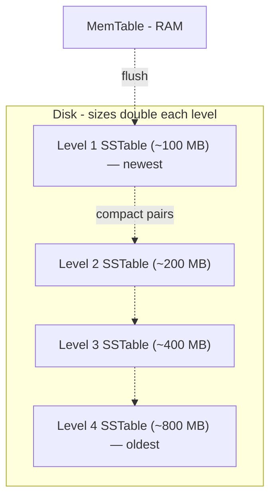
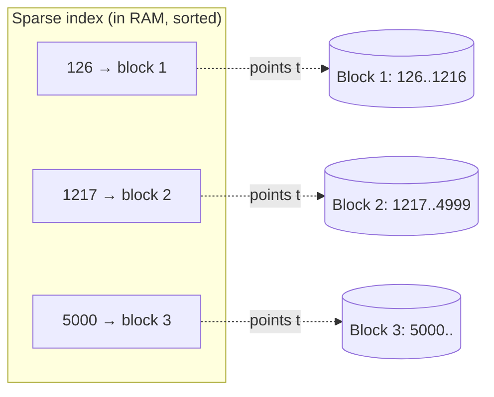
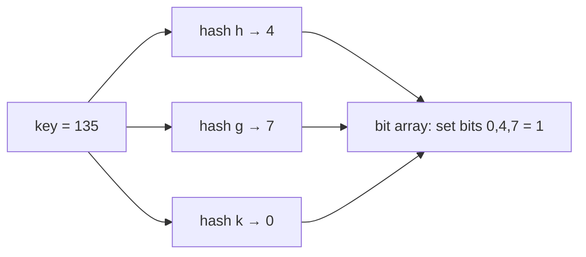
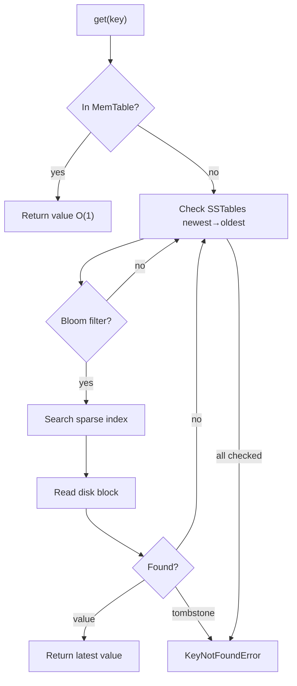

# Lecture 10: Making the LSM Tree Read‑Fast — Sparse Index, Bloom Filter, and Tombstones

## Table of Contents
- [Overview](#overview)
- [Recap: The Write Path (and Two Sizing Rules)](#recap-the-write-path-and-two-sizing-rules)
- [The Shape of the Problem: At Most One SSTable per Level](#the-shape-of-the-problem-at-most-one-sstable-per-level)
- [The Read Path — and Why It's Painfully Slow](#the-read-path--and-why-its-painfully-slow)
- [Optimization 1: The Sparse Index](#optimization-1-the-sparse-index)
- [Optimization 2: The Bloom Filter](#optimization-2-the-bloom-filter)
- [Deletes: Tombstones](#deletes-tombstones)
- [The Full LSM Algorithm](#the-full-lsm-algorithm)
- [Where LSM Lives: Cassandra, Redis, and the B+ Tree Cousins](#where-lsm-lives-cassandra-redis-and-the-b-tree-cousins)
- [Try It Yourself](#try-it-yourself)
- [Homework / Next Lecture Preview](#homework--next-lecture-preview)

## Overview
Last lecture we built an LSM tree that writes blazingly fast but *reads* terribly (a single lookup could take seconds). This lecture fixes reads and deletes. We add a **sparse index** to turn ~30 disk seeks per file into one, a **Bloom filter** to skip files that definitely don't contain the key, and **tombstones** to delete from immutable files. By the end you'll have the complete read/write/delete algorithm that powers Cassandra, ScyllaDB, and RocksDB — and you'll understand the time–space trade-off you're signing up for. (This builds directly on [Lecture 9](./Lec09.md); skim its LSM section first if the write path isn't fresh.)

---

## Recap: The Write Path (and Two Sizing Rules)
A write is always just two appends:
1. Append `(key, value, timestamp)` to the **WAL** (durability; sequential = fast).
2. Upsert the key in the **MemTable** (an in-memory map acting as a write-through cache; fast reads).

That's it — no matter how many SSTables exist on disk, a write only ever touches these two structures. When the WAL fills up it is **flushed** into a new, immutable, sorted, deduplicated **SSTable**, and the WAL is deleted. Two equal-sized SSTables on a level get **compacted** (merge-sorted, newest-wins) into one larger SSTable on the next level. (Full walkthrough in [Lecture 9](./Lec09.md).)

Two sizing rules the faculty stressed, both with real consequences:

> 🔑 **Key Point — the WAL must be *smaller* than the MemTable.** This guarantees that anything in the WAL is *also* in the MemTable. Why it matters: it means **we never have to read the WAL** during a lookup. If the WAL could be bigger, a key might live in the WAL but have been evicted from the MemTable and not yet flushed to any SSTable — forcing slow, unsorted WAL scans. In practice the WAL is ~100 MB; the MemTable is several GB (RAM is cheap — even laptops start at 16 GB).

> 🔑 **Key Point — budget extra disk.** Because the same key can sit (stale) in many SSTables until compaction reclaims the space, you must over-provision storage. **To store ~100 GB of live data, keep ~200 GB of disk.** This redundancy is the price of fast, append-only, sequential writes — the classic time–space trade-off.

> 🤔 **Think About It (from class):** Why create a *new* SSTable when the WAL flushes, instead of appending to the existing one? Two reasons: (1) inserting into the middle of a sorted file needs **random writes** (shifting data) — we only ever do sequential writes; (2) we always want to compact files of **equal size** (the merge-sort argument), and appending would break that.

---

## The Shape of the Problem: At Most One SSTable per Level
Compaction rule: *the moment a level has two SSTables, merge them into one on the next level.* A new SSTable on level *k+1* is only ever born by **deleting two** SSTables on level *k*. So at any instant, **each level holds at most one un-merged SSTable.**



Consequence for reads: if there are **n levels**, there are up to **n SSTables** a key could hide in. Newer data lives in *smaller, higher* levels; older data sinks into *larger, lower* levels. A read therefore scans SSTables **newest → oldest** (top to bottom), because the first hit is by definition the most recent value.

---

## The Read Path — and Why It's Painfully Slow
`get(key)`:
1. Check the **MemTable**. If present, return immediately — it's guaranteed to be the newest value (writes always land here first), so we don't even look at the SSTables. This is an `O(1)` hash lookup, and we bump the key's LRU timestamp so a freshly-read key isn't evicted.
2. On a miss, scan each SSTable from newest to oldest.

The target: a large MemTable + LRU eviction means **~90% of reads are served from RAM** in nanoseconds. The other ~10% hit disk — and that's where it hurts.

How bad is a disk lookup? Each SSTable is sorted, so we *could* binary search it. But the file is scattered across disk blocks, so each binary-search step is a **random disk seek**:

| Quantity | Value |
|---|---|
| SSTable size | 100 GB |
| Entry size | 100 bytes |
| Entries per SSTable | 100 GB / 100 B = **1 billion** |
| Binary search steps | log₂(10⁹) ≈ **30** |
| Time per random disk read | ~18 ms (≈10 ms to move the head + ~8 ms to spin) |
| Time to search **1** SSTable | 30 × 18 ms ≈ **540 ms** |
| With ~10 SSTables | ≈ **5.4 seconds** 😱 |

Five seconds for one read is a non-starter. Binary search already cut us from 1 billion steps to 30 — we need to cut those 30 disk seeks down too.

> 🤔 **Think About It:** Why is binary search on disk so much worse than binary search in RAM? Because RAM is **byte-addressable** (random access is free), while disk is **block-addressable** and must physically seek. (SSDs are page-addressable too — far faster than HDDs but still ~1000× slower than RAM. The faculty's analogy: reading from RAM is a supersonic jet; reading from SSD is a tortoise.)

---

## Optimization 1: The Sparse Index
We've seen this trick before — it's exactly how a SQL **B+ tree** index works. Since the SSTable is sorted and data is read in whole blocks anyway, we don't need to index *every* key. We keep, **in RAM**, just the **first key of each disk block** plus where that block lives.

- A **dense index** maps *every* key to its location (that's what the MemTable already is).
- A **sparse index** maps *one key per block* — far smaller.

How small? Block = 4 KB, entry = 100 bytes ⇒ **40 keys per block**. So the sparse index is ~40× smaller than the data: a 100 GB SSTable needs only ~25 million index entries (~100 MB) — small enough to keep resident in RAM.



Lookup for key `1300`: binary-search the **in-RAM** sparse index (free — RAM is random-access) to find that `1300` falls in block 2, read **exactly one block** from disk, then binary-search *within that block* in RAM. Result: **1 disk seek per SSTable instead of 30.**

That collapses the math: 10 SSTables × 18 ms ≈ **180 ms** worst case (a 30× speedup), and since ~90% of reads never leave RAM, **average read latency drops to ~20 ms.**

> 🔑 **Key Point:** One sparse index is built per SSTable, *when the SSTable is created*, and is immutable like the SSTable itself. Because SSTables never change, the index never needs updating — it's discarded only when its SSTable is compacted away.

> 🤔 **Think About It:** Why not a *full* (dense) index in RAM for `O(1)` per SSTable? Cost: 1 billion entries × ~28 bytes (key + offset) = ~28 GB *per* SSTable, ~280 GB across 10 — too much RAM. The sparse index gets nearly the same speed for ~1% of the memory.

---

## Optimization 2: The Bloom Filter
The sparse index made each SSTable cost one disk read. But consider the **worst case: a key that isn't in the database at all** (e.g., checking whether a brand-new username is taken). We'd read one block from *every* SSTable, and every read returns "not here" — pure wasted I/O. Worse than finding it in the last file is finding it *nowhere*.

We want a way to ask, *cheaply and in RAM*, "could this key possibly be in this SSTable?" — and skip the disk read when the answer is a definite no. That structure is the **Bloom filter**.

**Construction.** Keep a bit array (say 64 bits, in practice millions) and *k* independent hash functions. To **insert** a key, hash it with all *k* functions and set those *k* bits to 1. To **check** a key, hash it the same way: if **any** of those bits is 0, the key was *definitely never inserted*; if **all** are 1, the key is *probably* present.



The asymmetry is the whole point:

> 🔑 **Key Point:** A Bloom filter says **"NO" with 100% certainty** (no false negatives — if a key was inserted, its bits are set). It says **"YES" only probabilistically** (false positives happen: unrelated keys may have collectively set all *k* bits). So: filter says *no* → skip the SSTable entirely; filter says *yes* → read the one block to confirm.

Collisions cause false positives, but a sufficiently large bit array keeps them rare — a well-tuned filter uses only ~**10 bits per key**. You can use *k* different hash functions, or one function with *k* different seeds/salts; either way they must distribute uniformly and be deterministic.

> 🤔 **Think About It (the cancer-test analogy from class):** A cancer test is 99.9% accurate (false-positive rate 0.1%). You test positive. What's the chance you actually have cancer? Intuition says ~99.9% — but if the disease is rare (say 1 in a million), the answer is **under 0.01%**, because the few true positives are swamped by false positives from the huge healthy population. The test result is *a proxy for the truth, not the truth.* A Bloom filter's "yes" is exactly this kind of proxy — necessary to verify, not to trust. (Its "no," however, is ground truth.)

**Where else Bloom filters show up:** the instant username-availability check on signup pages. The page hits a Bloom filter first; "no" means the username is guaranteed free (no DB call needed); "yes" triggers a real DB/Redis check. They're sprinkled throughout large systems wherever a cheap "definitely-not-present" answer saves an expensive lookup.

With sparse index + Bloom filter, the read path becomes: MemTable (90% of reads, ~0.1 ms) → for each remaining SSTable, ask the Bloom filter (RAM); if "yes," sparse-index to one block and read it (1 seek).

---

## Deletes: Tombstones
How do you delete a key when SSTables are **immutable**? Two tempting-but-wrong ideas:

- **Delete from the MemTable only.** Fails: the key still lives in SSTables, so the next read finds the old value — you've merely undone the last write, not deleted the key.
- **Delete from MemTable + WAL + every SSTable.** Correct but brutal: it requires touching immutable files, which means random writes, fragmentation, and gaps on disk. Far too expensive.

The real solution: **a delete is just a write of a special marker called a tombstone.** `delete(key)` ≡ `set(key, TOMBSTONE)`. It flows through the normal write path (WAL + MemTable) like any other write, carrying the newest timestamp. On read, if the newest value found is the tombstone, we return "not found" (`KeyNotFoundError`).

What should the tombstone *value* be? Not a sentinel like `-1` or `0` or `null` — any of those could be a legitimate value a user actually stored. Instead use a **sufficiently long random string** (or a dedicated marker) that's astronomically unlikely to collide with real data.

```text
TOMBSTONE = "R2psTBkBrbsIGkuUqSO2NG94Aq03g0mn82H3CmO2KOkukrwGuEt"

void delete(key) { set(key, TOMBSTONE) }

string get(key) {
    value = _get(key)              // search MemTable then SSTables
    if (value == TOMBSTONE) raise KeyNotFoundError
    return value
}
```

The tombstone is eventually reclaimed by **compaction**: when merging, if the newest version of a key is a tombstone, it's dropped from the output file — permanently deleting the data.

> 🔑 **Key Point:** Compaction can only *safely drop* a tombstone when it reaches the **oldest** SSTable (SSTable 0). Until then, an older copy of the key might still live in a lower level, so the tombstone must be kept to keep shadowing it. Permanent deletion matters: if you acknowledge a delete but the value resurfaces in a later read, that's a serious correctness/UX bug — and in some jurisdictions a legal one. "Delete" must mean *gone*.

---

## The Full LSM Algorithm
Putting it all together:

**Writes**
1. Append `(key, value, timestamp)` to the WAL (durability).
2. Set the value in the MemTable (fast reads).
3. Insert the key into that SSTable's Bloom filter.
4. Side effects as needed: **flush** (WAL full → new SSTable), **compaction** (two SSTables on a level), **eviction** (MemTable full → LRU). Deletes are writes of `TOMBSTONE`.

**Reads** (`get(key)`)
1. Check the **MemTable**. If found, it's the latest value (never stale) → return in `O(1)`; bump its LRU timestamp. (~90% of reads end here.)
2. Otherwise scan SSTables **newest → oldest**. For each:
   - Ask the **Bloom filter**. If "no," skip this SSTable (no disk read).
   - If "yes," binary-search the **sparse index** in RAM → read **one block** from disk → binary-search within it in RAM.
   - If found, that's the latest value (we're scanning newest-first) → return it. If it's a tombstone → `KeyNotFoundError`.
3. If no SSTable has it → `KeyNotFoundError`.



> 🔑 **Key Point:** Every component pulls its weight — **WAL** = durability, **MemTable** = fast reads + write-through (so it's never stale, never needs separate cache invalidation), **SSTables** = sorted long-term storage, **compaction** = reclaim space, **sparse index** = 1 seek/file, **Bloom filter** = skip absent files. Real Cassandra/ScyllaDB add many more OS- and hardware-level optimizations; this is the faithful high-level model.

---

## Where LSM Lives: Cassandra, Redis, and the B+ Tree Cousins
- **LSM-tree databases:** Cassandra, ScyllaDB, RocksDB — wide-column / key-value stores tuned for heavy, sequential writes.
- **MongoDB uses B+ trees, not LSM.** It's a **document** store (each record is a JSON/BSON document, possibly nested), not a key-value store. Use it for large semi-structured documents you want to index and search (e.g., an Amazon product where a laptop's `ram` is itself a nested object). Don't use Mongo for a pure key-value workload.
- **Redis** is the key-value store you'll use next. It's primarily an **in-memory** cache (hash map → `O(1)` access), and for bigger datasets you shard across a **Redis cluster**. Beyond plain key-value it offers rich types: e.g., a **sorted set** (a balanced BST / tree-map) is the right structure for a **leaderboard** where one rank change can shuffle many ranks — a heap only gives you the min/max, not every rank.

> 🤔 **Think About It (Redis leaderboard recap):** In an earlier case study we cached a contest leaderboard in Redis with key = `contest_id:page_number` and value = the full JSON for that page of ranks. Why key by page? Because the UI paginates — you serve one page's worth of pre-rendered rows in a single `O(1)` lookup.

---

## Try It Yourself
1. **Size the read.** Your LSM store has 8 SSTables, entries are 200 bytes, blocks are 4 KB, and the largest SSTable is 200 GB. (a) How many keys per block? (b) Roughly how big is that SSTable's sparse index — does it fit in 1 GB of RAM? (c) With Bloom filters at ~1% false-positive rate, about how many disk reads does a lookup for a *non-existent* key cost on average?
2. **Tombstone lifecycle.** Insert `x=5`, flush to SSTable A; insert `x=9`, flush to SSTable B; then `delete(x)`. Show where the tombstone lives and trace what happens to it through two compactions. At what exact moment is `x` *permanently* gone, and why not sooner?
3. **Break the Bloom filter.** Construct a tiny example (8-bit array, 2 hash functions, 3 inserted keys) where a 4th, never-inserted key returns a false positive. Then explain why no configuration can ever produce a false *negative*.
4. **Pick the structure.** For each, choose Bloom filter, sparse index, or MemTable and justify: (a) "is this email already subscribed?" with zero tolerance for missing a real subscriber being told "new," (b) "fetch the value for user:42 from a 500 GB SSTable," (c) "serve the 10 most recently read keys instantly."

## Homework / Next Lecture Preview
- **Redis assignment (first one outside the dashboard).** Spin up one or more Redis servers and implement a solution to a given problem using Redis functions. The faculty will post Redis learning resources and an interactive **playground** to practice the functions. ⚠️ This material is examinable — questions about this assignment will appear in the **final exam's assignment section**, and there may be **coding questions**, so learn it whether or not you submit.
- **Add a Bloom filter** to the key-value database you built for [Lecture 9](./Lec09.md), and benchmark the read improvement.
- **Coming next ([Lecture 11](./Lec11.md)):** the databases arc ends and **case studies** begin — starting with **Typeahead** (search autocomplete), plus the distinction between **synchronous and asynchronous** communication.
