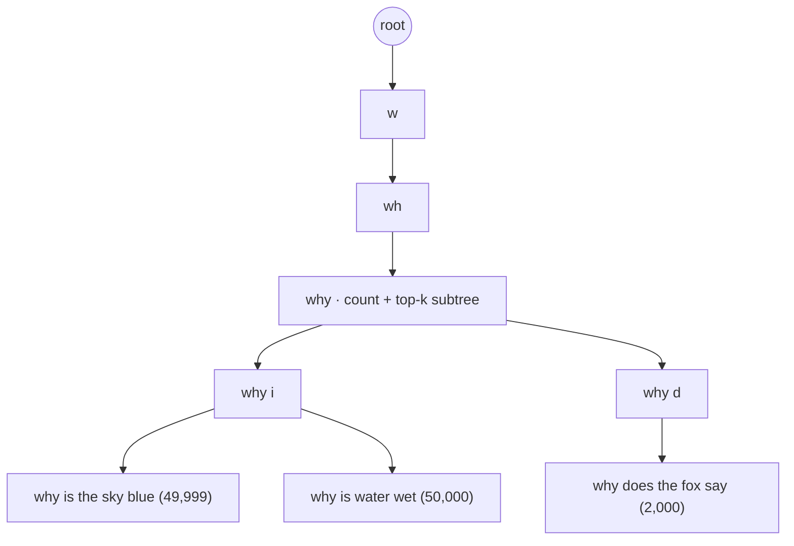
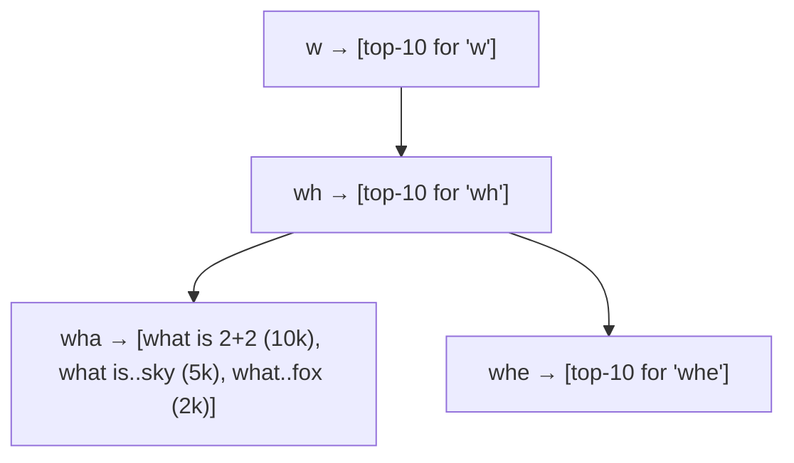
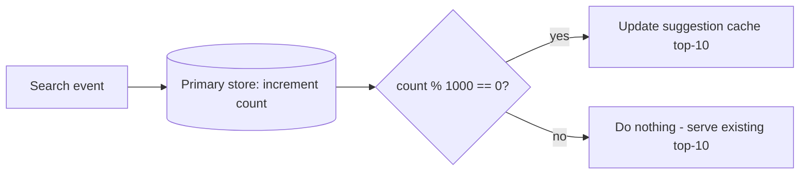
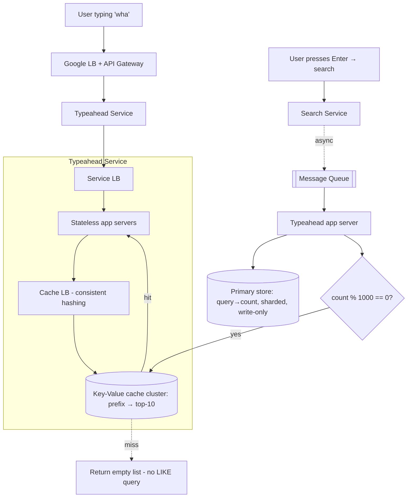

# Lecture 12: Designing Typeahead — Trie → Augmented Trie → Key‑Value, with Batching and Sampling

## Table of Contents
- [Overview](#overview)
- [Starting Point: Why the Trie Is the Obvious (Wrong) First Answer](#starting-point-why-the-trie-is-the-obvious-wrong-first-answer)
- [Sharding a Trie: Cardinality vs Hot Shards](#sharding-a-trie-cardinality-vs-hot-shards)
- [The Augmented Trie: Precompute the Top‑10](#the-augmented-trie-precompute-the-top10)
- [The Hidden Cost: Writes Explode](#the-hidden-cost-writes-explode)
- [Write Reduction 1: Batching](#write-reduction-1-batching)
- [The Pivot: Drop the Trie, Use a Key‑Value Store](#the-pivot-drop-the-trie-use-a-key-value-store)
- [Write Reduction 2: Sampling](#write-reduction-2-sampling)
- [The Final Architecture](#the-final-architecture)
- [Future Scope: Adding Recency and Trending](#future-scope-adding-recency-and-trending)
- [Try It Yourself](#try-it-yourself)
- [Homework / Next Lecture Preview](#homework--next-lecture-preview)

## Overview
We left [Lecture 11](./Lec11.md) with a fully-scoped problem: a Google typeahead that's **both read-heavy and write-heavy** (~2M reads/sec, ~2M writes/sec once we account for updates), holds ~320 TB, needs **sharding**, and tolerates **eventual consistency**. This lecture is the design. We start with the instinctive answer (a trie), discover *two* fatal problems (it can't cheaply return the top-10, and it shards into hot spots), fix the first with an **augmented trie**, then realize the augmentation has turned writes into a flood. Taming that flood with **batching** and **sampling**, and dropping the trie for a plain **key-value store**, gives us the real architecture — and a template for write-heavy, low-latency systems.

> 🔑 **Key Point (emphasized in class):** Stay on the MVP. The MVP is "10 suggestions ranked by overall frequency." Candidates who open by designing *trending* or *recency* signal that they can't focus on the problem. You're interviewing as an **architect**, not a founder or PM — the deliverable is a *design that solves the stated requirements*, not a list of clever features.

---

## Starting Point: Why the Trie Is the Obvious (Wrong) First Answer
Typeahead is prefix matching, and a **trie** is the textbook structure for prefixes — space- and time-optimal for "does this prefix exist?" So most people reach for it. Time complexity isn't the problem: looking up a prefix is `O(L)` (L = prefix length), and a hashmap is *also* `O(L)` because you must hash the whole string anyway. The trie has two *different* problems.

**Problem 1 — returning the top-10 is expensive.** Reaching the node for prefix `why` is easy, but the suggestions are *every* string in that node's subtree (counts stored at terminal nodes). To get the top-10 by count you must traverse the entire subtree (a DFS) — `O(n)` per query. With `q` queries that's `O(q·n)`. Unacceptable at 2M reads/sec.

**Problem 2 — sharding (next section).**

> 🤔 **Think About It:** A trie node is essentially `children[63]` (a–z, A–Z, 0–9, space), an `isTerminal` flag, and a `count` at terminals. Reading a prefix is fast — so why isn't the trie enough? (Because the *value* you must return — top-k over the whole subtree — requires walking the subtree. The fast part isn't the part that's expensive.)

---

## Sharding a Trie: Cardinality vs Hot Shards
320 TB can't live in one trie on one machine, so we shard: many tries, each on its own server, partitioned by prefix. The sharding key must avoid **fan-outs** — all suggestions for a prefix should sit on one shard.

- **Shard by first character** → low **cardinality**: at most 26 shards (English). 320 TB / 26 ≈ 12 TB/shard — far over the practical **~500 GB per database server** limit (a server also spends space/compute on indexes; smaller servers are cheaper). Not enough shards.
- **Shard by first 3 characters** → 26³ ≈ **17,000** possible shards. Plenty of cardinality.

But cardinality isn't the whole story — **load distribution is non-uniform**. Prefixes aren't equally popular:

> 🤔 **Think About It (the live Google Trends demo):** Compare `y`, `ipl`, and `zxz` in Google Trends. The `y`/`ipl` shards are slammed with reads *and* writes (and `ipl` spikes every cricket season), while `zxz` sits idle. A consistent hash can't save you here because a trie has **hard links** — every continuation of `why` must live on the *same* shard, or the trie is pointless. So you can't randomly scatter the data. This produces permanent **hot shards**.

Practical hacks (vertically scale the hot shard; subdivide it one more level by the next character — at the cost of an extra network hop) help ~90% of the time in production but won't satisfy an interviewer. The trie's link structure is the root cause — keep this in mind; it's why we eventually abandon the trie.

---

## The Augmented Trie: Precompute the Top‑10
Fix Problem 1 the same way we optimize repeated subtree queries on a binary tree: **precompute and store the answer at each node** (an *augmented data structure*). Recall the "sum of the subtree rooted at node X" problem — brute force is `O(n)` per query; precomputing each node's subtree-sum makes every query `O(1)`. Same idea here: at every trie node, store its **top-10 suggestions**.

Now each keystroke returns suggestions in `O(1)` — read the node for the current prefix, return its stored list. Problem 1 solved.

> 🔑 **Key Point:** Augmentation (a *prefix-sum tree*) is great for **static** data but bad for **updates** — unlike a segment tree, it's not optimized for both. That distinction is about to bite us hard.

---

## The Hidden Cost: Writes Explode
The stored top-10 lists are derived from counts. When a search increments a count, that change can alter the top-10 of **every ancestor node** up to the root. So one search (`what does the fox say`) can trigger up to ~10 list updates (one per prefix length).

We had ~200,000 searches/sec (= 200,000 writes/sec to the raw counts). With ~10 cascading updates each, the **suggestion store now sees ~2 million writes/sec** — on top of ~2 million reads/sec. The system is now **heavy on both reads and writes**, and *no single database is optimized for both*.

> 🤔 **Think About It:** Can we just *postpone* writes (flush every 15–30 min)? No — postponing doesn't *reduce* writes; the backlog still has to drain, and the sync will spike latency exactly when we can least afford it (reads suffer while writes run). We must genuinely **reduce the number of writes**.

---

## Write Reduction 1: Batching
Separate two stores with different jobs:
- **Primary store** — `(query → count)`. Write-heavy, never read by users. Every search increments a count here.
- **Suggestion cache** — `(prefix → top-10 list)`. Read-heavy *and* (naively) write-heavy.

**Batching:** don't update the suggestion cache on *every* count change — only when the count crosses a **threshold**. Simplest implementation: update when `count % 1000 == 0`. So a query's suggestions refresh roughly every 1,000 searches, not every search.

This cuts cache writes by ~**1000×** (from ~2M/sec to a few thousand/sec) — comfortably within a key-value store's ~10⁶ ops/sec, so reads are no longer starved. Crucially, **batching causes no data loss** — every search is still counted in the primary store; the cache just lags. You serve slightly **stale** suggestions, which is fine because we already chose eventual consistency.

---

## The Pivot: Drop the Trie, Use a Key‑Value Store
Step back and look at what the augmented trie actually stores: at each node, `prefix → top-10 list`. That's a **key-value pair**. The trie's tree structure is now dead weight — and worse, its hard links are exactly what caused the hot-shard problem. So **delete the trie and store `prefix → top-10 list` directly in a hashmap / key-value store.**

| Key (prefix) | Value (top-10 suggestions with counts) |
|---|---|
| `wha` | `[what is 2+2 (10k), what is the color of the sky (5k), what does the fox say (2k), …]` |
| `what` | `[what is 2+2 (10k), what is the color of the sky (5k), …]` |
| `how` | `[how to tie a tie (8k), how old is …, …]` |

The payoff is huge: with no inter-key links, we can **shard by the full prefix string via consistent hashing**, scattering keys uniformly across servers. `y`, `ys`, `y is`, and `zxz` can all land on different shards — the **hot-shard problem disappears**. And the trie's only real advantage (space efficiency from shared prefixes) doesn't matter here: data is sharded across thousands of cheap servers, so *space is not the constraint*. (A trie wins when you must fit data in **one machine's memory**; that's not our situation.)

> 🔑 **Key Point:** The trie is the right tool for in-memory, single-machine prefix work. At sharded scale, a key-value store + consistent hashing beats it — uniform distribution matters more than space, and you can always add servers. Recognizing when to *drop* the elegant structure is the senior move.

---

## Write Reduction 2: Sampling
Batching kept all the data. If we're willing to **lose** some, we can cut writes further. Do we need *exact* counts? No — we only need the **ranking/trend**. Whether a query was searched 10,000 or 9,000 times doesn't change which 10 suggestions we show.

**Sampling:** consume only ~**10%** of search events from the message queue, chosen at random; ignore the rest. Writes drop ~10×. The stored counts become *wrong* (scaled down, noisy), but because sampling is random, **popular queries are still proportionally more likely to be recorded**, so the ranking is preserved.

> 🤔 **Think About It (the exit-poll analogy):** TV channels predict election results without polling every voter — they sample a few thousand random people and extrapolate. This works by the **law of large numbers**: a sufficiently large *random* sample reflects the whole population's behavior. Sampling our search stream is the same trick. (Caveat: it fails on *small* datasets — polling 10 of 100 people is unreliable; sampling a billion queries at 10% is not. If your data is small, raise the sample rate.)

| Technique | Writes reduced? | Data loss? | When to use |
|---|---|---|---|
| **Batching** | Yes (~1000×) | **No** (counts exact, suggestions stale) | Always acceptable here; eventual consistency |
| **Sampling** | Yes (~10×) | **Yes** (counts wrong, ranking preserved) | Only when you care about *trends*, not exact counts |

---

## The Final Architecture

Reading the flow:
- **Read path (typing):** request → Google LB/gateway → typeahead service → its own LB → **stateless** app servers (any request to any server; no session) → cache LB → consistent-hashed **key-value cache** → return the prefix's top-10. **Cache miss → return an empty list.** We do *not* fall back to the primary store with a `LIKE` query — that's slow, and the primary store holds `query→count`, not suggestions. (Missing suggestions for a few seconds is fine — consistency was never a goal.)
- **Write path (search):** on Enter, the search service publishes the query to the **message queue**; a typeahead app server consumes it, upserts the count in the **sharded primary store**, and — only when the threshold trips — pushes the refreshed top-10 to the cache.
- **Persistence:** also persist the cache to disk so a restarted server reloads instead of rebuilding from scratch.

**What database for the primary store?** Default to **SQL (e.g., Postgres)** — the data is structured, and *your go-to is always SQL unless you have a concrete reason otherwise*. Use `varchar` (memory-efficient; recall the [Lecture 9](./Lec09.md) update problem — but we never edit the query text, only the count, so it's fine), and index on the **first 5–6 characters**, not the whole 10-char query. (An LSM store works too, but SQL is the cleaner default here.)

> 🤔 **Think About It (an interviewer will push on this):** "Updating a query's suggestions writes to ~10 different cache shards (one per prefix length) — isn't that a terrible fan-out?" Defend it: it's ~10 shards out of *thousands*, we don't wait for an **acknowledgement**, there's no **two-phase commit**, and consistency doesn't matter — fire and forget. The *same* fan-out *would* be terrible if you needed acks or atomicity across those shards. Context decides whether a fan-out is acceptable.

---

## Future Scope: Adding Recency and Trending
Ranking purely by all-time count is wrong for trends: `iPhone 7` (launched 2014, huge cumulative count) would outrank `iPhone 17` (just launched, small-but-spiking count) — even at 10% sampling, 10% of a giant number beats 10% of a small one. Options, easiest first:

- **Decay (recommended, easiest):** every night, multiply all counts by, say, 0.9. Old queries bleed away while fresh searches keep topping up, so recent activity dominates. A query searched ~1,000×/day converges to `1000 / (1 − 0.9) = 10,000`, not infinity — so steady-but-old terms settle at a bounded value while a *spiking* term shoots past them. Use **linear** decay to keep ~weeks of history, **exponential** decay to favor only the last few days.
- **Time-window counts:** keep extra columns — total, last-week, last-day — and rank with a weighted blend; reset the window periodically (fixed window) or slide it.
- **Moving average / EMA:** a **moving average** over the last 7 days smooths daily noise; an **exponential moving average (EMA)** weights today most heavily, surfacing trends fastest. (The faculty's first industry project was exactly an EMA-based trending system — it worked very well.)

Further future scope (from the written notes): **geolocation** (keep `global:query` and `India:query` counters; merge for Indian users), **client-side personalization** (browser merges local history with backend suggestions), and **typo handling** (also count the spell-corrected query; at lookup, merge suggestions for the prefix and its correction using edit distance, à la Norvig's corrector).

---

## Try It Yourself
1. **Defend or refute the fan-out.** Two designs each write to ~10 shards per request: (a) our typeahead cache update, (b) a bank transfer that must debit and credit across shards. One is fine, one is not — explain precisely what makes the difference (ack? 2PC? consistency?).
2. **Batching vs sampling.** A trending-news ticker must never *miss* a story but can show slightly stale view-counts. Which technique fits, and which would be wrong? Now change the requirement to "approximate view-counts are fine, minimize writes at all costs" — does your answer flip?
3. **Kill the trie (or don't).** Give one workload where a trie genuinely beats a sharded key-value store for prefixes, and one where it loses. What property decides it (hint: single-machine memory vs sharded scale)?
4. **Make IPL 17 win.** With all-time counts, `IPL 2016` outranks `IPL 2026`. Design a decay constant (per-day multiplier) so a query spiking today overtakes a 10-year-old favorite within a week. Sketch the count trajectories.

## Homework / Next Lecture Preview
- **Build the full typeahead (individual assignment).** On your own machine, stand up an app server, **multiple Redis servers** with **consistent hashing**, and database servers — all in **Docker** (so it runs identically on the grader's machine). You may use AI to generate the front-end and Docker setup (treat them as black boxes), but you must *understand and be able to reproduce* the **core logic**: consistent hashing, key-value lookup, and **batched writes**.
- **Coming next ([Lecture 13](./Lec13.md)):** a new case study — **design a messaging app (WhatsApp-scale)**. Class has already begun gathering its requirements: one-to-one + limited-size group chats, media/reactions (just S3 links), the **speed-of-light** latency floor, and — unlike typeahead — a hard need for **immediate consistency and zero data loss**. Run the same four-step method: understand → functional → non-functional → scale → design.
