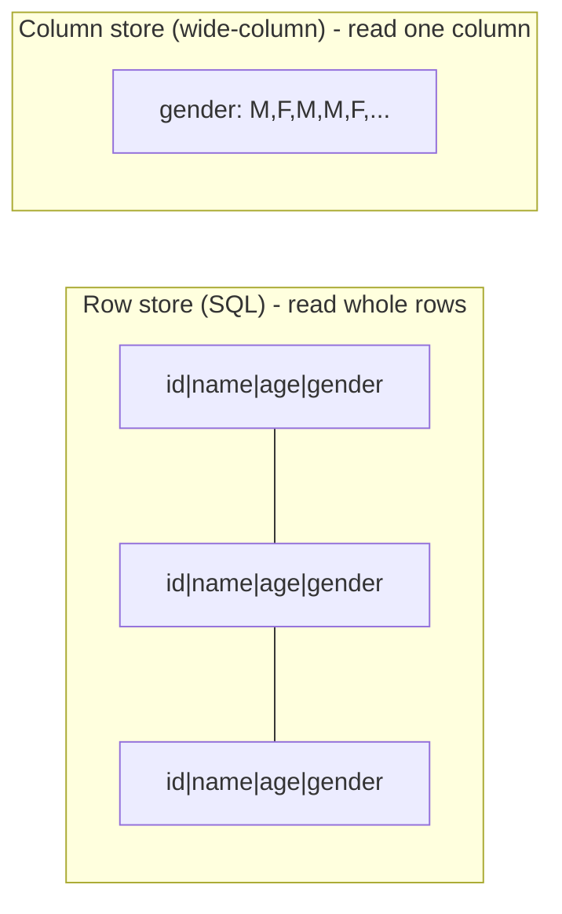
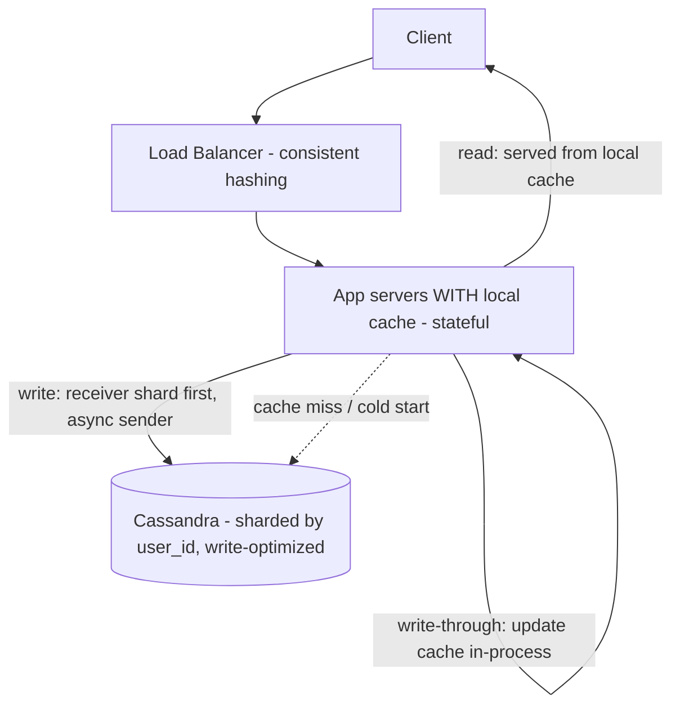

# Lecture 14: Messaging App (Part 2) — Idempotent Payments, Choosing Cassandra, Local Caches, and WebSockets

## Table of Contents
- [Overview](#overview)
- [Idempotency, Revisited: Why Payments Are Different](#idempotency-revisited-why-payments-are-different)
- [Why Not SQL for Messages?](#why-not-sql-for-messages)
- [The NoSQL Menu (and When to Use Each)](#the-nosql-menu-and-when-to-use-each)
- [How Facebook Messenger Led to Cassandra](#how-facebook-messenger-led-to-cassandra)
- [Choosing the Database: Cassandra](#choosing-the-database-cassandra)
- [Designing the Cache: Local, Write-Through, LRU](#designing-the-cache-local-write-through-lru)
- [Data Transfer: HTTP vs WebSockets (and MQTT)](#data-transfer-http-vs-websockets-and-mqtt)
- [Next Case Study: IRCTC (Requirements)](#next-case-study-irctc-requirements)
- [Try It Yourself](#try-it-yourself)
- [Homework / Next Lecture Preview](#homework--next-lecture-preview)

## Overview
Part 1 ([Lecture 13](./Lec13.md)) settled the *requirements and core tricks* for a WhatsApp-scale messaging app — sharding by `user_id`, the receiver-shard-first consistency illusion, client-side `message_id` for idempotency/ordering. This lecture finishes the design by making the two biggest infrastructure decisions: **which database** (a write-optimized wide-column store — Cassandra) and **which cache** (a *local* write-through cache), plus the **transport protocol** (WebSockets for live messages). We also sharpen **idempotency** with the payments case, where "exactly once" is non-negotiable, and introduce the next case study, **IRCTC**.

> 🔑 **Key Point (emphasized in class):** When a system is *both* read- and write-heavy and you need immediate consistency, you can't batch or sample writes away — so you **absorb the reads in a cache** and make the **database write-optimized**. That single move drives both the DB choice and the cache design below.

---

## Idempotency, Revisited: Why Payments Are Different
In chat, an accidental duplicate message is annoying but survivable (≈1% dupes won't hurt users). In **payments**, a duplicate is catastrophic. A user who taps **Pay ₹5000** several times (UI lag, impatience, or a frontend bug firing multiple requests) must be charged **exactly once**.

> 🔑 **Key Point:** Any operation that moves money must be **idempotent** — performed any number of times, it has a single effect. The mechanism is the same as for messages ([Lecture 13](./Lec13.md)): attach a **client-generated idempotency key** (e.g., a transaction id) to the request; the server commits the charge only if that key hasn't been seen, otherwise it returns the prior result without re-charging. The difference from chat is the *stakes*, not the technique.

---

## Why Not SQL for Messages?
Your default is always SQL ([Lecture 9](./Lec09.md)) — so justify *leaving* it. Walk the SQL strengths and check each against this workload:

- **ACID / atomicity?** Not needed. A `sendMessage` is a *single* write, not a multi-statement transaction. Messages are **immutable** (even "edit" stores a new version), so there are no concurrent updates to isolate. We only need **durability** — which *every* database provides.
- **Strict schema?** A liability here. Add one column later (say a `seen`/`delivered` status) and you must run a **table migration** across thousands of servers — a full rewrite, requiring **rolling deployment** and inflicting **downtime on a slice of users** at a time.
- **"Jack of all trades"?** Expensive at this scale. SQL spends RAM and CPU optimizing reads (buffer pool, B+ tree indexes, query planning). The more data per server, the more **RAM + compute** you must buy proportionally — so SQL servers get costly fast. Indexes also eat disk.
- **Operational reality.** You're adding cheap servers *daily* to absorb 20 TB/day; with consistent hashing that means constant **data migration**, and ~**10% of servers are always down** — every outage triggers more migration.

So SQL gives us guarantees we don't need (ACID, strict schema, read-optimization) at a cost we can't afford. We want something **write-optimized, schema-flexible, and self-healing**.

> 🤔 **Think About It:** Adding a single `status` column sounds trivial. Why is it a big deal at WhatsApp scale? (Because a rigid schema means a migration across every shard — a giant rewrite with downtime. A schema-flexible NoSQL store lets you just start writing the new field.)

---

## The NoSQL Menu (and When to Use Each)
| Family | Use it when… | Examples | Not for |
|---|---|---|---|
| **Document** | Semi-structured records, each with different fields; index on any attribute; full-text search (Elasticsearch) | MongoDB, CouchDB, Elasticsearch | joins, cross-doc transactions |
| **Key-Value** | `get(key)`/`set(key)` only; caches, counters | Redis, Memcached, DynamoDB | searching/joining on *values* |
| **Column-Family / Wide-Column** | High write throughput; **analytics** (aggregate few columns over many rows); time-series | Cassandra, ScyllaDB, HBase, KDB | searching inside values; joins |

**Document stores** key each record by a unique id (`_id` in MongoDB), allow nesting, and let you index any top-level attribute — but offer **no joins** (no foreign-key enforcement), so you store *denormalized* data and lose strong consistency by default.

> 🔑 **Key Point — read internals, not marketing (the MongoDB cautionary tale):** MongoDB once advertised strong consistency; clients lost data discovering it wasn't, sued, and the claim was pulled — later they genuinely added ACID, now bannered on their site. An architect must understand *how a database is built and what it trades off*, not trust a homepage. (MongoDB *can* offer ACID — but across shards the latency is brutal, which the docs won't tell you.) Assume any NoSQL store is **basically available, eventually consistent** unless you've verified otherwise.

**Why column storage helps analytics.** SQL stores a **row** contiguously, so "what % of users are male?" must read *every* block of the table (all columns) just to count one column. A **wide-column** store keeps each *column* contiguously, so that query reads only the gender column — far fewer disk seeks.

> 🔑 **Key Point:** SQL excels at **transactions** (touch many columns of a few rows). Wide-column stores excel at **analytics / aggregates** (touch few columns across many rows) and **time-series**. Pick by access pattern.

---

## How Facebook Messenger Led to Cassandra
This isn't hypothetical — it's the real origin story. Facebook Messenger ran on MySQL and hit exactly our walls: daily server additions → constant data migration; ~10% of servers always down → 10% of users always degraded; and consistent hashing **doesn't guarantee** that adding a server relieves the *hottest* one (it relies on randomness).

Then came **inbox search** ("find every message containing *exam*"). In SQL you'd use `WHERE text LIKE '%exam%'` — but `LIKE` does a naïve substring match (`O(n·m)`) across *every* row. The fix is an **inverted index** (word → list of message ids), exactly like the index at the back of a textbook:

| word | messages |
|---|---|
| `exam` | 123, 124, 125 |
| `hld` | 123 |
| `tomorrow` | 123 |

Search `exam` → one indexed lookup → join to fetch the messages. (Solr existed but didn't auto-scale; you'd build scaling yourself.) Maintaining this index in SQL just *added* data and complexity. Two engineers — **Avinash Lakshman** (a DynamoDB co-creator) and **Prashant Malik** — built a purpose-made store: **Cassandra**.

---

## Choosing the Database: Cassandra
Cassandra is a **wide-column** database whose storage engine is the **LSM tree** ([Lecture 10](./Lec10.md)) — so writes are sequential appends (memtable + WAL), giving very high write throughput, while reads are good because a whole partition/column is fetched together (few seeks). It was engineered as a *complete distributed solution*, not just an engine:

- **Peer-to-peer, no master.** Servers share state via a **gossip protocol**, so when a server dies (the 10%-always-down reality) **no data migration** is needed — peers already hold the data and a request just reroutes. Stays **available** (AP: available + partition-tolerant, eventually consistent).
- **Smart partitioning.** SSTables can be sorted by **key or timestamp**, so you partition by `user_id` **and** time (e.g., this user's messages for this month on one node) — ideal for **time-series** and it kills **hot shards** (one user's history spreads across machines).
- **Built-in scaling** — load balancing and an optimized consistent hashing that actually relieves the busiest node when you add capacity.

> 🔑 **Key Point:** The **Cassandra paper** by Lakshman & Malik is **mandatory reading** (expect exam questions). You'll recognize all of it from this course — LSM trees, consistent hashing's pitfalls, and the inbox-search/partitioning solution.

Cassandra handles our ~400,000 writes/sec well. But **no single store** comfortably serves *both* 800,000 reads/sec and 400,000 writes/sec — push it on both and one latency suffers. We can't shrink the writes (immediate consistency rules out batching/sampling), so we **offload reads to a cache** and let Cassandra be write-optimized.

---

## Designing the Cache: Local, Write-Through, LRU
A useful 5-step cache framework: (1) establish the need, (2) choose local vs global, (3) pick an **invalidation** policy from consistency needs, (4) pick an **eviction** policy, (5) decide routing/load-balancing.

- **Need:** established — Cassandra can't take 800k reads on top of the writes.
- **Local vs global?** A **global distributed cache** (e.g., a Redis cluster) would need roughly as many servers as our app tier *and* a **two-phase commit** to keep cache+DB consistent on every write (write-through across two systems = high latency). Instead, make the **app servers double as the cache (local cache)**: a write-through update to a local cache is just an in-process variable update — **no 2PC, no ack wait** — giving **immediate consistency *and* low latency**.

- **Invalidation = write-through.** Because the cache is local, every DB write also updates the in-process cache immediately — consistent with no latency penalty (a global cache would have needed 2PC). Write-back risks loss on crash; write-around is only eventually consistent — both rejected.
- **Eviction = LRU.** The cache holds only recent conversations (you can't cache 200 PB); least-recently-used data is dropped.
- **Routing = consistent hashing (servers are now stateful).** A local user cache means a user's requests must reach *their* app server, so you can't round-robin — use consistent hashing. Power users (~5–10%) spread randomly across servers, so no single hot server.

> 🤔 **Think About It (cache server crash):** With local caches, a crashing app server loses its cached data. Consistent hashing reroutes those users to the next server, which doesn't have their cache — a **cold start** (fetch from Cassandra, slightly higher latency for the first reads). Only the ~10% of users on the crashed node are affected, and only briefly. (This is the "WhatsApp opens a bit slowly sometimes" experience.) The system stays **available** for everyone — the right trade-off.

> 🔑 **Key Point:** **App servers scale by load; database servers scale by data.** Normally app servers are stateless and you add/remove them freely with elastic load balancing — but a local cache makes them stateful, so we accept consistent-hashing routing as the price of a free, consistent, low-latency cache.

---

## Data Transfer: HTTP vs WebSockets (and MQTT)
REST/SOAP/GraphQL are **frameworks**, not transport protocols — they ride on **TCP/HTTP**. Plain HTTP does a **3-way handshake**, transfers, then **closes** the connection; the next request handshakes again. For a live chat that re-handshake per message is pure added latency.

A **WebSocket** upgrades from an initial HTTP request into a **persistent, bidirectional** connection — open once, then push data both ways with no new handshakes. But you don't make the *whole* app a WebSocket; decide per API:

| API | Transport | Why |
|---|---|---|
| `getConversations` | HTTP | not live; fetched on app open |
| `getMessages` (history, paginated) | HTTP | old messages aren't live |
| `sendMessage` / live incoming | **WebSocket** | continuous, low-latency, bidirectional |
| "typing…" indicator | **WebSocket** | live presence |

For live delivery, the server **pushes** new messages over the socket (the API is the *contract* defining the data shape — the client isn't polling). Behind it, messages flow through a **message queue** to a **notification service** (e.g., Apple's APNs).

> 🔑 **Key Point — a WebSocket is *not* peer-to-peer.** It's still **client↔server**: A's message goes to the backend, then to B. True P2P (BitTorrent, DC++) connects machines directly. (Also: sockets time out if idle too long — they aren't open forever.)

Real-world notes: WhatsApp actually keeps **no message database** — only a user DB; messages live in a **persistent message queue** (deleted on expiry). It uses **MQTT** (a lightweight publish-subscribe protocol), not raw WebSockets, and **end-to-end encryption via the Signal protocol**. Don't volunteer security/encryption design in an interview unless you're a genuine expert — say "I'd use an established protocol like Signal" and move on.

---

## Next Case Study: IRCTC (Requirements)
The class then opened **IRCTC** (Indian Railways booking). The *full design* is in [Lecture 16](./Lec16.md); here are the requirements, because they teach a crucial idea: **consistency is decided per-API, not per-system.**

**Functional (MVP):** `searchTrains(source, destination, date, class, limit, offset)`, `getSeatAvailability(train_id, source, destination, class)`, `bookTicket(train_id, user_id, route, class, date, passengers[])`, `getTicketStatus(ticket_id)`. (No seat selection; cancel/view-history/admin = future scope.)

**Non-functional — per-API consistency:**
- **Search → eventually consistent.** A just-added/removed train showing up late is fine: railways add/remove trains over *months*, far longer than the minutes our system needs to converge. (Search is usually served by a cache or Elasticsearch, not the primary DB — so it's eventually consistent almost everywhere.)
- **Seat availability → eventually consistent.** You see "100 seats," but filling the passenger form + payment takes ~10 minutes, during which others book — so an exact live count is pointless. Block seats only **once payment is initiated**, not while browsing.
- **Book ticket → immediately consistent.** No **double-booking**, no **overbooking** (unlike airlines, which overbook expecting cancellations). This is the one API that demands strong consistency.

> 🔑 **Key Point:** "Eventual consistency" doesn't mean you *prefer* stale data — it means the system is *fine* if immediate consistency isn't achieved for that API. You decide per API which ones can tolerate it.

**Scale:** India ~1.4 B → ~10% have IRCTC accounts (MAU) → ~1% daily active (Pareto **inverted again** — people book rarely) → ~2 tickets/active user. The QPS may look tiny, **but solve for the worst case**: the **Tatkal window** spikes load ~**100×**. Size the system for `peak = 100 × average`.

---

## Try It Yourself
1. **Justify the DB switch.** A teammate says "just use Postgres with read replicas." Rebut with three concrete costs of SQL at this scale (schema migration, RAM/CPU per GB, consistent-hashing migration) and name the property of Cassandra that fixes each.
2. **Local vs global cache.** Show why a *global* write-through cache forces a two-phase commit but a *local* one doesn't. What new problem does the local cache create, and how does consistent hashing + accepting cold starts resolve it?
3. **Pick the transport.** For a stock-trading app, classify each as HTTP or WebSocket and justify: (a) fetch last 30 days of trades, (b) live price ticker, (c) place an order, (d) load account settings. Where would you (incorrectly) be tempted to call a WebSocket "peer-to-peer"?
4. **Per-API consistency.** For IRCTC, explain why `getSeatAvailability` can be eventually consistent but `bookTicket` cannot — using the ~10-minute form/payment gap. Then design *when* to lock a seat so you neither block browsers nor allow double-booking.

## Homework / Next Lecture Preview
- **Read the Cassandra paper** (Lakshman & Malik) — **mandatory**, examinable.
- **Scale-estimate and design IRCTC** (account for the Tatkal 100× peak); be ready to **present** the design.
- **Explore message queues** — we'll dig into them in an upcoming class (they're how live messages reach the notification service).
- **Coming next:** an **e-commerce** case study ([Lecture 15](./Lec15.md)), then **Netflix**; the **IRCTC design + video streaming** are worked through in [Lecture 16](./Lec16.md), and an **Uber** case study follows in an extra class.
