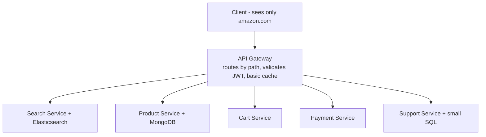
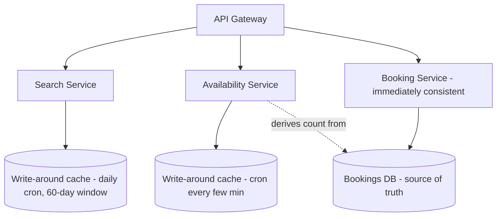

# Lecture 15: Monolith vs Microservices, the API Gateway, Inter‑Service Communication — and IRCTC as Microservices

## Table of Contents
- [Overview](#overview)
- [E-Commerce: One Product, Many Teams](#e-commerce-one-product-many-teams)
- [Monolith Architecture and Its Drawbacks](#monolith-architecture-and-its-drawbacks)
- [Why One Size Doesn't Fit All Services](#why-one-size-doesnt-fit-all-services)
- [Microservices and the API Gateway](#microservices-and-the-api-gateway)
- [The Distributed-System Tax](#the-distributed-system-tax)
- [Inter-Service Communication: REST → RPC → gRPC](#inter-service-communication-rest--rpc--grpc)
- [Applying It: IRCTC as Microservices](#applying-it-irctc-as-microservices)
- [Try It Yourself](#try-it-yourself)
- [Homework / Next Lecture Preview](#homework--next-lecture-preview)

## Overview
This lecture is about the *shape* of a large system, not a single feature. Using an e-commerce platform as the example, we see why a **monolith** breaks down at scale and how **microservices** fix it — at the cost of becoming a distributed system. We cover the **API gateway** that fronts the services, and the all-important question of **how services talk to each other** (REST vs RPC vs gRPC, synchronous vs asynchronous). Finally we apply the microservice lens to **IRCTC**, designing its search and availability services (the booking service is completed in [Lecture 16](./Lec16.md)).

> 🔑 **Key Point (emphasized in class):** Don't *start* with microservices. Begin with a monolith; migrate only when its drawbacks (deployment, per-service scaling, team coordination) actually hurt. Premature microservices buy you a distributed system's complexity — latency, debugging, testing — before you need it.

---

## E-Commerce: One Product, Many Teams
"Design Amazon" isn't one feature — it's dozens of distinct subsystems across three actor groups:

| Actor | Subsystems |
|---|---|
| **Customer** | wishlist, address (in user management), payment, delivery & tracking, reviews (read *and* write — different jobs), customer support, return/replace |
| **Vendor** | inventory + pricing (IPMS — usually one team), order processing, billing/payment, coupons/discounts, ads (pay to rank), vendor-side search, support dashboard |
| **Platform** | legal & vendor onboarding, platform-wide analytics/data-science (what's trending, where to pre-stock warehouses) |

No single person — or single codebase — builds all this. Each subsystem is a **single responsibility** (SOLID applied at the system level): one team, one reason to change. The question is how to *deploy* them.

---

## Monolith Architecture and Its Drawbacks
Compile everything into **one executable** (`ecommerce.jar`) and run it on a server. Internally it may have thousands of well-separated classes/packages — but it ships and runs as **one unit**. That's a **monolith**.

You *can* still scale a monolith — put a load balancer in front and run many identical copies (vertical or horizontal scaling is independent of code structure). But the monolith has deep problems:

- **Single point of failure / no fault isolation.** All code runs in one process, so a bug in the *least*-used service (say customer support, ~10 requests/sec) — a segfault, a bad memory access — **crashes the entire app**, and the retry storm cascades across all replicas.
- **Coupled deployment.** Fixing one line means **redeploying everything** (rolling deployment limits downtime, but the whole artifact redeploys). Compiling and loading a giant codebase is slow; IDEs choke; an AI assistant's context budget is blown loading it.
- **Tight coupling.** No matter how clean, some coupling remains; a fix in one area can silently break another, and with thousands of developers you can't guarantee code quality across the shared base.
- **Can't specialize per service** (next section).

> 🤔 **Think About It:** After you've scaled a monolith to hundreds of servers, is it still a single point of failure? **Yes** — scaling adds *capacity*, not *fault isolation*. One undetected bug in one service still takes down every replica. Scaling ≠ resilience.

---

## Why One Size Doesn't Fit All Services
Different subsystems have genuinely different needs — a monolith forces a single compromise:

- **Database.** Product catalog → **document store (MongoDB)** for varied attributes. But Mongo's index is a prefix-based B-tree — typing `polo` won't match a "black polo" if you indexed the title, and partial/typo queries fail. E-commerce search needs an **inverted index (Elasticsearch)** indexing every field and prefix, typo-tolerant. Customer support → a small **SQL** DB. *Each service wants a different database.*
- **Tech stack.** A recommendation engine wants **Python** (ML libraries); a Java monolith can't host it without rewrites or wrappers.
- **Hardware/scale.** Elasticsearch needs lots of **RAM**; customer support needs almost none. In a monolith you must scale every service to the *peak* service's needs on *uniform, expensive* servers — wasteful. You want to scale **each service to its own load on servers sized to its own needs**.

> 🔑 **Key Point:** Scale and provision **per service**. Search gets RAM-heavy servers scaled to DAU; customer support gets cheap, low-RAM servers scaled to ~1% of orders. That cost optimization is impossible in a monolith.

---

## Microservices and the API Gateway
Split each subsystem into an **independent codebase** that deploys, scales, and is provisioned **on its own**, with its own database/tech/cache. That's **microservices**. (Textbooks say services must be fully independent, communicating only via APIs with nothing shared; in practice you allow shared data and direct communication where it's pragmatic — e.g., a central IPMS database many services read.)

But now every server runs *different* code — whose IP does DNS point to? You front everything with an **API gateway**: an intelligent load balancer that inspects each request and routes it to the right microservice. The user only ever sees `amazon.com`; whether it's a monolith or microservices is invisible.

The gateway can do basic auth (validate a JWT), light caching, and routing. Note **load balancers come in layers**: an **L3/L4** LB works near the wiring/transport layer and just forwards to clusters (it can't read the request); an **L7** LB (the gateway) reads the **HTTP header** (e.g., `user_id` for sharded/stateful routing). Real products: **Nginx, Kong, HAProxy** (many also load-balance *within* a microservice's own app servers).

> 🔑 **Key Point — auth in microservices:** An **auth service** issues a JWT on login. The **API gateway** validates the token (authentication — "is this a real user?"). The **target microservice** still does authorization ("can *this* user do *this* action / are they admin?"). Don't skip per-service authorization.

---

## The Distributed-System Tax
Microservices turn your app into a **distributed system**, so all the hard problems return — problems a monolith never had (shared RAM/OS/hardware made logging, concurrency, atomicity, and consistency easy):

- **Latency & consistency.** A call that was an in-process function (`cart.func()`) is now a **network call** to another service — with latency, and consistency/availability concerns.
- **Debugging is hard.** A failure can originate in service A, propagate undetected through B, and blow up in C's logs. You backtrack across services — which is why large orgs have **Site Reliability Engineers (SRE)** / engineering-systems teams whose job is to localize failures fast (often first surfaced by a customer, not your alerts).
- **Testing is hard.** End-to-end tests must spin up many services and verify a change doesn't break downstream via inter-service calls — hence dedicated **QA/SDET** teams (increasingly automated by agentic workflows).

> 🤔 **Think About It:** Given all this, why ever choose microservices? Because at sufficient scale the monolith's pains (coupled deploys, can't specialize, one bug kills everything) outweigh the distributed tax. It's a **trade-off of disadvantages** — decide by your scale, team size, and which pains you're actually feeling.

---

## Inter-Service Communication: REST → RPC → gRPC
Services talk in one of two modes — the same **sync vs async** distinction from [Lecture 11](./Lec11.md):

- **Asynchronous** (fire-and-forget): use a **message queue** (Kafka). The producer publishes an event; any service subscribes. The producer doesn't know its subscribers — like the **observer pattern**, but the publisher here doesn't even maintain a subscriber list. (Used in the [Lec13/14](./Lec14.md) messaging async writes and the [Lec12](./Lec12.md) typeahead pipeline.)
- **Synchronous** (wait for the response): the interesting case below.

For synchronous calls you *could* use **REST**, but REST is built for **client↔server** and carries overhead you don't need *between trusted internal services*:
- It assumes a **possibly-malicious client**, so requests carry auth tokens, cookies, JWTs in headers — wasted bytes between your own servers.
- You must define every endpoint (URL + GET/PUT/POST — often ambiguous).
- It **serializes** objects to JSON strings. Serialization is computationally real (recursive/cyclic structures need a visited-set DFS) and memory-wasteful (a 2-valued `color` field becomes a multi-byte string when **1 bit** suffices).

So for internal communication, use a **Remote Procedure Call (RPC)**: an abstraction that lets you call a function on a *remote* server as if it were local — no API to define, no manual serialization, and **language-agnostic** (adapters let a Java service send an object a Python service receives). RPC still serializes, but drops the headers/JWT/cookies overhead.

At Google's scale even RPC's JSON serialization was too slow across millions of calls/sec, so they built **gRPC** with **Protocol Buffers (protobuf)** — it transfers data in **binary** directly (no JSON-string round trip), making it ~**100–1000× faster** for those use cases. gRPC is open-source but **not for browsers** (it needs a `.proto` contract on both ends — it's microservice-to-microservice, not client-server).

> 🔑 **Key Point — stubs/contracts:** RPC needs **stubs** (the agreed input/output contract). Defining them is where most of the time goes (stakeholders align on exactly what data flows). And like a REST API, you **can't change a stub unilaterally** — you version it, or you break every caller. After the contract is fixed, each service deploys and scales independently.

---

## Applying It: IRCTC as Microservices
IRCTC has three MVP APIs with *different* non-functional needs ([Lecture 14](./Lec14.md)) — search (eventually consistent), availability (eventually consistent), booking (immediately consistent) — so model each as its **own microservice**, with its own DB/cache/scale.

**Load estimation.** India ~1.4 B → ~10% have IRCTC accounts (140 M MAU) → ~1% daily active (Pareto inverted — booking is rare; ~1.4 M DAU) → ~2 tickets/user ⇒ ~3 M bookings/day ⇒ ~**30 writes/sec** (light!). But **solve for the worst case** — the **Tatkal** window spikes ~100× ⇒ ~**3,000 writes/sec** (moderate-heavy). Reads (search/availability) are ~10× ⇒ ~**30,000 reads/sec**.

### Search service (eventually consistent)
Store a train schedule: `(train_id, source_id, arrival, departure)` — one row per stop, ordered by arrival; running-days in a normalized table. A query (source, destination, date) means: find trains running that day where both stations appear with `arrival(source) < arrival(destination)`. Doing this purely in SQL is ugly, so you'd fetch the day's trains and filter in the app layer — **heavy on both DB and compute** at 30k req/sec.

Fix with a **cache**: key = `source:destination:date(:page)`, value = the **precomputed, paginated** result list (same key trick as the [Lec12](./Lec12.md) leaderboard). Make it a **write-around cache** filled by a **daily cron job**: bookings open ~**60 days** ahead, so each midnight the job drops yesterday's data and adds day-60's, and during that pass also removes any **discontinued** trains (so a cancelled train disappears within **1 day** — that's the "eventual" in eventual consistency, not 60 days).

Sizing: ~15k trains × 60 days × ~20 stops ≈ 18 M rows × ~100 B ≈ **1.8 GB** — fits on one server, but you still **replicate** (not shard) so 30k req/sec don't fall through to the DB if a cache node dies. It's small enough to even live **on the app servers** (their only job is fetch-and-return). Denormalizing to key by source+destination pairs (~N² ≈ 400 entries/train) gives **zero-computation O(1)** lookups.

> 🔑 **Key Point — write-around via cron beats TTL here.** A TTL would make many entries expire *together*, stampeding the DB (thundering herd). A scheduled job refreshes deterministically and keeps the cache warm.

### Availability service (eventually consistent)
Availability = **derived data**: `total_seats − booked_seats` (from a `bookings` table + a per-train seat-count table).

> 🔑 **Key Point — don't store derived data in the database.** The DB is the **source of truth**; a stored "available count" is both inaccurate (it lags bookings) and redundant (you can compute it). Especially in SQL, don't persist derived values. Instead compute it and keep it in an **eventually-consistent cache**, refreshed by a **cron job every few minutes** (again, cron over TTL to avoid synchronized expiry).

Why eventual consistency is acceptable: between seeing "100 seats" and actually paying, the user spends ~10 minutes filling the passenger form + payment, during which the count changes anyway — a live count is pointless (unless you push it over a WebSocket, which some sites do, but it isn't required here).

### Booking service (immediately consistent) — setup
Booking needs strong consistency, no double-booking, no overbooking, at ~3,000 writes/sec ([Lecture 16](./Lec16.md) completes this). It also hides a small **DSA problem**: a seat may be booked A→C and another passenger D→E on the *same* seat; can a new request G→F reuse it? You must check **interval overlap** across a seat's existing bookings — efficiently, and **without the N+1 query problem**.

> 🤔 **Think About It (the N+1 problem):** To show a user's friends' names, a naïve approach runs **1** query for the friend ids, then **N** queries (one per friend) for each name — `N+1` round trips for data fetchable in **one** join/batch query. Avoid it everywhere (booking-overlap checks, friend lists, any "fetch list then loop-fetch details").

---

## Try It Yourself
1. **Monolith → microservices, justified.** For the e-commerce platform, pick two subsystems that should be *separate* microservices and one pair that could reasonably stay together. Justify each using DB, tech-stack, and scale needs — not vibes.
2. **Pick the transport.** For each internal call, choose message queue (async), REST, or gRPC and justify: (a) "inventory updated → reindex in search," (b) "checkout → reserve stock synchronously," (c) "two internal services exchanging millions of small messages/sec." Where would REST's client-server overhead be pure waste?
3. **Derived data discipline.** A teammate wants to add an `available_seats` column to the trains table "for speed." Argue why that violates source-of-truth, and design the cache + refresh job that gives the same speed without persisting derived data.
4. **TTL vs cron.** Explain the thundering-herd failure of a uniform TTL on the IRCTC search cache, and how a daily cron job avoids it. When *would* TTL be the better choice (hint: non-uniform access patterns)?

## Homework / Next Lecture Preview
- **Design the booking service** for IRCTC: handle ~3,000 writes/sec with immediate consistency, no double-booking/overbooking, and solve the seat-interval-overlap check without an N+1 query.
- **Coming next ([Lecture 16](./Lec16.md)):** completing the **IRCTC booking** design (write-around caches for search/availability recap + the booking solution), then a new domain — **video streaming** (how Netflix/YouTube/Agora deliver video: CDNs, encoding/decoding, and stream security). **Netflix** and **Uber** case studies follow in extra classes.
