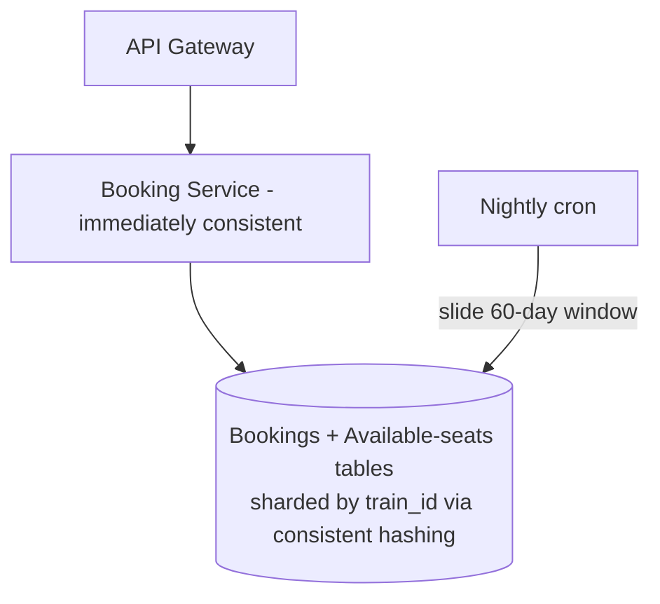
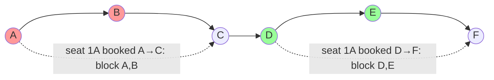
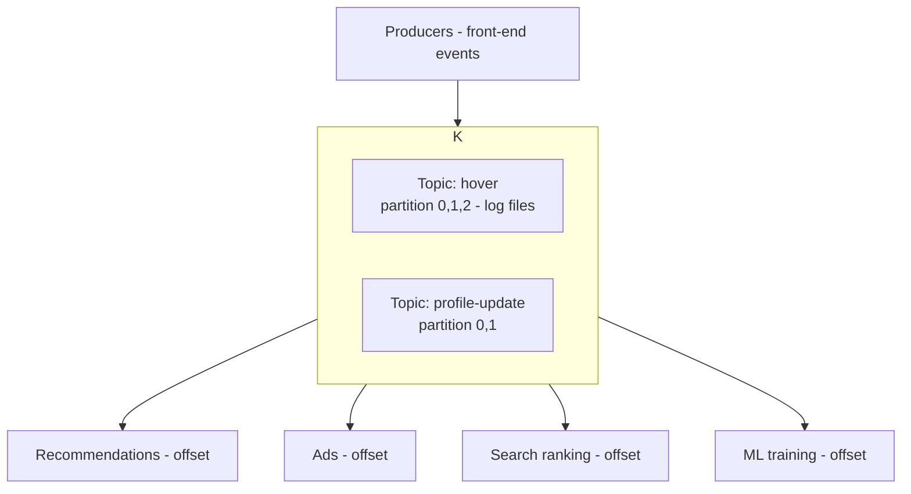
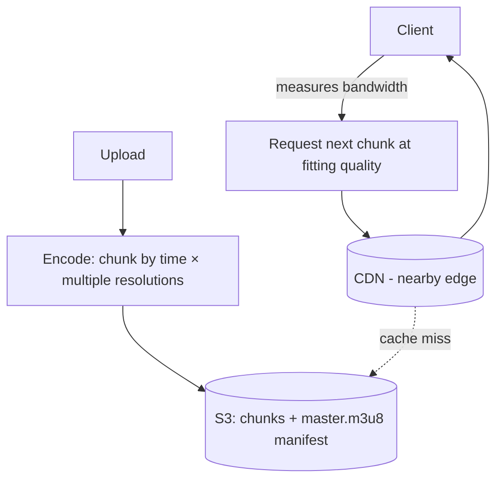

# Lecture 16: IRCTC Booking, Kafka & Messaging Queues, and Video Streaming

## Table of Contents
- [Overview](#overview)
- [IRCTC: Completing the Booking Service](#irctc-completing-the-booking-service)
- [The Seat-Overlap Problem](#the-seat-overlap-problem)
- [Messaging Queues from First Principles → Kafka](#messaging-queues-from-first-principles--kafka)
- [Kafka's Optimizations and Use Cases](#kafkas-optimizations-and-use-cases)
- [Video Streaming: Why It's Hard](#video-streaming-why-its-hard)
- [Designing Video Streaming: Chunking, Adaptive Bitrate, HLS, and CDNs](#designing-video-streaming-chunking-adaptive-bitrate-hls-and-cdns)
- [Try It Yourself](#try-it-yourself)
- [Homework / Next Lecture Preview](#homework--next-lecture-preview)

## Overview
The final lecture ties three threads together. First we finish **IRCTC** by designing the immediately-consistent **booking** service and solving its hidden seat-overlap puzzle. Then we build a **messaging queue (Kafka)** from scratch — not as magic plumbing, but as a cluster of servers storing append-only log files — motivated by the need to fan one event out to many services. Finally we design **video streaming** (Netflix-style): chunking, adaptive bitrate, the HLS manifest, and CDNs. (IRCTC search/availability were designed in [Lecture 15](./Lec15.md).)

> 🔑 **Key Point (emphasized in class):** The high-level architecture is nearly the same for every app — load balancer → API gateway → microservices, each with its own DB and cache. What changes per problem is *what you store in the cache* and *how you shard the database*. Master those two decisions.

---

## IRCTC: Completing the Booking Service
Recall from [Lecture 15](./Lec15.md): **search** uses a write-around cache (daily cron, 60-day window) and **availability** is *derived data* served from a write-around cache (cron every few minutes, never a TTL — synchronized expiry would stampede the DB). Now **booking** — ~3,000 writes/sec at Tatkal peak, **immediately consistent**, no double-booking, no overbooking.

**Data model.** A static `trains` table (metadata: name, type, running days) + a static **seat map** per train (`train_id, bogey, seat_no, class`) — exactly like the seat map in the Book My Show case study. The **bookings** table stores one row *per passenger*:

| column | notes |
|---|---|
| `id` | true primary key (one per passenger row) |
| `PNR` | shared across all passengers in one booking |
| `user_id` | who booked |
| `passenger` | name/age/ID — **denormalized** (passengers may be non-users) |
| `train_id`, `date`, `source`, `destination`, `seat_no` | the journey |
| `status` | waiting / confirmed / cancelled (cancelled ⇒ seat freed) |

A naïve availability check subtracts `booked seats` (this table) from `total seats` (seat map) — two queries + computation per booking. **Optimize** by maintaining a **pre-populated "available seats" table** (`train_id, date, seat_no, source, status=available`), filled by a **nightly cron** that slides a 2-month window (add the new day's seats, drop the passed day's unbooked rows). Since trains run ~80–100% full, almost all rows exist anyway — you're pre-populating, not inflating data. Booking then just queries available rows and flips them.

> 🔑 **Key Point — shard by `train_id`.** A booking is a transaction on *one train's* seats; sharding by `train_id` puts all of a train's data on **one shard**, so a normal **single-machine DB transaction + lock** prevents double-booking ([Lecture 9](./Lec09.md): ACID only holds on one machine — sharding correctly is what *enables* it). Consistent hashing spreads trains evenly (busy and idle time-windows average out). Use SQL here — you genuinely need transactions. And don't store a redundant "remaining count" counter: it must always equal `total − booked`, so any drift causes over/under-booking — **derive it, don't persist it.**

---

## The Seat-Overlap Problem
A single seat can be sold for *non-overlapping* legs of the same journey: seat 3A booked A→C and again D→E. The booking algorithm must allow a *new* leg only if it doesn't overlap an existing one — efficiently, and **without the N+1 query problem** ([Lecture 15](./Lec15.md)).

**The elegant trick (source-only rows).** Instead of storing `(source, destination)` and doing interval math, store **one row per intermediate station** a seat is occupied at. Booking A→C on seat 1A writes rows for the seat at A, B (every stop strictly before C). To book a new leg, check whether the seat is free at **every** station in the new leg's range; if all are free, book (write rows for each). This avoids sorting/interval-merging — just per-station availability lookups.

(The textbook alternative is the **greedy "minimum platforms / meeting rooms"** sweep: +1 at each start, −1 at each end, a new booking fits only where the running count is 0 — but that needs sorting, so it's more computation.)

> 🔑 **Key Point — station quota & a practical shortcut.** Blocking all intermediate stations could starve small-town passengers boarding mid-route, so IRCTC reserves a **station quota** per boarding point until a deadline. And the cheap optimization: **always book a completely-unbooked seat first** — those need *no* overlap check at all; only fall back to per-station checks when no free seat remains.

---

## Messaging Queues from First Principles → Kafka
**Motivating problem:** a social app (LinkedIn/Instagram) tracks *every* user action — clicks, hovers, watch-time — and must fan that stream out to *many* services (recommendations, ads, search ranking, analytics, ML training). How do you get one source's data to N consumers?

Walk the bad-to-good ladder:
1. **API chaining** (front-end calls service 1, which calls 2, which calls 3…). ❌ Tight coupling, synchronous, one failure cascades — an anti-pattern.
2. **One dispatcher service** calling everyone's APIs. ❌ Still synchronous (waits on each), and a single point of failure.
3. **Shared database** everyone polls. ✅ Async! But what *kind* of store? The consumers never *search* this data — they only read new events in order and extract what they need (each has its own real DB/index downstream). So you don't need indexes, search, or random writes.
4. **It's just a log.** Append-only, read in order — writes are **sequential** (fastest possible disk write), never edited/deleted. That's a **queue on disk** (FIFO, stored as log files).

Now scale that disk queue:
- **Multiple files** (roll over at a size threshold) instead of one giant file.
- **Multiple servers** (horizontal scaling) when one runs out of space.
- **Topics & partitions.** Group events by **topic** (e.g., "hover", "profile-update"); within a topic, **partition** across servers by a key (e.g., `user_id mod N`) so load spreads. Each partition is an ordered log file.
- **Consumers + offsets.** A consumer reads sequentially and remembers its **offset** ("I've read up to here"), so it resumes without re-reading — and reads stay sequential (fast).
- **Replicas + quorum.** Replicate partitions for durability; use quorum (`reads + writes > replication factor`) for consistency.

That system **is Apache Kafka** — built at LinkedIn for exactly this log-aggregation fan-out (there's a Kafka paper, strongly recommended).

> 🤔 **Think About It:** The consumers never *search* this shared store — they only read new events in order, then extract what they need into their *own* downstream DB/index. So what's the simplest structure that fits? Not a searchable database (no indexes, joins, or random writes needed) — just an **append-only log**, i.e. a **queue on disk**. Recognizing "this is just a log" is what turns a vague "shared DB" into Kafka.

> 🔑 **Key Point:** A messaging queue is **not** a pipe or wire that "passes messages" — it's a **cluster of servers storing append-only log files**. Producers append; consumers poll at their own pace using offsets. The producer doesn't know or care who consumes (like the [observer pattern](./Lec15.md), but the publisher keeps no subscriber list at all).

---

## Kafka's Optimizations and Use Cases
Kafka is the strongest message queue largely because of how it cuts latency:
- **Zero-copy (`sendfile`).** Normally sending a file means reading it into your app's memory, then out to the network. Kafka serves directly from the **OS page cache** via the `sendfile` syscall — no extra copy into user space. Big latency win.
- **In-memory batching before disk flush** — just like the LSM tree ([Lecture 10](./Lec10.md)): buffer writes in RAM, flush sequentially in batches, giving huge write throughput. (Producers also **batch** on their side — e.g., send after 1,000 hover events accumulate.)
- **Retention / replayability.** Unlike a classic queue that deletes a message once consumed, Kafka **keeps data for a window** (default ~7 days). A crashed consumer can re-read; this gives durability and reprocessing. (It also uses **binary serialization**, not strings — faster and smaller.)

**When to use a messaging queue:**
- **Asynchronous communication** — fire-and-forget fan-out where the producer doesn't wait for acks.
- **Shock absorber** for traffic spikes or heavy async compute. Example: ChatGPT's web/app servers can't run inference themselves — requests are **queued** and fed to GPU **inference servers** at a sustainable rate (the UI shows "thinking"). Same pattern for video processing (upload → queue → a **status-polling** service checks when it's done). The queue smooths sudden peaks your infra can't be provisioned for.
- **Log aggregation** — Kafka's original LinkedIn use case (terabytes of logs/day).

> 🔑 **Key Point:** Don't reach for Kafka early. It belongs with **microservices**, which belong with **large teams and scale**. Start as a monolith — even one server doing app + DB + cache — and adopt queues only when the need is real. (Kafka is so valuable that companies like Confluent exist solely to run it for you.)

---

## Video Streaming: Why It's Hard
A video is "just a file" on a server — so why is streaming hard? Four reasons, only some under your control:

| Challenge | Why |
|---|---|
| **Huge size** | a video can be 100 MB–10 GB+; it won't fit nicely in a DB, and the client can't download it all up front |
| **Smooth experience** | depends on the *client's* network — **bandwidth varies** across users and **fluctuates** for a single user (out of your control) |
| **Device compatibility** | phones, tablets, TVs, laptops have different screens/resolutions — a 1080p stream wastes data on a 720p phone screen and may stutter |
| **Concurrency** | a hit release floods you simultaneously — Hotstar peaked at **~60 million concurrent** viewers for an India–Pakistan match |

MVP microservices: a **video uploader**, a **video server** (serves chunks to clients), and **search** (by title/actor/director). Note **video and audio are stored separately** (different codecs/encoding) — which also lets you ship **multiple audio tracks** (languages) for one video.

---

## Designing Video Streaming: Chunking, Adaptive Bitrate, HLS, and CDNs
**Store videos in object storage (S3), not the database** — DBs can't hold 10 GB blobs at scale.

**Chunk by time, ahead of time.** Split each video into short **time-based** segments (e.g., ~6 s). Crucially, chunk **at upload, not at request time** — video processing is CPU-heavy and would wreck latency if done live. Store only the chunks in S3.

> 🤔 **Think About It (faculty's questions):** Should you chunk by **bytes or by time**, and chunk **at request time or pre-stored**? Time-based chunks keep playback and quality-switching aligned to the timeline; and you pre-chunk at **upload** because doing CPU-heavy encoding per request would cripple latency for every viewer.

**Adaptive bitrate.** Store each video at **multiple resolutions** (original, lower, lowest), each chunked. Then:
1. **Measure the client's bandwidth** on-device (data downloaded ÷ time = speed; track a running average).
2. Send the **chunk quality that fits** the current bandwidth — high-bandwidth clients get HD, low-bandwidth clients get a lower res instead of buffering forever.
3. Let the user **override** (force HD on a weak connection, accepting buffering).

**Just-in-time buffering.** Don't pre-load the whole movie (wastes the user's data plan; a mid-download bandwidth dip locks in *bad-quality* chunks). Instead, using the current chunk's remaining time and the measured bandwidth, fetch *just enough* ahead to keep one chunk ready. Keep buffering "dumb" — too much intelligence adds latency. (The little **thumbnails** you see when hovering the seek bar aren't video — they're tiny low-res images **prefetched with the metadata**.)

**HLS manifest (`.m3u8`).** How does the client know each chunk's URL? The first download is a **manifest file** (Apple's **HLS** — HTTP Live Streaming): `master.m3u8` lists the available resolutions, each pointing to a playlist of all that resolution's **chunk URLs**. The client then fetches chunks **directly** (often keyed/expiring URLs), no per-chunk round trip to your app server to resolve locations. HLS is the de-facto protocol across platforms (YouTube uses an encoded variant).

**CDNs.** Even with URLs, fetching from S3 is high-latency. A **CDN** caches chunks at edge servers near the user (any video watched even once or twice gets cached), so in practice S3 is rarely hit directly. This is what makes streaming feel instant at global scale.

**Compression + dropped frames.** Chunking includes heavy **compression** (JPEG-style): neighboring pixels are usually identical, so much data is perceptually redundant and can be dropped without the brain noticing. A video is a stack of similar frames — so an occasional dropped frame is fine.

> 🔑 **Key Point — TCP for VOD, UDP for live calls.** Pre-recorded streaming uses **TCP**: sequencing matters and you must not skip a missing 6-second chunk (you'd lose content) — wait and retransmit. A **video call** uses **UDP**: only the present moment matters, so a dropped packet is ignored rather than waited for.

**Live streaming** is the same base (chunk → multi-quality → manifest → CDN) but latency-bound, so optimize at the **capture layer** (the camera/encoder emits ready-to-serve 6-s chunks directly) and lean *much* harder on CDNs (Hotstar "abuses CDNs"). And you don't have to build it all: services like **Agora** handle encoding/decoding/chunking; you just build the player. **Security:** exposed chunk URLs are usually fine (the video reaches the client anyway), but **encrypt** if needed — Netflix and YouTube own their entire pipeline (CDNs + encoding + encryption); third-party (Agora) exposes URLs, which is acceptable when the content isn't sensitive.

---

## Try It Yourself
1. **Make booking double-safe.** Two users hit "book seat 1A, A→C" on the same train at the same instant. Trace how sharding by `train_id` + a single-shard transaction/lock prevents a double-booking, and explain why a stored "remaining seats" counter would be dangerous here.
2. **Derive a queue.** A new "watch-time" event must reach 5 services. Start from API chaining and explain, step by step, why each fix (dispatcher → shared DB → log → Kafka) is better. At which step does it become asynchronous, and at which does it become horizontally scalable?
3. **Kafka or REST?** Classify and justify: (a) checkout calling the payment service synchronously, (b) every product view feeding the recommendation model, (c) buffering a ChatGPT-style request before GPU inference. Which one is the "shock absorber" pattern?
4. **Stream on a flaky 3G connection.** Walk through what the player does as bandwidth drops mid-movie and recovers: which chunk qualities it requests, why just-in-time buffering beats pre-loading the whole film, and what the `.m3u8` manifest and CDN each contribute.

## Homework / Next Lecture Preview
- **Read the papers:** the **Cassandra** paper ([Lecture 14](./Lec14.md)) is **mandatory/examinable**; the **Kafka** paper is **strongly recommended** (not examinable).
- **Deepen later:** RPC internals, CDN "abuse" for live streaming (Hotstar), and protocol implementation are slated for an upcoming **network-programming** elective.
- **Course wrap:** one more class remains. You've now built, end to end — a database engine (LSM), a search typeahead, a messaging app, an e-commerce/microservices platform, IRCTC, a messaging queue, and a video-streaming service — using one repeatable method: **understand → functional → non-functional → scale → design**, then pick the right **database, sharding key, cache, and communication** for the job.
