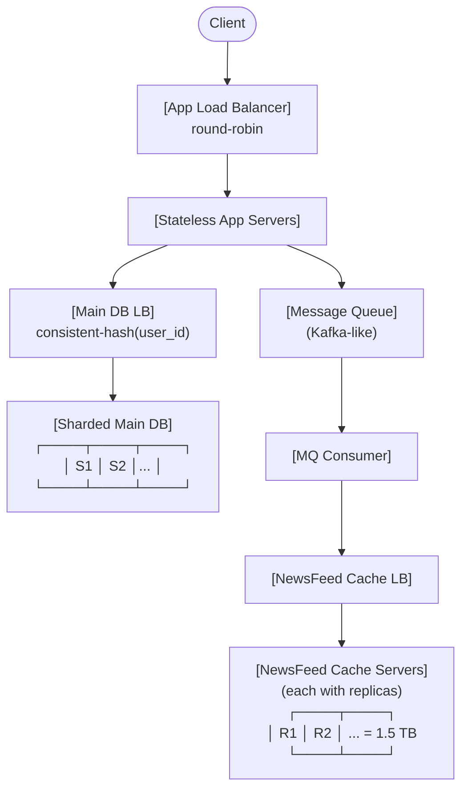

# Case Study: Facebook NewsFeed Design (Part 2) — HLD Notes

## Table of Contents
1. [Recap from Previous Class](#1-recap-from-previous-class)
2. [Sequence of Steps for Open-Ended HLD Problems](#2-sequence-of-steps-for-open-ended-hld-problems)
3. [Profile Page Recap — No Cache Needed](#3-profile-page-recap--no-cache-needed)
4. [NewsFeed — The Fan-Out Problem](#4-newsfeed--the-fan-out-problem)
5. [Attempt 1: Cache the Entire Pre-Built NewsFeed](#5-attempt-1-cache-the-entire-pre-built-newsfeed)
6. [Attempt 2: Distribute Pre-Built NewsFeeds Across Servers](#6-attempt-2-distribute-pre-built-newsfeeds-across-servers)
7. [Final Solution: Cache Only the Posts of the Last 30 Days](#7-final-solution-cache-only-the-posts-of-the-last-30-days)
8. [How Does the Cache Get the Data? — Message Queues](#8-how-does-the-cache-get-the-data--message-queues)
9. [Replication of the NewsFeed DB](#9-replication-of-the-newsfeed-db)
10. [Sharding vs Replication](#10-sharding-vs-replication)
11. [Network Partitions & Partition Tolerance](#11-network-partitions--partition-tolerance)
12. [CAP Theorem](#12-cap-theorem)
13. [PACELC Theorem](#13-pacelc-theorem)
14. [Final Architecture](#14-final-architecture)
15. [Important Highlights from Faculty](#15-important-highlights-from-faculty)
16. [Questions to Ponder](#16-questions-to-ponder)
17. [Homework / Next Class Preview](#17-homework--next-class-preview)

---

## 1. Recap from Previous Class

- Three tables identified for Facebook: **Users**, **Posts**, **Friends**.
- Post size ≈ **500 bytes**.
- Total post data ≈ **400 TB over 20 years** → cannot fit on one machine.
- Sharding key = **user_id**, using **Consistent Hashing**.
- Posts that involve two users (A writes on B's profile) are **stored redundantly in both shards** → storage doubles to ~800 TB but reads become single-shard.
- Profile page → **no cache needed** (single-shard, indexed-field SQL query).
- NewsFeed → **cache needed** (fan-out problem to be solved).

---

## 2. Sequence of Steps for Open-Ended HLD Problems

The faculty emphasized this as a **mandatory ordering**:

1. **Design the schema first** — never start by deciding whether to cache.
2. **Estimate the data scale** (back-of-the-envelope).
3. Decide whether data fits in one machine → if yes, no cache needed (SQL on indexed fields is optimal).
4. If not, decide **sharding key** and **distribution algorithm**.
5. Only AFTER all of that, ask: *Do we need a cache, and if so, what kind?*

> **Highlight:** The starting point of any open-ended HLD problem is NEVER "do I need a cache?" — it is the schema.

---

## 3. Profile Page Recap — No Cache Needed

- Query needed: fetch all posts where `recipient_id = user_id`.
- One single shard hit (entire data of a user lives on one shard, thanks to consistent hashing).
- Indexed-field query → **best use case of SQL itself**.
- > "This is why we have SQL. This is why we have indexing in SQL. This is why we normalize data in SQL."

### Handling cross-shard posts (A posts on B's profile)
- Post row is **duplicated** in shard(A) and shard(B).
- The write to the second shard is done **asynchronously** — user gets ACK from the first shard, the second is propagated eventually.
- The user does not demand immediate consistency between Adam and Deepesh's profiles — **eventual consistency** is acceptable.

---

## 4. NewsFeed 

### Problem
To build a user’s newsfeed, the system needs posts from all of their friends/followings.

Current System:
- An average user have 1000 firends approximately (assumption).
- These users are distributed across many database shards (it was discussed in lecture 4).


---

### Trivial Approach
For every user:
1. Query each friend individually.
2. Fetch recent posts of the friends (for example, last 30 days).
3. Merge and sort all posts.
4. Return the final feed.

High-level complexity:
- `2 billion users × 1000 friend fetches` 
- enormous number of read operations and network calls.

---

### Limitations of the Trivial Approach

#### 1. Duplicate Computation
Popular creators/celebrities create massive repeated work.

Example:
- A post from Virat Kohli may need to appear in millions of feeds.
- The naive system may fetch/process the same post separately for every fan.

This creates huge unnecessary computation.

#### 2. High Server Load
- Massive fan-out requests increase pressure on DB servers.
- More computation and queries increase chances of overload/crashes.
- Person A and Person B may have 60% same feed but still fetching them separately, imagine this happening for thousands of users. Too much repeated calls. 

#### 3. High Latency
- Friends are spread across different shards.
- Feed generation requires many cross-network calls. Also DB query takes the time. 
- More network hops → slower feed generation.

---

### Conclusion
The trivial approach has high chances of server crash and high latency which degrades user experience and reduces durability of the system. 

Therefore, we need a more scalable feed architecture:
- possibly caching,
- precomputed feeds,
- fan-out-on-write,
- hybrid architectures,
- or other optimizations.

---

## 5. Attempt 1: Cache the Entire Pre-Built NewsFeed

### Calculation
```
DAU caching coverage = ALL 3 billion users (don't know who shows up daily)
Posts per newsfeed   = 50 pages × 10 posts = 500 posts (business assumption)
Size per post        = 500 bytes
Total cache size     = 3B × 500 × 500 bytes
                     = 750 TB
```

### Why this is wrong 

- **Invalidation Problem:**
   - When user A posts → must invalidate newsfeeds of all 1000 friends.
   - When Facebook's ranking algorithm changes (4–5 changes/day) → invalidates virtually ALL newsfeeds.


---

## 6. Attempt 2: Distribute Pre-Built NewsFeeds Across Servers

- Suggestion: shard the 750 TB newsfeed cache across many servers.
- **Rejected** — the invalidation problem still exists, plus you're back to multi-shard writes for every new post (1000 friend newsfeed updates per post).

---

## 7. Final Solution: Cache Only the Posts of the Last 30 Days

### Key Insight
- You don't need a pre-built newsfeed — you only need the **raw posts** required to build it.
- 500 posts can be reordered in the application server in microseconds.
- Users don't care about posts older than ~30 days (assumption).

### Calculation
```
Posts per day        = 1% × 2B DAU × 5 posts = 100 million
Window               = 30 days
Total posts          = 100M × 30 = 3 billion
Size per post        = 500 bytes
Total cache size     = 3B × 500 bytes = 1.5 TB
```

### **1.5 TB fits in a single machine's hard disk.**

### What this server is
- A separate SQL DB storing **only the posts of the last 30 days** (entire Facebook user base).
- It is **redundant data** — also exists in the main sharded DB.
- It is a **cache** even though it's not in RAM.

> **Highlight:** A cache need not be in RAM. Cache = "faster data storage with redundant data." The Scaler Code Judge cached test cases in the **file system / hard disk** — that's still a cache. Redis, Aerospike, Memcached happen to be RAM-based, but the definition is broader.

### Read flow
1. Request reaches application server.
2. App server queries main DB shards for the friend list (via Users + Friends tables — small data, fast).
3. App server queries the **NewsFeed DB (1.5 TB cache)** with one JOIN of Friends + Posts (indexed on user_id).
4. Gets ~500 posts back.
5. Reorders by pre-computed recommendation score in the application server.
6. Returns paginated response.

> **Highlight:** Only the Posts table lives in the NewsFeed cache server. Users + Friends tables stay in the main sharded DB.

---

## 8. How Does the Cache Get the Data? — Message Queues

### Options considered
| Option | Verdict |
|--------|---------|
| **Cron job pulling from all DB shards every day** | ❌ One-day lag = bad UX. |
| **Cron job pulling every 5 minutes from all shards** | ❌ Overloads every DB shard, every 5 minutes. |
| **Write to NewsFeed DB first, then cron job copies to main shards** | ❌ Profile data must be immediately consistent in the user's own profile — writing to cache first breaks that. |
| **Client-side cache** | ❌ Server crash before write means data is lost while client thinks it's saved. |
| **Use a Message Queue (asynchronous events)** ✅ | This is the correct solution. |

### Solution: Message Queue
- The **application server is the brain**. When it creates a post, it:
  1. Writes synchronously to the main sharded DB (so profile reflects it immediately).
  2. Publishes an event to a **message queue**.
- A consumer reads events from the queue and writes them into the NewsFeed cache DB asynchronously.
- This is **true asynchronous processing** — no polling, no cron, no overload.

### Message queue technologies
- Kafka, RabbitMQ, ActiveMQ are examples.

> **Highlight (Interview Tip):** Don't name-drop technologies (Kafka, Redis, Postgres) in HLD interviews. Say "a message queue" or "a key-value cache." The moment you say "Kafka," the interview shifts to "why not RabbitMQ?" and you may not be able to defend specifics. Discuss **concepts**, not vendors.

### Cron job vs Message Queue
- A cron job is **asynchronous w.r.t. the main system**, but **synchronous w.r.t. the DB** (it still blocks on the DB queries it runs).
- A message queue gives **true asynchronous processing**.

---

## 9. Replication of the NewsFeed DB

- The single 1.5 TB server is a **single point of failure (SPOF)** and a load bottleneck (all 2B DAU read newsfeeds).
- Solution: **replicate** that server.
- Replicas = identical copies of the same 1.5 TB.

### Why replicas?
1. **Load distribution** across multiple servers.
2. **Durability** — if hard disk crashes, another physical machine still has the data.

### Consistency between replicas?
- **Eventual consistency** is sufficient.
- Mechanism: one server takes writes, then propagates to other replicas. Read traffic load-balanced across all replicas.
- During the propagation window, some replicas serve stale data → tolerable for newsfeed.
- > **Highlight:** The faculty referred to LinkedIn experiment from a previous class — different students saw different feeds because they hit different replicas. That's eventual consistency in the wild.

### Why not 2-Phase Commit (immediate consistency)?
- 2PC waits for ACK from ALL replicas → latency explodes.
- Acceptable only for financial-grade systems (banking, stock exchange), not for newsfeed.

---

## 10. Sharding vs Replication

> **Common fresher interview question:** What's the difference?

| Feature | Sharding | Replication |
|---------|----------|-------------|
| What's stored | Different *parts* of data on each server | Full *copies* of the same data |
| Purpose | Distribute storage + load | Durability + read scaling |
| Example with data ABC | Server1: A; Server2: B; Server3: C | Server1: ABC; Server2: ABC; Server3: ABC |

### In real large-scale systems → use BOTH
- **Shards + Replicas of each shard.**
- Each shard has multiple replicas. Multiple shards together hold the full dataset.

---

## 11. Network Partitions & Partition Tolerance

### What is a partition?
- In a graph of millions of servers, edges = network connections.
- When an edge drops (network failure, hardware damage, cable cut), the graph splits into disconnected sub-graphs → **partition**.
- Networks between 10M+ servers (e.g., Google) drop **thousands of times per day**.

### What should happen on partition?
- **Stopping the whole system is not viable** (Google would crash 1000× per day).
- The system should keep serving requests → **Partition Tolerance**.
- Partition tolerance ≠ "all requests succeed." Some may need to retry / show stale data. But the system stays *available for requests*.

### Real example
- Amazon during partition: search may work, transactions/cart may fail.
- Instagram during partition: feed may load stale data, like counts may be outdated.
- That's partition tolerance — degraded but not down.

---

## 12. CAP Theorem

### The three properties
- **C — Consistency:** All replicas show the same data at the same time.
- **A — Availability:** Every request gets a (non-error) response.
- **P — Partition Tolerance:** System continues operating during a partition. System does not completely crash globally

### The theorem
- You cannot have all three simultaneously. **Pick 2.**

### Practical interpretation (per faculty)
- Partition Tolerance is **virtually always required** (you can't stop a 10M-server system for partition events).
- So the realistic choice during a partition is: **Consistency OR Availability**.

### Rare exception: sacrifice P for both C and A
- Stock exchanges (e.g., Bombay Stock Exchange):
  - Hosts all servers in own building with multiple high-bandwidth cables between every pair.
  - Minimizes partition probability.
  - If a partition does happen → **the whole exchange goes down**. Both C and A maintained.
- Reason: stock pricing legally cannot be inconsistent (different users seeing different prices = illegal), and cannot be unavailable when prices changed (denying user the chance to buy at a lower price = illegal).
- Brokers like Zerodha CAN go down independently — but the exchange itself cannot serve inconsistent prices.

### CP example (Consistency + Partition Tolerance)
- Banking account balance: reads may be denied during a partition rather than show inconsistent values. So if reads are denied: Availability is sacrificed. 
- CP systems preserve correctness by sacrificing availability of some requests

### AP example (Availability + Partition Tolerance)
- Social media feeds, e-commerce browsing, search results.
- AP systems preserve availability by allowing temporary inconsistency

> **Highlight (Interview):** CAP is one of the **most frequently asked HLD interview questions**. Be ready with concrete examples of CP, AP, and (rare) CA systems.

> **Highlight:** Eventual consistency is NOT a third state. Strictly there's only "consistent" or "not consistent." Eventual consistency is engineering shorthand for "temporarily inconsistent, will sync later."

---

## 13. PACELC Theorem

CAP only describes behavior during a **partition**. PACELC extends to the no-partition case.

### Statement
- **If (P)artition** → choose **A**vailability or **C**onsistency
- **Else (E)** → choose **L**atency or **C**onsistency
- Above Latency actually means low latency and if there will consistency then there will be more latency. 

### Why even without partition?
- Maintaining strict consistency across replicas without a partition still requires **2-Phase Commit** → high latency, slow writes.
- Most systems pick **eventual consistency** to keep latency low.

### Examples
| System | Partition behavior | No-partition behavior |
|--------|--------------------|----------------------|
| DynamoDB | AP | EL (latency over consistency) |
| MongoDB (default) | CP | EC (consistency over latency) |
| Banking | CP | EC |
| Facebook NewsFeed | AP | EL |

> **Highlight:** Even in the absence of partitions, perfect consistency in distributed systems is hard — it has a latency cost.

---

## 14. Final Architecture



- **App servers:** stateless, round-robin.
- **Main DB:** sharded by user_id (consistent hashing); posts duplicated for both creator & recipient shards.
- **Message Queue:** carries new-post events to the NewsFeed cache asynchronously.
- **NewsFeed Cache DB:** stores last 30 days of posts (1.5 TB), replicated for durability + load distribution; eventual consistency between replicas.

### Tables in each location
- Main DB shards: Users, Friends, Posts (full history).
- NewsFeed Cache: **only Posts (last 30 days)** — Users & Friends are still read from main DB.

---

## 15. Important Highlights from Faculty

1. **Start every HLD with schema, not with caching.**
2. **One single query joining two indexed tables IS the optimal SQL use case.** Don't add caches for these.
3. **Storage problems can be solved with horizontal scaling. Invalidation problems cannot.**
4. **Caching the pre-built newsfeed is wrong.** Cache the *raw posts*; reorder per request in app server.
5. **Reordering 500 items in memory is essentially free.** Don't pre-compute.
6. **A cache is anything providing redundant, faster access** — not necessarily RAM. File system, replicated SQL DB, all qualify.
7. **Async cron jobs are not truly async.** They still block on queries. **Message queues are true async.**
8. **In interviews, talk concepts, not products.** "Message queue" not "Kafka"; "KV cache" not "Redis."
9. **Replication exists for load distribution AND durability.** Both matter.
10. **Sharding ≠ Replication.** Real systems use both: replicated shards.
11. **Cost scales exponentially with single-server specs.** Cheaper to have many low-spec servers than a few high-spec ones.
12. **CAP is a hard constraint of distributed systems**, just like Ω(n) is a hard lower bound on sorting.
13. **Partition tolerance is almost always required** — the meaningful CAP trade-off is C vs A during partition.
14. **Eventual consistency is an engineering convenience, not a third consistency mode.**
15. **The 30-day cache window is a business decision based on storage capacity + usage observation.** Leave a buffer; if data grows, shrink the window.
16. **Vertical scaling is better when manageable** (1.5 TB → 2 TB). Don't horizontally scale prematurely.

---

## 16. Questions to Ponder

1. Why is schema-first always the right starting point for HLD?
2. Why is caching the entire newsfeed (750 TB) wrong — give at least 3 reasons.
3. Why is a cache not always RAM?
4. Why are cron jobs considered "not truly asynchronous"?
5. Why duplicate posts across two shards instead of querying both at read time?
6. Why is eventual consistency acceptable for newsfeed but not for a stock exchange?
7. Why do stock exchanges sacrifice partition tolerance instead of C or A?
8. If you can't have C, A, and P at once, what do most internet-scale systems pick?
9. What does PACELC add beyond CAP?
10. Why is naming a specific technology (Kafka, Redis) in an interview risky?
11. What's the difference between a shard and a replica? Why use both?
12. Why is the NewsFeed cache window set to 30 days and not 5 days or 100 days?
13. What happens to user's profile post visibility if we wrote to the cache first?
14. Why is reordering 500 posts in the app server preferable to pre-computing a stored newsfeed?
15. How does the system handle a partition between two NewsFeed replicas?

---

## 17. Homework / Next Class Preview

The faculty deferred the following topics to the **next class**:

1. **How exactly replication is implemented inside servers:**
   - How does propagation work between replicas?
   - Which server takes writes? What if it crashes?
   - How is read/write coordination handled?
2. **Engineering workarounds to CAP:**
   - CAP says you can't have C + A during a partition.
   - But in practice, designs exist that *approximate* both.
   - "Mathematically impossible, engineering-wise solvable."
3. **Likes & comments** — how the architecture changes when these are reintroduced (deferred for a future class).
4. **Zookeeper** and similar orchestration software for managing replicas — coming up.

> Students were not given an explicit coding assignment in this class, but were expected to be **clear on CAP examples** (CP vs AP vs the rare CA) for interview readiness.
