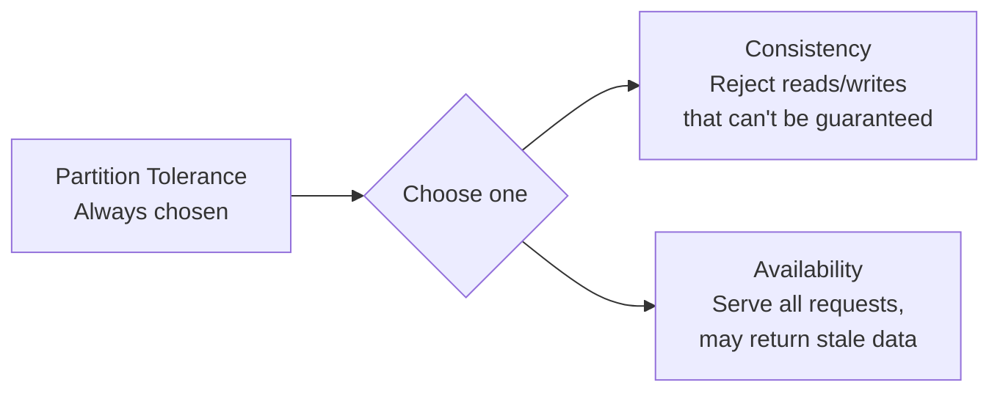
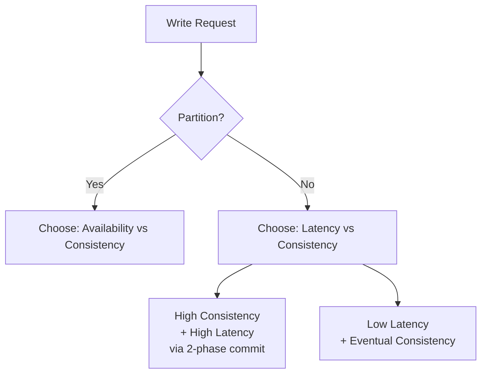
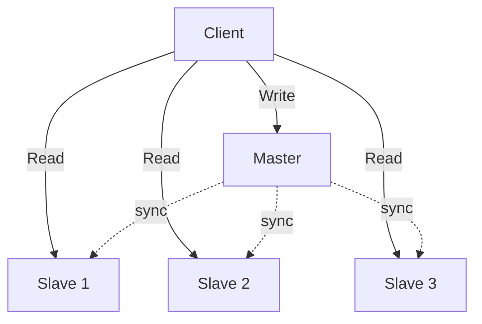
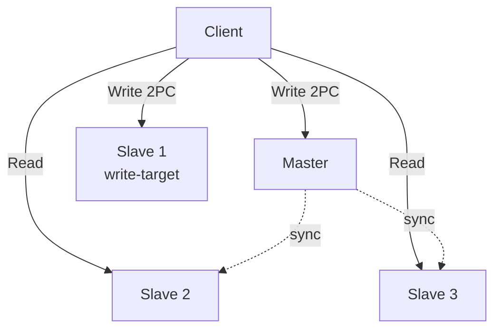
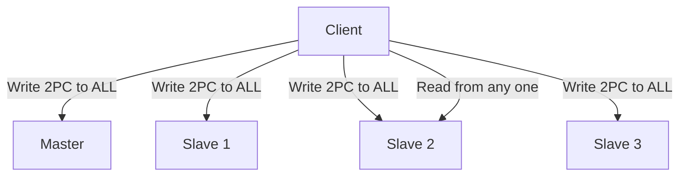
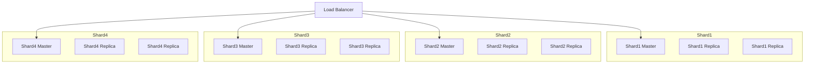
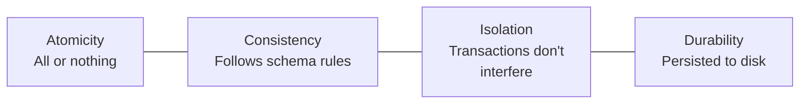
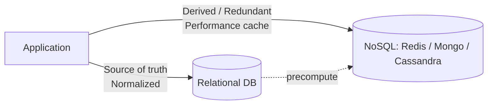

# SQL vs NoSQL Databases — Replication, Quorum, and Database Philosophies


## Table of Contents

1. [Recap: CAP Theorem](#1-recap-cap-theorem)
2. [PACELC Theorem](#2-pacelc-theorem)
3. [Network Partitions — Duration & Behavior](#3-network-partitions--duration--behavior)
4. [Consistency Types](#4-consistency-types)
5. [Replication — What and Why](#5-replication--what-and-why)
6. [Master–Slave Architecture (V0)](#6-masterslave-architecture-v0)
7. [V1: Two-Server Write (Avoid Data Loss)](#7-v1-two-server-write-avoid-data-loss)
8. [V2: Write on All Servers (Immediate Consistency)](#8-v2-write-on-all-servers-immediate-consistency)
9. [V3: Quorum-Based Replication (Tunable Consistency)](#9-v3-quorum-based-replication-tunable-consistency)
10. [Replication Factor vs Total DB Servers](#10-replication-factor-vs-total-db-servers)
11. [Relational Databases & ACID Properties](#11-relational-databases--acid-properties)
12. [Introduction to NoSQL](#12-introduction-to-nosql)
13. [Key Takeaways](#13-key-takeaways)
14. [Questions to Ponder](#14-questions-to-ponder)
15. [Homework](#15-homework)

---

## 1. Recap: CAP Theorem

**CAP Theorem** says that out of the three properties — **Consistency, Availability, Partition Tolerance** — a distributed system can guarantee only **two** at any time.

### Practical interpretation
- For large-scale systems with millions of users and thousands of servers, **Partition Tolerance is non-negotiable** — you cannot take down the entire system every time a network link fails.
- So the *real* choice is always between **Consistency (C)** and **Availability (A)**.

> **Important:** "Not available" does not mean the system is completely down. It is *partially* available — some requests may still succeed, while others are denied or serve stale data.



---

## 2. PACELC Theorem

PACELC extends CAP by addressing the *no-partition* case:

- **P**artition → trade-off between **A**vailability and **C**onsistency (same as CAP).
- **E**lse (no partition) → trade-off between **L**atency and **C**onsistency.

### Why latency vs consistency?
To guarantee consistency in a distributed system, you must use a **two-phase commit** — wait for acknowledgement from every server before confirming the write. That waiting time is the latency tax.

- **Atomic writes in distributed systems are hard.** If acknowledgement from one server is delayed or lost, you cannot blindly roll back (the data may already be written there — you just don't know). So retries are required → increased latency.



---

## 3. Network Partitions — Duration & Behavior

> **Question posed in class:** How long does a network partition typically sustain — days, weeks, months?

- Partitions are usually **transient** — seconds or minutes, rarely longer.
- During a partition, **immediate consistency is lost**, but **eventual consistency** is preserved — once the link is restored, servers sync and converge.

### Example scenario: Partition with Consistency + Partition Tolerance prioritized
- Availability is sacrificed.
- **Read remains available, but Write is blocked** (a common pattern).

---

## 4. Consistency Types

| Type | Meaning |
|------|--------|
| **Linearizability (Immediate / Strong)** | Every read returns the most recently written value, instantly. |
| **Causal Consistency** | Events related to each other must be seen in causal order. *Example: A Facebook comment depends on a post — anyone who sees the comment must also see the post.* |
| **Eventual Consistency** | Replicas converge to the same value eventually, but not immediately. |

### Real-world tuning per use case
In an **e-commerce platform**, different operations need different guarantees:
- **Search results** → can be eventually consistent (a sold-out product appearing briefly is acceptable).
- **Add to cart / Purchase** → must be immediately consistent (cannot sell stock that doesn't exist).

> **Important:** Within a single system, you can — and should — prioritize differently per use case.

---

## 5. Replication — What and Why

**Replication** = storing the *same* data on multiple servers.

> **Distinction:** Replication ≠ Sharding.
> - **Sharding** distributes *different parts* of data across servers.
> - **Replication** stores *identical* data on multiple servers.

### Why replicate?
1. **Load balancing** — multiple requests can be served by multiple replicas.
2. **Durability** — protects against physical hardware failure, disk damage, server destruction.

### The replication challenge
How do writes propagate so that all replicas (eventually or immediately) hold the same data? Several strategies exist — the most common is **Master–Slave**.

> **Note on terminology:** "Master–Slave" is now commonly renamed to **Leader–Follower**, **Active–Passive**, or **Primary–Secondary** due to the historical baggage of the original terms (similar to GitHub renaming `master` → `main`). Internally these notes use *master–slave* for brevity, but prefer the new terms in cross-team or public projects.

---

## 6. Master–Slave Architecture (V0)

### The basic setup
- One server is elected as the **Master** — handles **all writes**.
- All other servers are **Slaves** — handle **all reads**.
- Slaves **periodically sync** with the master (sync frequency is configurable).



### Master election is democratic
- If the master crashes, the slaves **democratically elect** a new master.
- This is implemented via a **distributed configuration management system** (e.g., **Zookeeper** — covered in later classes).
- When the old master comes back online, it rejoins as a **slave** — not as master. *Hence the "master–slave" label is misleading; it's actually democratic.*

### V0 — Quality Ratings

| Property | Rating | Reason |
|---|---|---|
| Consistency | **Very low / Data loss possible** | If master crashes before slaves sync → data is lost. Best case = eventual consistency. |
| Availability | **Very high** | Many slaves serve reads; new master is elected on failure. |
| Read latency | **Very low** | Multiple slaves; any can serve. |
| Write latency | **Very low** | Only one server is written to. |

> **Important:** V0 is **not usable** for data-critical systems (banking, finance) because it can lose data.

---

## 7. V1: Two-Server Write (Avoid Data Loss)

### Replication Factor (X)
- **X = total number of replicas** — includes the master.
- Example: 1 master + 3 slaves → X = 4.

### V1 idea
Write to **two servers** using a **two-phase commit**:
- **One master** + **one slave** (chosen — fixed or random).
- The "two-write slave" no longer needs to sync from master for that write; remaining slaves still sync periodically.



### Why not more than 2?
- 2 is the **minimum needed to avoid data loss**.
- Each additional server in the 2PC increases write latency proportionally.

### V1 — Quality Ratings

| Property | Rating | Reason |
|---|---|---|
| Consistency | **Eventual** (no data loss now) | Data is durable; slaves still sync over time. |
| Read availability | **Very high** | Any slave can serve. |
| Write availability | **Moderate** | If either of the 2 write-targets is unreachable → block writes. |
| Read latency | **Very low** | Single-server reads. |
| Write latency | **Moderate** | 2-phase commit across 2 servers. |

> **Important:** 100% durability is **impossible**. You can only *reduce the probability* of data loss — analogous to locking a door; the lock can still be broken, you've just added resistance.

---

## 8. V2: Write on All Servers (Immediate Consistency)

To guarantee **immediate consistency**, every write must be propagated to every server before being acknowledged.

### Why partial writes don't give immediate consistency

> **Scenario discussed in class:**
> - Variables `a = 10`, `b = 20`.
> - Update `a = 30` writes to Master + Slave 1.
> - Update `b = 50` writes to Master + Slave 2.
> - A read for `a` lands on Slave 2 → stale value `10` returned.
>
> Since we don't know in advance *where* the most recent write happened **per variable**, routing reads to "the server with the most recent write" doesn't work generally.

### V2 setup
- **Write** to **all** servers using 2PC.
- **Read** from **any one** slave.



### V2 — Quality Ratings

| Property | Rating | Reason |
|---|---|---|
| Consistency | **Immediate** | Every server has the latest data. |
| Read availability | **Very high** | Any slave can serve. |
| Write availability | **Very low** | If any single server is down → block writes (cannot leave any out and stay consistent). |
| Read latency | **Very low** | Read from one server. |
| Write latency | **Very high** | 2PC across **all** servers. |

> **Important:** V2 is fine for systems with **few replicas**, but unworkable when replicas number in the hundreds or thousands (e.g., Amazon-scale, where data centers across countries hold the same data for edge computing benefits).

---

## 9. V3: Quorum-Based Replication (Tunable Consistency)

### The idea
- Let **W** = number of servers written to per write.
- Let **R** = number of servers read from per read.
- Let **X** = replication factor.
- **Constraint:** `W + R ≥ X + 1` — by **Pigeonhole Principle**, this guarantees at least one overlap between write-set and read-set.

That one overlap is sufficient: among the R reads, you can compare **timestamps** (each row stores an `updated_at` in a shared timezone) and pick the most recent value.

```mermaid
flowchart TD
    subgraph Replicas X=7
        N1[Node 1]
        N2[Node 2]
        N3[Node 3]
        N4[Node 4]
        N5[Node 5]
        N6[Node 6]
        N7[Node 7]
    end
    Writer -->|W=4 writes| N1
    Writer -->|W=4 writes| N3
    Writer -->|W=4 writes| N5
    Writer -->|W=4 writes| N7
    Reader -->|R=4 reads| N2
    Reader -->|R=4 reads| N3
    Reader -->|R=4 reads| N5
    Reader -->|R=4 reads| N6
```

### How tuning works (with replication factor X)

| W (writes) | R (reads, min) | Write latency | Read latency | Description |
|---|---|---|---|---|
| 1 | X | Very low | Very high | Earlier V0-style. |
| 2 | X − 1 | Low | High | V1-style. |
| 3 | X − 2 | Moderate | Moderate | Balanced. |
| X − 1 | 2 | High | Low | Almost-all writes. |
| X | 1 | Very high | Very low | V2-style. |

> **Important:** No partition involved here. Even when fully connected, there is a **fundamental trade-off** between read latency and write latency — you tune `W` and `R` per workload.

### Retry semantics
- **Write retry:** must hit the *same* server (uncertain whether the previous attempt succeeded).
- **Read retry:** can hit *any other* server — adds flexibility but adds to read latency.

### Two write-target configurations
1. **Fixed write servers** — always write to the same `W` servers. Then reading from the other `X − W` servers makes no sense (they're never updated). Effectively reduces replication factor to `W`.
2. **Random write servers** — different write request lands on different `W` servers. Reads must query enough servers (`R`) to guarantee overlap.

### Real-world implementations
- **Cassandra** and **MongoDB** use this quorum architecture.
- Both provide **tunable consistency** via configurable `W` and `R`.

---

## 10. Replication Factor vs Total DB Servers

> **Question posed in class:** Is replication factor always equal to total number of database servers?

**Answer: No.**

Replication factor = number of replicas holding **the same data**.

### Facebook example
- Post data ≈ **400 TB** — cannot fit in one server → must be **sharded**.
- Each shard needs **its own replicas** for durability.
- Example: 4 shards × 3 replicas each = **12 total DB servers**, but **replication factor = 3**.



> **Important:** A load balancer treats all replicas of a shard as a *single logical unit*. Internally, each unit may run master–slave or quorum.

---

## 11. Relational Databases & ACID Properties

> **Clarification:** "SQL" is just a query language. The proper term is **Relational Database**. SQL has nothing to do with the database's internal storage philosophy.

### Why relational?
Not because every row is related to every other row, but because:
- Data is stored in **tabular schemas** with strict, predefined structure.
- Relations between entities are expressed via **foreign keys** or redundant columns.
- Joins can fetch related data efficiently.

> Even a "constants" table that has no foreign-key relationship to others is still part of a relational database — the *structure* is what makes it relational.

### Normalization
- Data is **normalized** (1NF, 2NF, BCNF, etc.) — one fact stored exactly once → single source of truth.
- Prevents update / read / delete anomalies.
  - *Example: deleting a user shouldn't delete their course if the course exists independently.*

### ACID Properties



#### A — Atomicity
- A transaction is a **sequence of queries**.
- If any one fails, **all are rolled back**.
- Classic example: bank transfer.
  - Debit A by 500 → Credit B by 500.
  - If credit fails, the debit must also be undone.

#### C — Consistency (NOT the CAP / cache consistency!)

> **Important distinction:** ACID-Consistency ≠ CAP-Consistency.
> - **CAP consistency** = same data on all replicas.
> - **ACID consistency** = data satisfies all defined logical rules (data types, NOT NULL, foreign keys, conservation laws like "sum of balances stays constant").

#### I — Isolation
- Concurrent transactions don't interfere.
- Configurable: multiple **isolation levels** balance strictness vs throughput.

#### D — Durability
- Once a transaction commits, it's written to **persistent storage** (disk), not just RAM.
- Survives crashes and power loss.

> **Important:** Durability in ACID is **single-machine durability**. It does *not* defend against physical destruction or natural disasters — that requires **replication**, which sits outside ACID guarantees of a single relational database.

### Why relational DBs are still the default
- Mature (invented in the 1960s — predates the public internet, ~93/94).
- Indexing, normalization, type safety.
- Search across diverse types — strings, integers, coordinates.
- Stored procedures (e.g., Postgres functions can encapsulate entire application logic).
- Row-level security, authentication, authorization (Postgres).

> **Important:** Always **start with a relational database**. Only move data to a NoSQL system when relational hits a real scaling problem.

---

## 12. Introduction to NoSQL

### The origin story — Google BigTable

- Google launched ~1998. By 2001 it had ~1 billion users.
- Their workload (web indexing, string search across the entire internet) didn't fit a relational schema cleanly.
- They invented **BigTable** — the **first NoSQL database** — to store **unstructured data** at massive scale.

### What does "NoSQL" mean?

> **Common misconception:** NoSQL ≠ "no SQL".
> **Actually:** NoSQL = **"Not Only SQL"**.

You still use relational databases for the bulk of your data. NoSQL stores supplement them when a workload truly doesn't fit.

### Example from previous classes
- **Contest leaderboard (Scaler case study):** SQL across 50+ tables joined to produce a leaderboard page → too slow.
- Solution: precompute the leaderboard and store it in **Redis** as a key–value pair:
  - Key = `(contestId, userId, pageNumber)`
  - Value = entire page payload
- This is **redundant, denormalized data** stored without schema — a NoSQL store.



### Mistake to avoid in interviews
> **Important:** Don't say "I'll use MongoDB" without justification. Interviewers will ask:
> - Why Mongo, not SQL?
> - How is data stored internally in Mongo?
> - How is search / indexing implemented in Mongo?
>
> You must understand pros, cons, and internal mechanics — and recognize that NoSQL is a *supplement*, not a replacement, for relational storage.

---

## 13. Key Takeaways

- **CAP**: Pick 2 of {C, A, P}; in practice P is always picked → trade-off is C vs A.
- **PACELC**: Even without partitions, there is a Latency vs Consistency trade-off.
- **Partitions** are usually short-lived; eventual consistency restores state.
- **Replication factor (X)** ≠ total DB servers — sharding multiplies the server count.
- **Replication strategies form a spectrum** controlled by `W` and `R`:
  - `W + R ≥ X + 1` guarantees immediate consistency.
  - Tuning `W` and `R` tunes the latency profile per workload.
- **ACID-Consistency** is about logical/schema correctness, NOT replica agreement.
- **Durability ≠ disaster recovery** — replication does that, not the DB engine.
- **Always start with SQL**; introduce NoSQL only to solve a specific scaling pain.
- **NoSQL = "Not Only SQL"** — supplement, not replacement.

---

## 14. Questions to Ponder

1. **Partition duration** — How long does a network partition typically last? What should the system do during that window?
2. **CAP choice in a CP scenario** — If you've picked Consistency + Partition Tolerance, *which* operations should be allowed and which should be blocked?
3. **Which architecture would you use for a banking system** with 500–1000 servers, given the immediate-consistency requirement?
4. **Can we have immediate consistency with lower latency and higher availability than V2?** *(Answer leads into Quorum / V3.)*
5. **Direct read from write-server idea** — Why can't we just route reads to the server we just wrote to?
6. **Is replication factor always equal to total DB servers?** *(Answer: No — sharding decouples them.)*
7. **Can ACID guarantees scale across multiple machines?** *(Answer: relational DBs assume one machine; cross-machine ACID is enormously hard.)*
8. **Is every piece of data relational in nature?** *(Even seemingly isolated tables like a constants table still live in a relational DB.)*

---

## 15. Homework

1. **Read the detailed write-up** the instructor will share on **how to set up Master–Slave architecture in MySQL**.
2. **If you have time, implement it** locally — get hands-on with the configuration.
3. Watch for **backlog notes & resources** the instructor will compile and share, possibly via a colleague's email (instructor will provide the contact). Send feedback / improvement suggestions directly to that contact.
4. **Next class preview** — One specific NoSQL database will be picked and dissected in detail (internals, indexing, comparison with SQL). Come prepared to compare it against relational concepts you already know.
