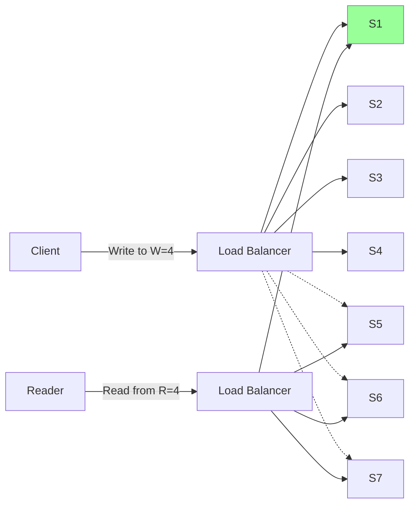
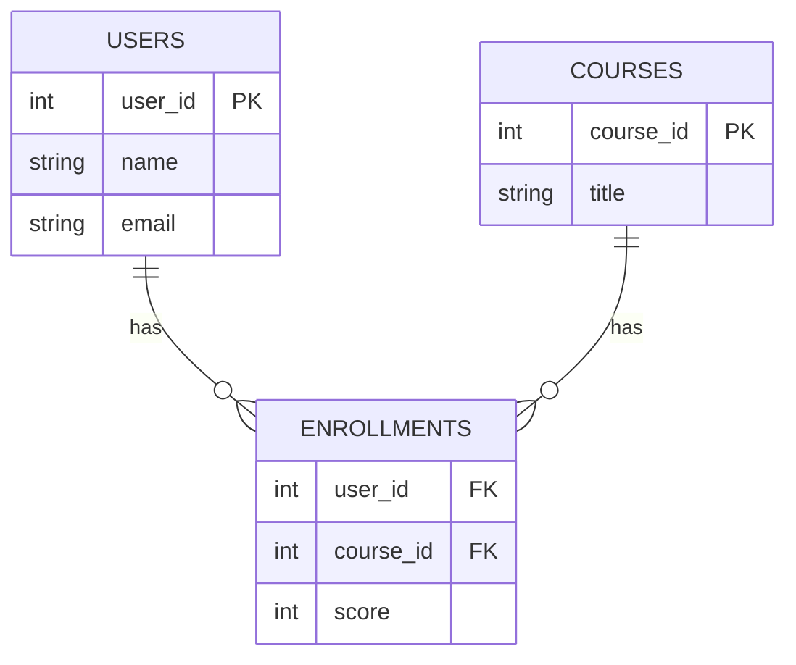
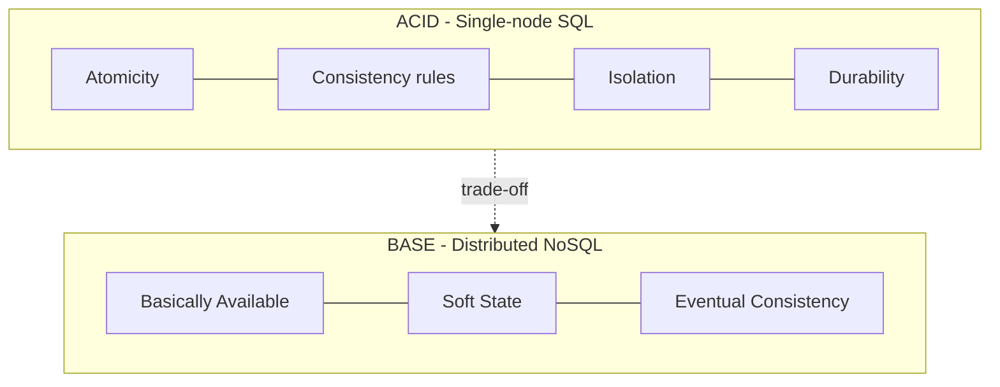
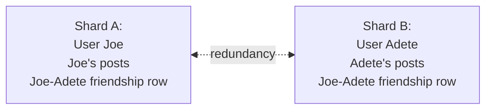
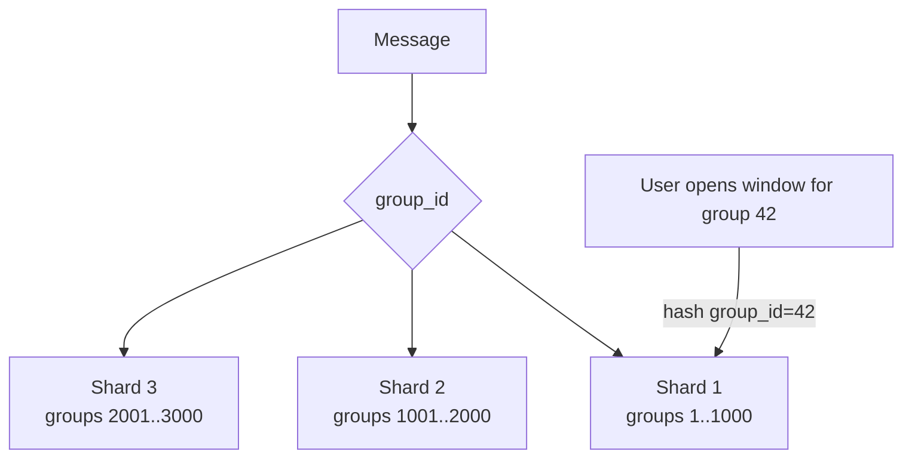
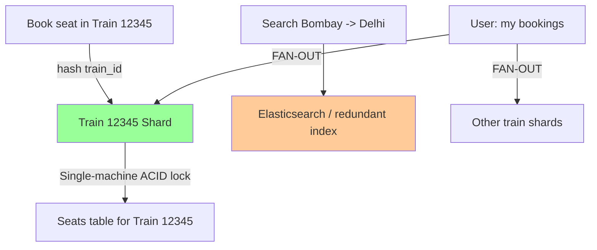
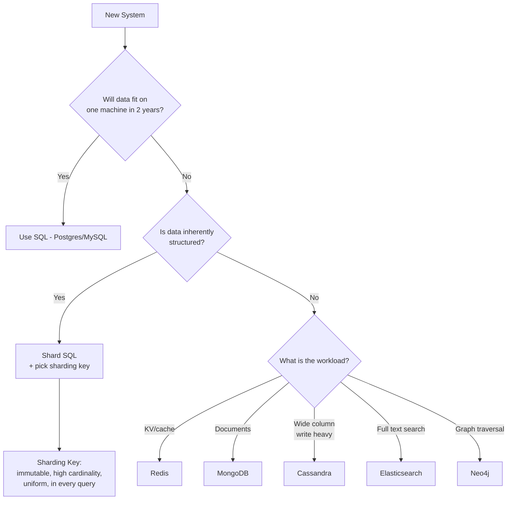

# SQL vs NoSQL & Sharding Keys — Comprehensive Class Notes

> **Course Context:** High-Level Design (Scaler Academy)
> **Topics:** Recap of replication/quorum, why SQL breaks at scale, rise of NoSQL, BASE properties, and how to choose a sharding key with real-world case studies (Facebook Messenger, Slack, IRCTC, Amazon).

---

## Table of Contents

1. [Recap — Replication, Quorum & Tunable Consistency](#1-recap--replication-quorum--tunable-consistency)
2. [Why Relational Databases Are the First Choice](#2-why-relational-databases-are-the-first-choice)
   - ACID Properties (Deep Dive)
   - Schema, Normalization & Storage Layout
3. [Why SQL Breaks at Scale](#3-why-sql-breaks-at-scale)
   - The Stack Overflow Page Problem (Normalization vs Denormalization)
   - The Amazon Product Catalog Problem (Schema Explosion)
4. [Enter NoSQL — The Origin Story](#4-enter-nosql--the-origin-story)
5. [BASE Properties (NoSQL Counterpart to ACID)](#5-base-properties)
6. [Moore's Law and Why Scale Hit a Wall](#6-moores-law--the-physical-limits-of-scale)
7. [Sharding — Concepts and Key Selection](#7-sharding--core-concepts)
   - What is a Sharding Key
   - Properties of a Good Sharding Key
8. [Case Studies — Picking the Right Sharding Key](#8-case-studies--picking-the-right-sharding-key)
   - Social Media (Facebook-like)
   - Facebook Messenger (1-on-1 messaging)
   - Slack (Group messaging)
   - IRCTC (Train booking)
9. [Composite Sharding Keys & Multiple Databases](#9-composite-sharding-keys--multiple-databases)
10. [Important Points Highlighted in Class](#10-important-points-highlighted-by-the-faculty)
11. [Questions to Ponder](#11-questions-to-ponder)
12. [Homework / Self-Study Assignments](#12-homework--self-study)
13. [Hands-On Exercises](#13-hands-on-exercises-to-test-your-understanding)
14. [Glossary / Quick Reference](#14-glossary--quick-reference)

---

## 1. Recap — Replication, Quorum & Tunable Consistency

### Master–Slave (single master) — quick refresher

- One master accepts writes; slaves replicate periodically (every 30s / 1m / 5m).
- If the master crashes, a **distributed configuration manager (e.g., ZooKeeper)** elects a new master democratically.
- **Risk:** If the master dies before slaves have synced, *data loss* — system is NOT durable.

### Making it Durable — write to multiple servers

| Strategy | Write Availability | Read Availability | Write Latency | Read Latency | Durability |
|---|---|---|---|---|---|
| Single master, async slaves | High | High | Low | Low | **Poor** (data loss risk) |
| Write to 2 servers (2PC) | Medium | High | Medium | Low | Good |
| Write to ALL replicas (full 2PC) | Very Low | High | Very High | Low | Strong (but expensive) |
| **Quorum (W + R > N)** | Tunable | Tunable | Tunable | Tunable | Tunable |

> **Important:** You can never achieve **100% durability** — if all replicas crash together, data is lost. You can only *reduce* the probability.

### Quorum (the Pigeonhole Trick)

If you have **N** replicas, write to **W** of them, and read from **R** of them, you are guaranteed at least one server with the latest data **iff**:

```
W + R > N
```

Minimum cost configuration: `W + R = N + 1`.

This is **tunable consistency** — Cassandra and MongoDB expose this directly.



> Pigeonhole principle: with 7 nodes, W=4 and R=4 → 4+4 > 7 → at least one read replica is guaranteed to overlap with the most recent write set.

---

## 2. Why Relational Databases Are the First Choice

> **Rule of thumb (very important for interviews):** *Start with SQL. Switch to NoSQL only when you have a concrete scale or shape-of-data problem you can articulate.*

### 2.1 ACID Properties

| Property | Meaning | Why it matters |
|---|---|---|
| **A**tomicity | All-or-nothing transactions | Bank transfers, ticket booking, e-commerce checkout |
| **C**onsistency *(ACID)* | Data follows logical/business rules (FKs, NOT NULL, data types, CHECK constraints) | Balance can't go negative; money can't vanish |
| **I**solation | Concurrent transactions don't interfere; configurable via isolation levels | Prevents lost updates, dirty reads, phantom reads |
| **D**urability | Committed data survives crashes (persisted to disk) | Survives power failure — but **NOT** disk destruction |

> ⚠️ **Pitfall:** *Consistency in ACID is NOT the same as Consistency in CAP.*
> - **ACID consistency** = logical integrity (rules, constraints).
> - **CAP consistency** = same data visible on all replicas at the same instant.

### 2.2 How ACID is Implemented (and Why It Dies in Distributed Systems)

ACID relies on **primitives that exist only in a single machine**:
- Shared RAM for locks
- Single OS to coordinate threads
- Single disk and write-ahead log for rollback
- Hardware-level atomic instructions (compare-and-swap)

The moment data is split across machines, you lose:
- Shared memory → no cheap locking
- Shared OS → no native synchronization
- Single WAL → no single source of truth for rollback

> You *can* still implement ACID in a distributed system (e.g., two-phase commit, Paxos, Raft) but **latency and availability take a huge hit**. This is the central reason SQL "isn't built for scale."

### 2.3 Schema, Static Layout & Migrations

When you define a schema like `(INT 4B, BOOL 1B, INT 4B)`:

```
Offset:  0........3 | 4 | 5........8 | 9........12 | ...
Row 1:   int        | b | int        | int         | ...
Row 2:   ...
```

Because rows live at **fixed offsets in contiguous memory blocks on disk**, adding a column requires:
1. Allocating a new layout.
2. **Copying the entire table** (database migration).
3. Downtime — the table is unusable during this.

> **Tradeoff Insight from class:** Constraints (static schema, types, FKs) **reduce features but increase efficiency**. The most-used data structures (`array`, `stack`) are the *most constrained*. Graphs are versatile but rarely used directly in production code paths.

### 2.4 Normalization

Storing each fact exactly once + linking via foreign keys:
- Saves space
- Avoids update/delete/insert anomalies
- Enables efficient indexing (B+ trees, `O(log n)` lookups)
- Joining 3–5 small, indexed tables is fast



---

## 3. Why SQL Breaks at Scale

### 3.1 The Stack Overflow Page Problem

Look at any Stack Overflow question page. To render it you need:

| Entity | Table |
|---|---|
| Question text/title | `questions` |
| Question upvotes | `question_votes` |
| Question author | `users` |
| Question editors | `question_edits` |
| Answers | `answers` |
| Answer upvotes | `answer_votes` |
| Answer authors | `users` (again) |
| Comments on Q | `question_comments` |
| Comments on A | `answer_comments` |
| Comment votes | `comment_votes` |
| Linked questions | `linked_questions` |
| Related (recommended) questions | `recommendations` |
| User medals/badges | `user_badges` |
| Hot network questions | `hot_questions` |

> **Important Point from class:** Rendering a single SO page would require joining **~20–25 tables**. Join cost grows roughly as nested-loop iteration; 10 joins → effectively `O(N^10)` worst case. *Indexes help (`O(log N)` per probe) but you cannot reasonably join 20+ tables on every page load.*

**The Core Insight:**

> Data is **stored normalized**, but is **never displayed normalized.** Every UI page is denormalized.

**Real example shared by the faculty (Scaler internal product):**
- Recruiter dashboard joined 5 tables for a candidate "engagement score."
- It got stuck under load.
- Fix: a **nightly cron pre-computed** the score and stored it as a redundant column. Immediate consistency wasn't needed.


### 3.2 The Amazon Product Catalog Problem (Schema Explosion)

Amazon sells *everything*. T-shirts have `sleeve_length`, `fabric`, `neck_shape`. Laptops have `ram`, `cpu_ghz`, `gpu`, `os`. Notebooks have `page_count`, `ruled?`.

> **Scale stated in class:** ~10,000 categories × ~1,000+ products per category, multiplied across countries.

#### Bad Approach #1 — One Giant Sparse Table

```sql
CREATE TABLE products (
    id, name, brand_id, category_id, price,
    sleeve_length, fabric, neck_shape,
    ram_gb, cpu_ghz, gpu, os,
    page_count, ruled, thread_count, ...  -- thousands of columns
);
```

**Problems:**
- Wastes huge amounts of disk (most cells are NULL).
- **`NULL` is ambiguous** — does NULL mean "doesn't apply" (laptop has no `sleeve_length`) or "seller forgot to fill" (T-shirt missing `sleeve_length`)?
- Sellers can't be forced to fill all columns → optional-attribute problem.

#### Bad Approach #2 — Table-per-Category (Inheritance Style)

`product` base table + 10,000 child tables (`t_shirts`, `laptops`, `notebooks`, ...).

Works for category-specific queries (e.g., "all laptops"), but **fails for cross-category queries**:

> *"Show me the top 10 costliest products on Amazon."* → Requires LEFT JOIN across all 10,000 child tables. The query is literally unwritable.

#### Bad Approach #3 — Attribute-Value (EAV) Table

```sql
CREATE TABLE product_attribute (
    product_id, attribute_name, attribute_value
);
```

Works structurally but:
- **You've abandoned all SQL constraints.** A laptop with `thread_count = '25K'` is now valid.
- Querying by attribute requires self-joins and string matching → slow.
- Indexing is awkward.

> **Faculty's conclusion:** When data is **inherently unstructured / heterogeneous**, the rigidity that makes SQL fast becomes the very thing that breaks it. *That's where NoSQL earns its place.*

---

## 4. Enter NoSQL — The Origin Story

- ~2000–2005: Google hit billion-user scale within ~3 years of dot-com era → existing RDBMSs couldn't keep up → built **Bigtable**.
- Amazon hit similar problems → built **Dynamo**.
- A 2005 conference convened to discuss "non-relational" databases. To go viral on Twitter, organizers used the hashtag **`#NoSQL`** — meaning *"Not Only SQL"* (an internet meme that became a category).

> **Important:** "NoSQL" never meant "replace SQL." It meant *"add specialized stores alongside your relational DB for specific problems."*

### Specialization vs. Generalization

| DB | Best For |
|---|---|
| Redis | Cache, leaderboards, ephemeral KV |
| Cassandra | High write throughput, time-series, wide-column |
| MongoDB | Document storage, heterogeneous schemas (Amazon-like catalogs) |
| Elasticsearch / Solr | Full-text search (typo-tolerant, ranked) |
| Neo4j | Graph traversals, recommendations |
| HBase / Bigtable | Petabyte-scale wide-column |

> **SQL is jack-of-all-trades**; **NoSQL stores are specialists**. A real architecture uses *both* — SQL for the system of record + several NoSQL stores for specific workloads + redundant data.

---

## 5. BASE Properties

NoSQL's intentional counterpart to ACID:

| Letter | Meaning | Plain Explanation |
|---|---|---|
| **BA** — Basically Available | The system tries to remain available, but parts may be unavailable at any moment | A NoSQL cluster has many nodes; node failures are normal |
| **S** — Soft State | The state of the system may change over time without input (due to eventual consistency propagation); partial updates may exist | Atomicity is *not* guaranteed |
| **E** — Eventual Consistency | Given no new writes, all replicas will eventually converge to the same value | No guarantee of *when* — could be ms, could be seconds |

> **Mental model from class:** Never look at a NoSQL DB as a single server. **Always perceive it as a cluster** — even if you spin it up locally. Replication, sharding, consistency knobs, and load balancing are built in.



---

## 6. Moore's Law — The Physical Limits of Scale

- **Moore's Law:** Transistor count on a chip doubles ~every 2 years.
- Held for ~40–45 years → predictable hardware scaling.
- **Now practically dead.** Why?
  - Transistors are now a few hundred atoms wide.
  - **Quantum tunneling** causes current to leak across gaps that should be insulating → unreliable circuits.

> **Why this matters for system design:** We can no longer just "wait for hardware to get faster." Software architecture (sharding, distribution, denormalization, NoSQL) is the *only* way to scale further.

### Extra data point (from my side)

- Industry has shifted to **multi-core**, **GPUs**, **specialized accelerators (TPUs, NPUs)**, and **chiplet architectures** to keep advancing performance despite Moore's Law slowing.
- Storage cost dropping (HDD ~$0.015/GB, SSD ~$0.06/GB in 2025) is what makes *trading space for time* (redundant denormalized data) economically viable.

---

## 7. Sharding — Core Concepts

### 7.1 What is Sharding?

**Sharding = horizontal partitioning of data across multiple machines.**

- The **sharding key** decides which shard each row lives in.
- A load-balancer / router computes `shard_id = hash(sharding_key)` and forwards the request.

> Sharding ⊇ Hashing. Hashing is one mechanism; sharding is the broader concept of distributing data.

### 7.2 Properties of a Good Sharding Key

| Property | Why it matters |
|---|---|
| **Immutable** | If it changes, the row must be moved between shards — expensive & network-intensive (e.g., `current_location` is a bad key) |
| **NOT NULL** | A null key cannot be hashed/routed |
| **High Cardinality** | Determines max shards. Gender (3 values) → max 3 shards. Age (~130 values) → max 130. User-ID (billions) → unbounded. |
| **Uniform Load Distribution** | Avoid hot shards. Age skews toward 20–40 → uneven load. Needs a good hash function *and* a key with even value distribution. |
| **Part of (nearly) every query** | If the key isn't in a request, you can't route it → forced to **fan-out** to all shards |
| **Avoids cross-shard joins / fan-out requests** | These are expensive and complex |

### 7.3 Two Assumptions to Always Make While Designing

1. **Same key value → same shard** (must be true for routing to work).
2. **Different key values → different shards** (assume worst case for correctness analysis, even if routing happens to colocate them).

### 7.4 Fan-out — The Enemy

A *fan-out request* hits all shards. They are sometimes unavoidable, but should be:
- **Rare** (not on the critical path)
- **Acceptable** (cold-path analytics, "view all my bookings" once in a while)

> If a frequent query forces fan-out, **your sharding key is wrong.**

---

## 8. Case Studies — Picking the Right Sharding Key

### 8.1 Social Media (Facebook-like)

**Tables:** `users`, `posts`, `friends`

**Best key:** `user_id`

- Every read/write involves a user (profile view, post creation, friend list).
- All a user's data colocated → no fan-out for personal pages.
- Friendship `(u1, u2)` is stored **redundantly in both shards** — both users need fast access.



### 8.2 Facebook Messenger (1-on-1 Messaging)

**Tables:** `users`, `messages(sender, receiver, text)`

**Best key:** `user_id` — but messages are **stored twice** (once in sender's shard, once in receiver's shard).

> Trade-off: 2× storage for **1 shard read** when opening a conversation window.

### 8.3 Slack (Group Messaging)

If we naïvely used `user_id` here:
- A 5000-person group → writing a message would fan-out to 5000 shards.
- Reading a group's history would also fan-out.

**Best key:** `group_id`

- Every message belongs to a group (1-on-1 chats are modeled as a 2-person group).
- All messages of a group are colocated → reading/writing in one group = single-shard.
- **Consequence (and a UX-visible artifact):** All chats for *one user* are spread across many shards.

> **Important Point:** *That's why in Slack you sometimes see a notification badge in the sidebar, but the actual message window takes a moment to load — they hit different shards.* Opening the chat window is a separate query to a separate shard.

> **1-on-1 messaging in Slack:** Modeled as a 2-person group → same `group_id` sharding works.



### 8.4 IRCTC (Train Booking)

**Tables:** `users`, `trains`, `bookings`

**Functional requirements:**
- Search trains
- Book ticket → **must prevent double-booking** (the hardest part)
- View user's bookings

#### Why `user_id` FAILS

- All of user's bookings on one shard ✓
- But trains are needed by *all* users → either replicate trains everywhere (causes **double-booking** because two app servers in two shards can both see "seat is free" and book it; no shared lock), or fan-out search query.
- Distributed ACID transactions across shards = lose availability & latency.

#### Why `train_id` WORKS

- All seats of one train on one shard → **a single-shard DB transaction can lock the seat** and prevent double-booking. ACID is restored *within* the shard.
- Search by route → still requires a separate redundant search index (Elasticsearch, etc.) — but that's the same as Amazon's search.

> **Important Point:** *Viewing one's bookings* becomes a fan-out — but this is an **infrequent, paginated** query, so the redundancy/fan-out cost is acceptable.



---

## 9. Composite Sharding Keys & Multiple Databases

### Composite keys

You **cannot** use two different sharding keys for two tables in the same DB cluster (the router wouldn't know where data lives). But you can use a **composite key** like `(location, user_id)`:

- Used in **geo-distributed** systems where data must live near the user (edge computing, latency optimization, regulatory data-residency laws).
- Each data center shards internally by `user_id`; globally, traffic is routed by `location`.

### Separate databases per entity

Facebook famously uses **UDB (User DB)** as a dedicated system *only* for user data (billions of users → doesn't fit in one machine, so it's also sharded internally). Posts, likes, ads → separate databases.

> **Important Point:** It's perfectly valid — and very common — to **run multiple databases**, each with its own sharding key, for different concerns.

---

## 10. Important Points Highlighted by the Faculty

1. **Always start with SQL.** Only move to NoSQL when you can explain *exactly* why SQL fails (scale, shape of data, throughput).
2. **In interviews, justify your DB choice.** "I used MongoDB because it's scalable" is a red flag if you have one user.
3. **ACID consistency ≠ CAP consistency.** Don't confuse the two.
4. **Durability ≠ disaster-proof.** Disk destruction still loses data. Use replication.
5. **Constraints make systems faster and safer**, but limit flexibility. Stack/Array (most constrained) >> Graph (most general) in everyday usage.
6. **Data is stored normalized, but displayed denormalized.** Be ready to maintain redundant data for read paths.
7. **Pre-computation is your friend.** If immediate consistency isn't needed, batch + cron.
8. **Moore's Law is dead** for single-machine scaling — distribution is mandatory above certain scale.
9. **NoSQL is a cluster**, always — even on localhost, configure it as if it's distributed.
10. **A sharding key must be in every query**; if it isn't, that query will fan out. Design for it.
11. **Redundant data is OK** when read latency is more important than storage and you can tolerate eventual consistency.
12. **Schema migrations cause downtime** unless you do *rolling migrations* across replicas.
13. **Cardinality caps your scale ceiling.** If your key has 130 unique values, you have 130 shards — forever.
14. **Immutable sharding keys only.** Otherwise you'll spend your network bandwidth re-sharding rows.

---

## 11. Questions to Ponder

1. If you write to 4 of 7 replicas and read from 4, why is at least one read replica guaranteed to have the latest write? *(Pigeonhole principle.)*
2. Why can't ACID transactions be implemented cheaply across machines? What primitive(s) become unavailable?
3. Why does the **CAP consistency** mean something different from **ACID consistency**?
4. Imagine YouTube — what's the sharding key for the **videos** table? For **comments**? For **watch history**? Should they be in the same DB?
5. If Amazon's product catalog were forced into a SQL schema, what would the migration look like every time a new category is added?
6. In Slack, what tradeoffs would change if it sharded by `(group_id, message_timestamp)` instead of just `group_id`?
7. If you had to design Uber, would you shard by `driver_id`, `rider_id`, or `geographic_grid_cell`? Why?
8. For IRCTC, how would you scale the **search** feature without using the train shards? *(Hint: redundant index.)*
9. What happens in your system if you pick a sharding key, the company succeeds, and you suddenly need to change it? How would you migrate?
10. Why is `gender` a terrible sharding key even though "it has uniform distribution"?

---

## 12. Homework / Self-Study

> The class did not assign explicit homework, but the faculty strongly **recommended**:

1. **Explore the Postgres-only Doom port** (or similar all-SQL game/app projects). Understand how far relational features can be pushed (CTEs, recursive queries, JSON support, row-level security, functions, triggers).
2. **Look up Postgres native sharding status** — verify the claim that it is still "under discussion."
3. **Read about Cassandra and MongoDB's tunable consistency settings** — try setting W/R/N parameters.
4. **Preview the upcoming case study on IRCTC and Search** — think about how Amazon's search works *before* the next class.
5. Review the previous class's **leaderboard case study** — see how Redis was used to denormalize/precompute join results.

---

## 13. Hands-On Exercises (to test your understanding)

> *Practicing reveals hidden gaps in understanding far better than re-reading notes.*

### Exercise 1 — Quorum simulator (15–20 min)

Write a small Python script that simulates `N` replicas, each holding a (key, value, version) triple. Implement two functions:

```python
def write(replicas, key, value, W):
    """Write to W replicas, return success only if all W ack."""
def read(replicas, key, R):
    """Read from R replicas, return the highest-version value seen."""
```

Then test:
- `N=7, W=4, R=4` — verify reads always see the latest write (even when 3 random replicas are stale).
- `N=7, W=2, R=2` — observe stale reads happening.
- Plot **write availability vs read availability** as you vary W.

**Goal:** internalize that `W + R > N` ↔ strong consistency.

### Exercise 2 — Design the sharding key for Twitter (paper + diagram)

Tables you need: `users`, `tweets`, `follows`, `timeline`.

Decide:
- What's the sharding key for **tweets**? *(Hint: read-heavy vs. write-heavy?)*
- How will you implement the **home timeline** ("show me tweets from people I follow")? Two famous approaches: **fan-out on write** vs **fan-out on read**. When does each win?
- What if a user has 100M followers (Taylor Swift problem)? Does your strategy break?

Draw a Mermaid diagram showing shards, replication, and timeline assembly.

### Exercise 3 — Break the IRCTC double-booking guarantee (thought experiment)

You're given an IRCTC clone sharded by `train_id`. Find at least **2 ways** the double-booking guarantee could still be broken in practice:
- Race between the cache and the DB?
- Tatkal booking opens at 10:00 AM — what happens to the train-shard's QPS?
- What if the train shard goes down mid-transaction?

For each scenario, write a one-paragraph mitigation (locking, idempotency keys, write-ahead reservations, etc.). This exercise teaches you that **picking the right sharding key is necessary but not sufficient** — you still need careful application-level design.

### Bonus Exercise — Cardinality audit

Pick any app you've built. List the candidate columns you'd consider as a sharding key. For each one, estimate:
- Cardinality (number of distinct values, today and in 5 years)
- Mutability (does it ever change?)
- Coverage (% of API requests where it's present)
- Distribution skew (Gini coefficient or just "is it uniform?")

Make a small ranked table. The winner is your sharding key candidate.

---

## 14. Glossary / Quick Reference

| Term | Meaning |
|---|---|
| **Replication factor (N)** | Number of copies of each piece of data |
| **W** | Number of replicas that must ack a write |
| **R** | Number of replicas read from |
| **Quorum** | `W + R > N` — guarantees strongly consistent reads |
| **2PC (Two-Phase Commit)** | Distributed transaction protocol; reduces availability |
| **ZooKeeper** | Distributed coordination service used for leader election |
| **ACID** | Atomicity, Consistency, Isolation, Durability (RDBMS) |
| **BASE** | Basically Available, Soft state, Eventual consistency (NoSQL) |
| **CAP** | Consistency, Availability, Partition tolerance — pick 2 (during partition) |
| **PACELC** | Extension of CAP — even without a partition, latency vs. consistency trade-off |
| **Sharding** | Horizontal partitioning of data across machines |
| **Sharding Key** | The column/value used to assign a row to a shard |
| **Fan-out request** | A query that must hit every shard |
| **Hot shard** | A shard receiving disproportionately more traffic than others |
| **Cardinality** | Number of distinct values a column can hold |
| **Migration** | Altering the structure (schema) of an existing table — usually requires downtime in SQL |
| **Normalization** | Storing each fact in one place; using FKs to reference |
| **Denormalization** | Deliberately storing redundant data to speed up reads |
| **EAV (Entity-Attribute-Value)** | Storing schema-less data in (id, name, value) rows |
| **Edge computing** | Placing servers geographically near users to reduce latency |
| **Hot-cold separation** | Storing frequently-accessed data on fast storage, rarely-accessed on slow/cheap |

---

## TL;DR Cheat Sheet



> **Final mental model:** SQL = single powerful machine + ACID. NoSQL = a *cluster* + BASE + specialized data model. Real systems use **both**, plus **redundant denormalized data**, plus a **carefully chosen sharding key** per cluster.
