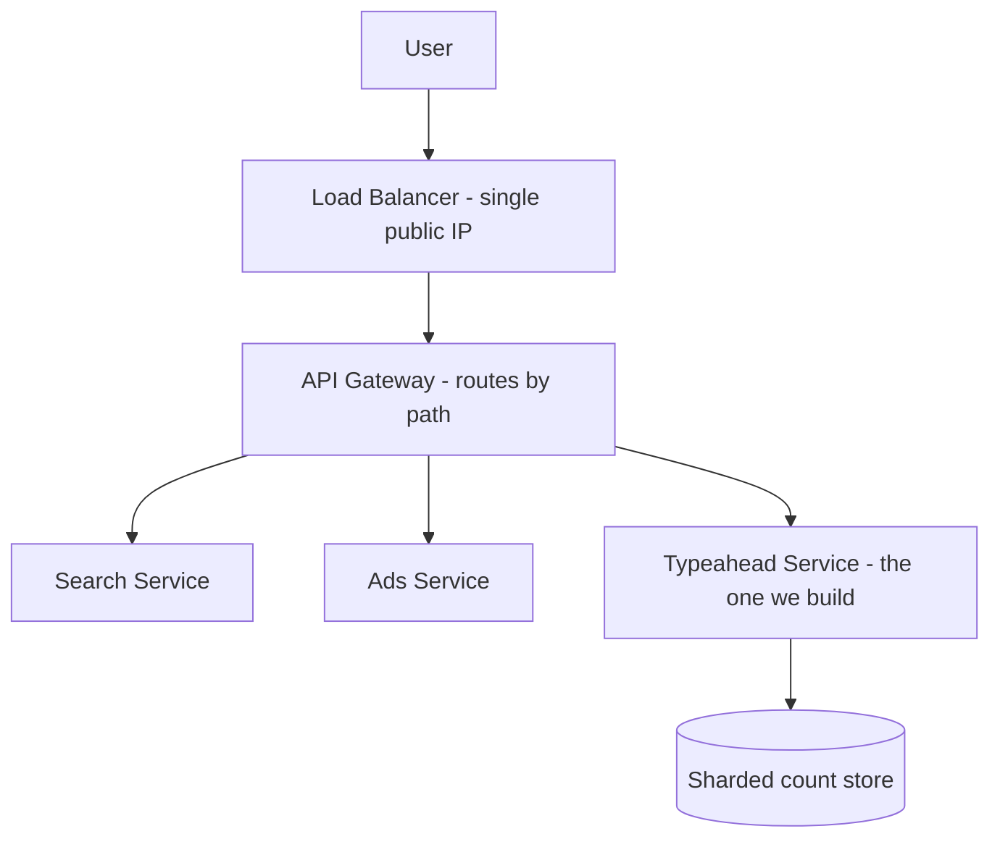
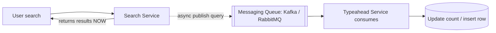

# Lecture 11: How to Attack a System‑Design Problem — Typeahead, Scale Estimation, and Async Communication

## Table of Contents
- [Note](note)
- [Overview](#overview)
- [The Interview Mindset: Clarify Before You Solve](#the-interview-mindset-clarify-before-you-solve)
- [What Exactly Is a Typeahead?](#what-exactly-is-a-typeahead)
- [Functional Requirements and the MVP](#functional-requirements-and-the-mvp)
- [Non-Functional Requirements: PACELC and Choosing Latency](#non-functional-requirements-pacelc-and-choosing-latency)
- [Scale Estimation (Back-of-the-Envelope)](#scale-estimation-back-of-the-envelope)
- [Microservices and Owning Your Data](#microservices-and-owning-your-data)
- [The Messaging Queue: Synchronous vs Asynchronous Communication](#the-messaging-queue-synchronous-vs-asynchronous-communication)
- [Try It Yourself](#try-it-yourself)
- [Homework / Next Lecture Preview](#homework--next-lecture-preview)

## Note
> This is condensed version of notes good for quick revision. For better understanding [Pragy Agarwal's notes on Typehead](https://docs.google.com/document/d/11YhxJwEiwWLVUoSAfFEacY0e49hb7zg_enOLpsIvNIc/edit?tab=t.0#heading=h.phf18zpz4htl) are highly recommended. 
## Overview
The databases arc is done; now we start **case studies**, and the first — designing a search **typeahead** (Google's autocomplete) — is really a vehicle for learning the *method* of high-level design. Unlike a DSA problem, an HLD problem has no fixed statement, no sample input/output, and often a feature you've never built. This lecture teaches the disciplined sequence — **clarify → functional requirements → non-functional requirements → scale estimation → (only then) design** — and along the way introduces **back-of-the-envelope estimation**, **microservices**, and the **synchronous vs asynchronous** distinction that motivates **messaging queues**. We deliberately stop *before* the solution: the trie/ranking design is [Lecture 12](./Lec12.md).

> 🔑 **Key Point (emphasized in class):** The single biggest mistake in a design interview is **jumping to a solution**. The moment you hear "typeahead," your brain shouts "trie!" — resist it. First understand the problem completely, then the scale, *then* design. Solving before understanding is how good engineers fail design interviews.

---

## The Interview Mindset: Clarify Before You Solve
Why are design interviews harder than DSA? A DSA problem hands you exact constraints and test cases; it's largely pattern-matching, and questions often repeat. An HLD problem gives you a vague phrase and nothing else. You are not writing code or designing classes — you're designing **infrastructure**: how many servers, how data flows, where it's stored, SQL vs NoSQL.

So your first move is always to **clarify** until your mental model matches the interviewer's. Two contexts use this skill:
- **In an interview** — you're alone, no resources, ~45–60 minutes. The goal is a solid **V0** (a defensible first design).
- **On the job** — you have a team, time, and real systems to study. Easier, but the same method applies.

> 🔑 **Key Point:** Only discuss requirements that **change the architecture**. "Should the suggestion box have rounded corners? Should hovering highlight a row? What trending icon?" — these are **cosmetics (CSS/UX)** and are **red flags** in an interview. Compare: "Does the messaging app support large groups?" *does* change the architecture (Slack shards by `group_id`, Messenger by `user_id` — see [Lecture 9](./Lec09.md)). Spend your minutes only where they move the design.

---

## What Exactly Is a Typeahead?
A **typeahead** is a form of autocomplete *specific to search*. As you type a query into Google, it suggests completions sharing your **prefix** — usually popular/trending queries (e.g., typing `why is` surfaces `why is india so hot this year`). 

Crucially, it is **not** the same as other autocompletes, and conflating them changes the design:
- Phone-keyboard word suggestions, Grammarly, GitHub Copilot — all autocomplete, but **not** search typeahead.
- Amazon/e-commerce typeahead adds category hints (`iPhone in Phones`); food-delivery has its own flavor.

We're building **search-engine typeahead for Google** — nothing else. (Personalization by search history or geolocation, and trending/recency, are real Google features but go into *future scope*, not the MVP.)

> 🤔 **Think About It (faculty's question):** "What is a typeahead?" If you've never heard the term, *say so and ask*. Pretending to know and designing the wrong thing is the worst outcome. Clarifying is a strength, not a weakness.

---

## Functional Requirements and the MVP
**Functional requirements** are the features you'll provide. In an interview you can only build an **MVP — Minimum Viable Product**: the *minimum* set of features, but the **core functionality must be present and correct**. Everything non-core becomes *future scope* (say "I'll do X first; if time permits, Y" — never "we won't do Y").

**MVP for our typeahead:**
- After the user types **3 characters**, show **10 suggestions** (number is a choice).
- Suggestions are **sorted by overall frequency** (how many times each query string has ever been searched).
- Every suggestion **shares the typed prefix**.
- Suggestions **update on every keystroke** (as the prefix changes, and as counts change — if a query's count overtakes another's, it bumps it out of the top 10).

**Future scope (explicitly deferred):** load suggestions on click (before typing), **recency / trending**, **geolocation** filtering, personalization by history/age. These are real features but don't belong in V0.

> 🔑 **Key Point:** "Overall count" = the number of *times a string was searched*, not the number of distinct users. The top 10 is purely a frequency ranking over all-time search counts (for now).

---

## Non-Functional Requirements: PACELC and Choosing Latency
**Non-functional requirements (NFRs)** are the system-quality knobs — latency, consistency, availability, idempotency, observability — and they directly shape the architecture.

Recall **PACELC**: **If** there's a **P**artition, choose between **A**vailability and **C**onsistency (the CAP theorem); **E**lse (no partition), choose between **L**atency and **C**onsistency. For typeahead:

- **Latency vs Consistency → choose latency.** Reason it out via *what the data is*: somewhere we keep a count per query string. "Inconsistent" means a count is slightly wrong or a recent search isn't recorded yet. Does the user notice? **No** — they don't know the counts or the ranking logic. Slightly-off suggestions are still useful.
- **Availability vs Consistency → consistency doesn't matter.** Different suggestions for the same user across devices/networks/times of day are totally fine.
- **We can even tolerate data loss.** If some search counts are dropped, the suggestions barely change. So **eventual consistency (or weaker)** is perfectly acceptable.

> 🔑 **Key Point:** Always derive consistency needs from the *business value of the data*. Suggestion counts are low-stakes, so we trade consistency away for speed. (Contrast a payments system, where you'd never lose a write — see [Lecture 14](./Lec14.md).)

---

## Scale Estimation (Back-of-the-Envelope)
**Why estimate scale at all?** Because scale decides architecture: do we need **sharding**? **Replicas**? Is the system **read-heavy or write-heavy**? (Recall: even when data fits on one server, high request throughput forces read replicas — exactly why we studied master–slave.)

> 🔑 **Key Point:** Scale is a **reality, not a requirement**. No founder says "I only want 100 users." Always design as if you'll grow to global scale, using *today's* numbers projected forward.

**Step 1 — Users.** World ≈ 8 billion; ~5–6 billion have internet; nearly all internet users use Google ⇒ ~5 billion MAU. By the **Pareto principle**, ~2 billion are daily active, and ~1 billion are *super-active* (heavy searchers). (A "silent" Google user does a quick search and leaves — unlike a silent Facebook user who scrolls for hours.)

**Step 2 — Searches.** Assume super-active users do ~20 searches/day: `1B × 20 = 20 billion searches/day`. Per second: `20×10⁹ / 10⁵ ≈ 200,000 searches/sec`. (A quick web check says ~158,000/sec — we're within a factor of ~1.3, which is fine.)

**Step 3 — Typeahead requests.** A suggestion fires on *every keystroke*. With average query length ~10 characters, that's ~10 typeahead calls per search: `200,000 × 10 = 2 million typeahead requests/sec`. (Peak can be ~5× the average ⇒ on the order of 10 million/sec.) Note: we **can't throttle** keystrokes — slow typists still need a response per character.

**Step 4 — Data size.** Row = 10 bytes (query) + 8 bytes (count, a `long`) = 18 → round to **20 bytes**. Only ~**10%** of searches are *unique* (new rows); the rest are repeats/trends. So new rows/day = `20B × 10% = 2 billion`, i.e. `2B × 20 bytes = 40 GB/day`. Over **20 years** (~8,000 days): `40 GB × 8,000 ≈ 320 TB`.

| Quantity | Estimate |
|---|---|
| Google MAU | ~5 billion |
| Daily active / super-active | ~2 B / ~1 B |
| Searches/day | ~20 billion |
| **Searches/sec** | **~200,000** |
| **Typeahead requests/sec** | **~2 million** (peak ~10 M) |
| Row size | ~20 bytes |
| Unique (new) rows/day | ~2 billion ⇒ ~40 GB/day |
| **20-year storage** | **~320 TB** |

**Conclusions:**
- **320 TB can't live on one server** (and even a huge disk couldn't serve the request load) ⇒ **sharding is mandatory**.
- **The system is BOTH read-heavy and write-heavy** — ~10 reads per write (read-heavy), yet ~200,000 writes/sec is itself enormous (write-heavy). No single database optimizes for both, which will force interesting trade-offs in [Lecture 12](./Lec12.md).

> 🔑 **Key Point — the estimation rule:** This is **back-of-the-envelope** math; round aggressively for speed. Being **off by a factor of 2–3 is fine; being off by a factor of 10 (an order of magnitude) is not.** A candidate who guessed 0.0001% unique queries was wrong by ~10,000×; "10% or 20%" would both pass.

---

## Microservices and Owning Your Data
Google isn't one codebase — it's hundreds of **microservices** behind load balancers and an **API gateway**. The user sees only one IP (the LB); the gateway routes each request to the right service (search, ads, …). We're adding a new one: the **typeahead service**.

Our typeahead needs, for each search query, to increment a count (or insert a new row). Wouldn't the **search service** already store query counts? **No** — search caches *recent* results (recency), not *frequencies*. So that data doesn't exist yet; we must produce it.

> 🤔 **Think About It (the OKR parable):** Could you just ask the search team to add count-tracking for you? In a large org this fails: they have their own priorities/OKRs, deadlines slip, the assigned dev leaves, they ask you to re-justify ROI, then say it doesn't align with their OKRs. And even if they build it, every future change repeats the saga. **Lesson: own the data your feature depends on.** Don't couple your roadmap to another team's.

So the typeahead service must capture every search query itself — which raises *how* the search service hands queries to us.

---

## The Messaging Queue: Synchronous vs Asynchronous Communication
The search service shouldn't *wait* for our typeahead service every time it serves a search — that would couple their latencies. This is the difference between:

- **Synchronous** — you expect an immediate reply (a phone call: "hello" → instant response; calling an OpenAI API and awaiting the result). Most apps you've built call APIs synchronously.
- **Asynchronous** — you don't wait for the reply (an email: I respond whenever; "fire and forget"). Async fits when multiple systems are involved and strict, immediate consistency isn't required.

Our pipeline is a perfect async use case: the search service **publishes** each query onto a **messaging queue** (e.g., **Kafka** or **RabbitMQ**), responds to the user immediately, and our typeahead service **consumes** from the queue on its own time to update counts.

> 🔑 **Key Point:** Messaging queues are the tool for **asynchronous** communication. A bonus: once the queue of search events exists, *any* team can subscribe to it later (analytics, spell-check, trending) with no new infrastructure — the producer is decoupled from all consumers. (We'll dive deeper into queues in a later case study; for the typeahead, this decoupling is exactly why we don't need a synchronous API between search and typeahead.)

---

## Try It Yourself
1. **Run the method on a new prompt.** "Design a typeahead for a food-delivery app's restaurant search." List two requirements that *change the architecture* and two that are **red-flag cosmetics**. What's the MVP vs future scope?
2. **Re-estimate.** Redo the scale math assuming average query length 25 (not 10) and 20% unique queries (not 10%). Which conclusions change — sharding? read/write-heaviness? 20-year storage? Show that being off by 2–3× doesn't change the *architecture decision*.
3. **Sync or async?** Classify and justify: (a) charging a credit card at checkout, (b) emailing a receipt after purchase, (c) updating a search-count after a query, (d) loading a user's profile page. For each async case, what would a messaging queue buy you?
4. **PACELC drill.** For a *banking balance* read and for a *typeahead suggestion* read, pick latency-vs-consistency and defend it from the data's business value. Why are the answers opposite?

## Homework / Next Lecture Preview
- **Design the typeahead.** With the scale now known (BOTH read- and write-heavy, ~320 TB, sharding required, eventual consistency acceptable), come up with a better design than your first instinct.
- **Coming next ([Lecture 12](./Lec12.md)):** we build the solution — starting with the **trie** approach (its pros/cons), then a **hashmap/key-value** approach, plus **top-k precomputation**, **sharding strategies**, and the write-reduction tricks (**batching** and **sampling**) that tame a system that's heavy on *both* reads and writes.
- **Process to internalize (use it every time):** understand the problem → functional requirements (MVP) → non-functional requirements → scale estimation → *then* design. Future case studies will spend ~30 minutes here instead of a whole lecture.
