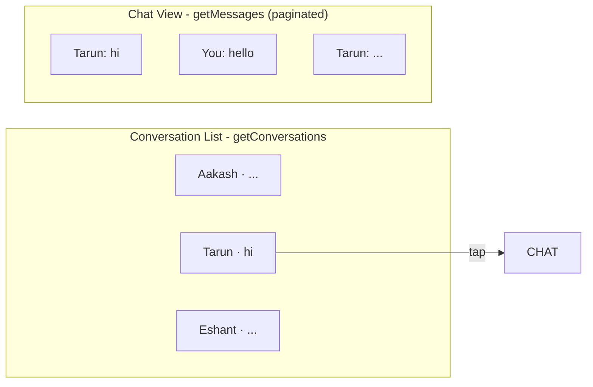
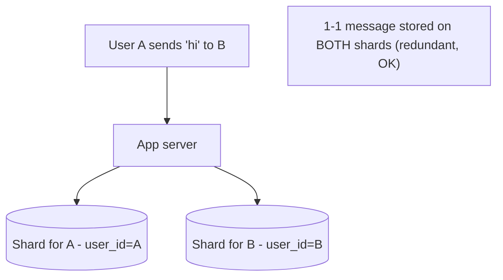
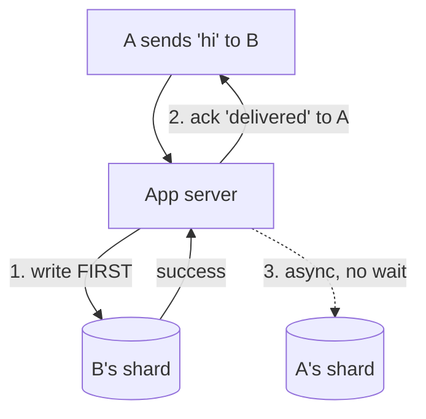
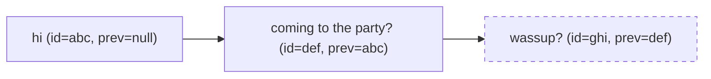

# Lecture 13: Designing a Messaging App (Part 1) — Requirements, Sharding, Consistency, Idempotency, and Ordering

## Table of Contents
- [Overview](#overview)
- [Step 0: Classify the App (Reason by Analogy)](#step-0-classify-the-app-reason-by-analogy)
- [Functional Requirements: Think in APIs](#functional-requirements-think-in-apis)
- [Non-Functional Requirements: Consistency, No Data Loss, and the Speed-of-Light Floor](#non-functional-requirements-consistency-no-data-loss-and-the-speed-of-light-floor)
- [Scale Estimation: Both Read- and Write-Heavy](#scale-estimation-both-read--and-write-heavy)
- [Choosing the Sharding Key](#choosing-the-sharding-key)
- [Achieving Consistency AND Low Latency: The Single-Commit Trick](#achieving-consistency-and-low-latency-the-single-commit-trick)
- [Idempotency and Client-Side ID Generation](#idempotency-and-client-side-id-generation)
- [Preserving Message Order: The Message Chain](#preserving-message-order-the-message-chain)
- [Cold Storage: You Don't Keep 200 PB Hot](#cold-storage-you-dont-keep-200-pb-hot)
- [Try It Yourself](#try-it-yourself)
- [Homework / Next Lecture Preview](#homework--next-lecture-preview)

## Overview
This is the second case study, and it pushes harder than Typeahead: a WhatsApp-scale messaging app needs the *opposite* non-functional profile — **immediate consistency, zero data loss**, *and* **low latency**, on a system that's **both read- and write-heavy**. PACELC says you can't have consistency with low latency, so the heart of this lecture is *engineering an illusion* of consistency that's fast. Along the way we cover the messaging-specific staples interviewers love: **idempotency**, **distributed ID generation** (UUID/Snowflake), and **message ordering**. (We continue with database choice and caching in [Lecture 14](./Lec14.md).)

> 🔑 **Key Point (emphasized in class):** When PACELC says "impossible," that's the start of the problem, not the end. "Theoretically impossible, practically we engineer a workaround" is exactly the problem-solving these companies test for.

---

## Step 0: Classify the App (Reason by Analogy)
Before requirements, figure out *which kind* of messaging app you're building — different buckets have fundamentally different architectures. List real systems and the *category* each represents (discuss categories, **not** features, and never another app's internal design — you don't actually know it):

| Bucket | Examples | Defining trait |
|---|---|---|
| **1-1, mobile-first, realtime** | WhatsApp, Signal, iMessage | SMS replacement, ultra-low latency, mostly 1-1 |
| **B2B / org chat, large groups** | Slack, MS Teams | Channels up to ~100k members; you must join an org |
| **Social-coupled DMs** | Instagram, Twitter/X DMs | Messaging bolted onto a social graph |
| **Video-first** | Zoom, Meet, Skype | Chat is secondary to video |
| **Disappearing / privacy** | Snapchat | Ephemeral messages |
| **Game channels** | Discord | Persistent audio channels |

**We're building WhatsApp**: 1-1 chats + **limited-size groups** (cap ~100–256 members), media and reactions. (Telegram/Slack's huge groups are a *different* problem — see why below.)

> 🤔 **Think About It:** Why classify first? Because one tiny requirement flips the design. WhatsApp (small groups) shards by `user_id`; Slack (giant groups) shards by `conversation_id`. Same "messaging app," opposite architecture.

---

## Functional Requirements: Think in APIs
MVP = the *minimal* core. Calls, video, stories, profile management, multi-device, end-to-end encryption → **future scope** (don't get baited into security unless you're genuinely an expert). Media and reactions are "supported" trivially — media is just an **S3 URL**, not bytes in the message row.

Express each feature as an **API**, because the API's parameters reveal the sharding key.

| API (MVP) | Parameters |
|---|---|
| `sendMessage` | `sender_id`, `recipient_id` (or `conversation_id`), `message` (JSON) → ack/failure |
| `getMessages` | `user_id`, `conversation_id` (or `receiver_id`), `pagination_offset`, `limit` → messages |
| `getConversations` | `user_id`, `pagination_offset`, `limit` → recent conversations (with a snippet of the latest message) |
| `sendMessageGroup` | `sender_id`, `group_id`, `message` → ack/failure |
| `getMessagesGroup` | `user_id`, `group_id`, `offset`, `limit` → messages |

> 🔑 **Key Point:** A good sharding key appears in **almost every API**. Notice `user_id` shows up in all of them — a strong hint (we'll confirm it below). The UX has two screens: a paginated **conversation list**, and a paginated **chat view** (load the most recent ~30–50 messages, fetch more on scroll).

---

## Non-Functional Requirements: Consistency, No Data Loss, and the Speed-of-Light Floor
Derive consistency from *what the data is* — here, **messages**, the backbone of human communication. The requirements are strict:

- **Immediate consistency.** If the sender gets a "delivered" acknowledgement, the message *must* be retrievable by the receiver. No "ack'd but invisible," no "notification arrives but the message never loads."
- **No data loss.** An ack'd message that's later lost is unacceptable (imagine a missed assignment-deadline message).
- **Ordering preserved.** The receiver must see messages in the order the sender sent them — meaning changes with order ("coming to the party?" → "wassup?" reads very differently reversed).
- **Idempotency.** The app must not silently send the *same* message multiple times (a deliberate user repeat is fine; an automatic duplicate is not). Critical foreshadowing for payments — [Lecture 14](./Lec14.md).
- **Availability under partition.** We want the app to stay up *and* consistent during a network partition — again "impossible," again engineered.

**Latency** has a hard physical floor. Light covers only ~**300 km per millisecond**; servers are likely on AWS (possibly another continent), so a round trip plus processing plus any cross-shard commit can't be 1 ms — that's physically impossible. A realistic target is **~2–3 s average, 5 s max**; beyond 5 s the app is unusable.

> 🤔 **Think About It (the physics check):** A candidate who promises "1 ms latency" reveals they don't understand networks. From Bangalore, light reaches only ~Chennai in 1 ms — and the server may be in the US. State a number that respects the speed of light (single-digit seconds), then refine with the interviewer.

So we need **consistency + low latency simultaneously** on a **read- and write-heavy** system. PACELC says no. We'll engineer a yes.

---

## Scale Estimation: Both Read- and Write-Heavy
- **Users:** WhatsApp ≈ Facebook ≈ **2 billion DAU**. For messaging, the Pareto principle **inverts** — ~**80%** are active senders ⇒ ~2 billion active users.
- **Messages:** ~20 messages/day/user ⇒ `2B × 20 = 40 billion messages/day` ⇒ `/10⁵ ≈ 400,000 messages/sec` (twice Google search's write rate).
- **Reads:** every message is read by ≥2 people (sender + receiver) ⇒ ~**800,000 reads/sec**. Groups push this higher but are only ~5–10% of traffic, so we can ignore them for the estimate.
- **Data:** a message row ≈ **500 bytes** (`message_id` 16 B, `sender_id`/`receiver_id` 8 B each, `text` ~200 B, `media_url` ~200 B, timestamp). `40B × 500 B = 20 TB/day` ⇒ over 20 years ≈ **200 petabytes**.

| Quantity | Estimate |
|---|---|
| DAU / active | ~2 B / ~2 B (80%) |
| Messages/day | 40 billion |
| **Writes (sendMessage)/sec** | **~400,000** (peak ~2 M) |
| **Reads (getMessages)/sec** | **~800,000** (peak ~4 M) |
| Message size | ~500 bytes |
| 20-year storage | ~200 PB |

**Conclusions:** 200 PB can't fit on one server (max ~3 PB/server today, and it couldn't serve the load anyway) ⇒ **shard**. And it's **both read- and write-heavy with neither dominating by 10×** — the hardest profile. *Can't reduce writes* (immediate consistency forbids batching/sampling), so we'll **reduce reads with a cache** and make the **database write-optimized** ([Lecture 14](./Lec14.md)).

---

## Choosing the Sharding Key
Candidates: `message_id`, `user_id`, `conversation_id`/`group_id`.

- **`message_id` — bad.** The id doesn't exist until the row is created, and a conversation's messages would scatter across shards ⇒ every `getMessages` is a **fan-out**.
- **`user_id` — good (WhatsApp's choice).** All of a user's data lives on one shard. `getConversations` and `getMessages` hit **one** shard. A 1-1 message is **stored on both** the sender's and receiver's shards (redundant, and that's fine). `sendMessage` therefore touches **2 shards**. Groups become a fan-out to ≤100 member shards — acceptable since groups are ~10% of traffic. It's immutable, high-cardinality, evenly distributed, and in every API. ✅
- **`conversation_id` — good for groups (Slack's choice).** A whole conversation sits on one shard, so `getMessages`/`sendMessage` hit one shard. But `getConversations` becomes a **fan-out** (a user is in many conversations on many shards). Fix: a separate **recentConversations DB** (sharded by `user_id`) holding each conversation's last-message summary, updated on every send.

> 🔑 **Key Point — what to choose depends on group size.** WhatsApp caps groups (~256), so **`user_id`** is ideal. Slack/Teams have huge channels (100k+), so **`conversation_id`** is ideal (a single group message would otherwise have to fan-out to 100k shards). For groups, *no* sharding key makes `getConversations` cheap — that's why you serve it from a separate DB or a client-side cache fed by notifications. WhatsApp avoids a full cross-shard commit on group sends: it writes the sender's shard synchronously and **fans out asynchronously**, so members receive at slightly different times.

---

## Achieving Consistency AND Low Latency: The Single-Commit Trick
A 1-1 `sendMessage` must write 2 shards (sender + receiver) and we want consistency. The textbook answer is a **two-phase commit (2PC)** — atomic across both shards — but 2PC is slow and lowers availability. Can we fake atomicity with a single fast commit?

**Naïve "write sender first."** Write A's shard, ack A, then async-write B's shard. Problem: if the ack to A succeeds but B's write fails, A sees "delivered" but B never gets it — a consistency violation. Bad.

**The fix — write the *receiver's* shard first:**

1. **Write B's (receiver's) shard first.** If it fails → fail fast, tell A "not delivered, retry" (good — A knows the truth).
2. **On success, immediately ack A** — the message *is* delivered (it's in B's shard, where B reads from). **Low latency** (no waiting on a second write).
3. **Async-write A's (sender's) shard** with retries; A isn't waiting.

The one gap: if step 3 (A's own shard) fails, A reloading wouldn't see *its own* sent message. Fix: **A's client caches its own sent messages locally**, so A always sees them regardless of its shard. The only failure mode is "A's shard write fails *and* A clears its app cache" — vanishingly rare; WhatsApp even warns that clearing cache causes odd behavior.

> 🔑 **Key Point:** This is an **illusion of consistency** — a single commit (to the receiver) + a client-side cache (for the sender) gives users a consistent, low-latency experience ~99.xx% of the time, without paying for 2PC. Under a **network partition**, the same design stays **available** (write the reachable receiver shard, queue the sender-shard write) *and* consistent-looking (frontend cache) — the "impossible" CAP/PACELC corner, engineered around.

---

## Idempotency and Client-Side ID Generation
**The problem:** networks are unreliable, so the client auto-retries failed sends (you don't want users re-typing). But if the *server stored the message and ack'd*, and only the **ack dropped**, the client retries → the server stores/sends a **duplicate**.

**Idempotency** (math: `f(f(x)) = f(x)` — e.g. `|x|`, `mod`; *not* `x²`) means an operation applied multiple times has the **same single effect**. We want `sendMessage` to be idempotent: ten retries of the *same* message = one stored message. (A user *deliberately* sending "hi" ten times is still allowed — we only collapse *automatic* duplicates.)

> 🔑 **Key Point:** The backend should be idempotent *regardless* of whether today's frontend retries — someone may add retries later. Make write (POST/PUT/DELETE) endpoints idempotent by default.

**The solution:** give every message a **unique `message_id` generated on the client**, sent with the request, and *reused* on retries. The server stores the message only if that `message_id` isn't already present; otherwise it ignores the write but still returns success (so the client stops retrying).

This requires generating unique IDs **without a central server** (which would be a single point of failure + latency) and across many shards/app servers. Options:

| Scheme | Bits | How | Notes |
|---|---|---|---|
| Auto-increment | — | DB sequence | ❌ collides across shards; **predictable** (enumerate users — security risk). IDs must be **sparse/random** |
| **UUID v4** | 128 | fully random | collision prob ≈ 1/2¹²⁸ ≈ 0; generate anywhere |
| **Snowflake (Twitter)** | 64 | sign-bit + timestamp + machine-id + sequence | roughly time-sortable; needs per-machine IDs (overhead). (Sign bit reserved so Java's signed longs stay positive.) |
| **UUID v7** | 128 | timestamp prefix + random + sequence | distributed, **time-sortable**, no machine-id needed — the modern default |

> 🤔 **Think About It:** Why not auto-increment IDs? Two failures: (1) two shards both mint `id=2` → **collision**; (2) sequential IDs are **guessable**, so an exposed endpoint lets an attacker walk every user. Good IDs are sparse and unpredictable — generate UUID v7 on the client.

---

## Preserving Message Order: The Message Chain
Sorting by **sent time** makes messages *flicker and reorder* as delayed messages arrive. Sorting by **received time** gives the wrong order entirely. Neither works.

**The fix — a message chain (a linked list).** Each message carries the **`previous_message_id`** of the last message *that sender sent from that device*. The receiver renders a message only if its predecessor is already shown; otherwise it displays **"waiting for messages…"** until the missing one arrives (with internal retries; if it never comes, the wait clears).

> 🔑 **Key Point:** This only guarantees **per-sender, per-device** order — exactly the intent ("all messages *from one person* appear in order"). Across multiple devices or multiple senders in a group (delivered asynchronously), interleaving isn't guaranteed, and that's acceptable. The `message_id` doing double duty (idempotency *and* the chain) is why we generate it client-side.

---

## Cold Storage: You Don't Keep 200 PB Hot
You won't keep 200 PB on fast storage — almost nobody scrolls to messages from 10 years ago. Move rarely-accessed data to **cold storage**: very cheap, very slow media (e.g., **magnetic tape**, **S3 Glacier** — note plain S3 is file storage, not cold storage and is costlier). Data is tiered out by age/recency.

This is why "download all my data" features (Facebook photos, Amazon order history) arrive by **email hours or days later** — the data was on cold storage and takes time to retrieve. WhatsApp sidesteps storage cost differently: it keeps messages on your **device** (changing phones loses history unless you back up); historically it even used **persistent queues** that deleted messages once all your devices consumed them or a TTL elapsed.

---

## Try It Yourself
1. **Flip the sharding key.** Re-derive the design for **Slack** (channels up to 100k). Why does `user_id` break for a single channel post, and how does `conversation_id` + a `recentConversations` DB fix `getConversations`? Which API becomes the unavoidable fan-out either way?
2. **Break the consistency illusion.** Find the exact sequence of failures where the "write receiver first + client cache" trick shows a user a *wrong* state. Estimate how rare it is, and propose what to tell the user (hint: the cache-clear warning).
3. **Idempotency in payments.** Adapt the client-`message_id` idea to a "Pay ₹5000" button pressed 3 times due to lag. What's the idempotency key, where is it checked, and why is exactly-once *non-negotiable* here vs merely nice for chat? (Preview of [Lecture 14](./Lec14.md).)
4. **Order without timestamps.** Construct a 3-message example where sent-time sorting flickers and received-time sorting is wrong, then show the message chain producing the correct, stable order. What does the receiver show while a middle message is missing?

## Homework / Next Lecture Preview
- **Start the Typeahead assignment now** (it's substantial — even with AI help you must understand and be able to reproduce the core logic; expect exam/viva questions).
- **Explore database use cases:** when to use **MongoDB**, **Cassandra**, and **Elasticsearch** (you know their internals from [Lecture 10](./Lec10.md) — now learn *when* to pick each).
- **Coming next ([Lecture 14](./Lec14.md)):** choosing the database for this app (spoiler: a **write-optimized wide-column store** like Cassandra/ScyllaDB) and designing the **cache** (key/value, write-through invalidation, LRU eviction, consistent-hashing routing, and what happens when a cache server dies) — plus **idempotency in payment systems**. Decide your DB + cache and be ready to present.
